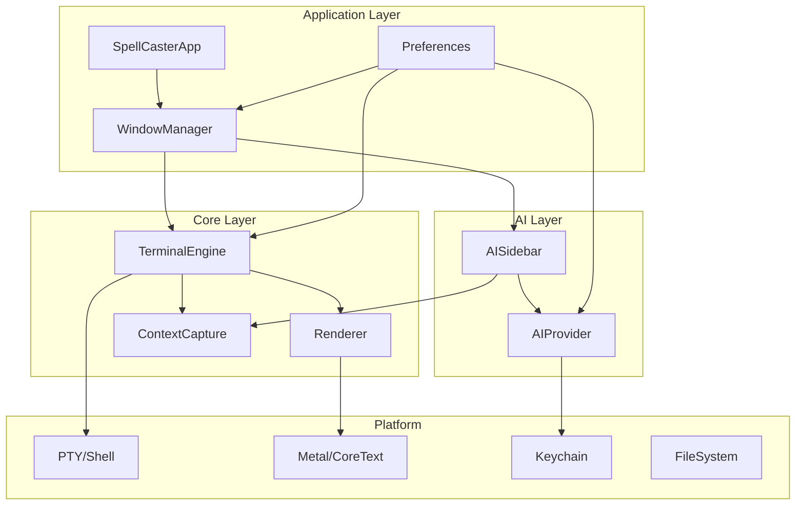
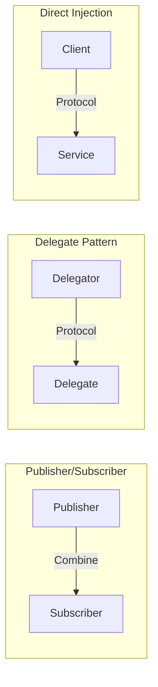
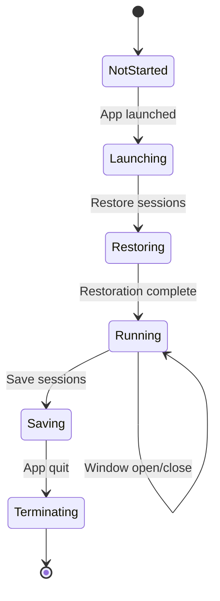
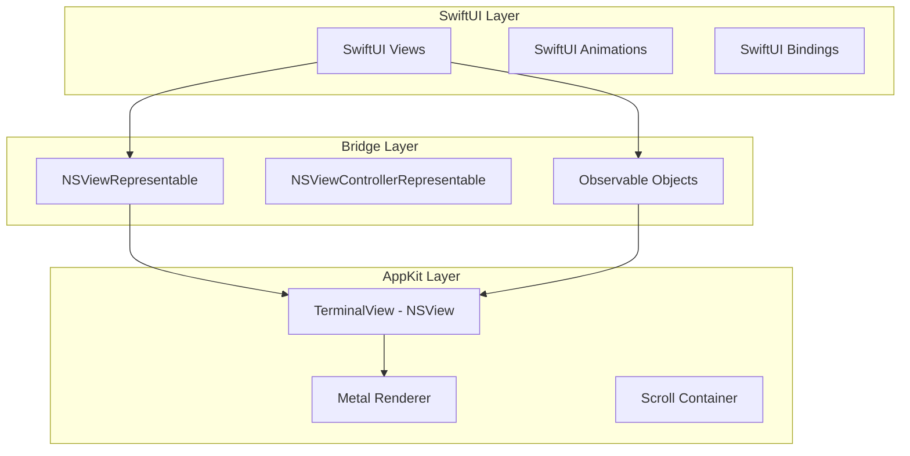
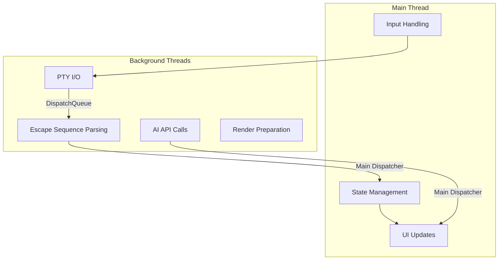

# Spell Caster - Overall Architecture

## Overview

Spell Caster is a macOS terminal emulator with an integrated AI co-pilot sidebar. This document outlines the overall application architecture, module separation, communication patterns, and integration strategies.

## Design Principles

1. **Separation of Concerns**: Each module has a single, well-defined responsibility
2. **Protocol-Oriented Design**: Swift protocols define module boundaries for testability and flexibility
3. **Performance First**: Terminal rendering uses AppKit/Metal for optimal performance; SwiftUI for UI chrome
4. **Reactive State Management**: Combine publishers for cross-module communication
5. **macOS Native**: Leverage platform-specific APIs and follow Human Interface Guidelines

## High-Level Architecture



## Module Definitions

### 1. TerminalEngine

**Responsibility**: Manages PTY sessions, parses escape sequences, maintains terminal state.

**Key Components**:
- PTY session management (fork/exec)
- ANSI/VT100/VT220/xterm escape sequence parser
- Terminal state machine (cursor position, modes, attributes)
- Input handling pipeline
- Signal handling

**Dependencies**: None (core module)

### 2. Renderer

**Responsibility**: High-performance terminal content rendering using Metal and CoreText.

**Key Components**:
- Cell grid model
- Metal shader pipeline for text rendering
- Scrollback buffer visualization
- Selection and cursor rendering
- Color palette management

**Dependencies**: TerminalEngine (for state)

### 3. WindowManager

**Responsibility**: Manages application windows, tabs, panes, and their lifecycle.

**Key Components**:
- Window/Tab/Pane hierarchy
- Split pane management
- Focus management
- Session persistence
- Profile application

**Dependencies**: TerminalEngine, Renderer, AISidebar, Preferences

### 4. AISidebar

**Responsibility**: Per-window AI assistant interface.

**Key Components**:
- Chat UI component
- Message history management
- Insert/Run/Copy action handlers
- Context inspector panel
- Streaming response display

**Dependencies**: AIProvider, ContextCapture

### 5. AIProvider

**Responsibility**: Abstracts AI backend communication.

**Key Components**:
- Provider protocol for multi-backend support
- Streaming API client
- Model selection logic
- API key management via Keychain
- Prompt preset system

**Dependencies**: Keychain (system)

### 6. ContextCapture

**Responsibility**: Captures and sanitizes terminal context for AI queries.

**Key Components**:
- Shell integration protocol
- Context pipeline (cwd, recent output, git status)
- Secret detection and redaction
- User toggle handling

**Dependencies**: TerminalEngine (for output access)

### 7. Preferences

**Responsibility**: Application-wide settings and profile management.

**Key Components**:
- Profile storage (UserDefaults + file-based for profiles)
- Settings UI
- Default profile management
- Migration handling

**Dependencies**: None

## Module Communication

### Communication Patterns



### Protocol Definitions

```swift
// MARK: - TerminalEngine Protocol

/// Protocol for terminal engine operations
protocol TerminalEngineProtocol: AnyObject {
    /// Current terminal state
    var state: TerminalState { get }
    
    /// State publisher for reactive updates
    var statePublisher: AnyPublisher<TerminalState, Never> { get }
    
    /// Output publisher for rendered content
    var outputPublisher: AnyPublisher<TerminalOutput, Never> { get }
    
    /// Send input to the terminal
    func sendInput(_ data: Data)
    
    /// Resize the terminal
    func resize(columns: Int, rows: Int)
    
    /// Start a new shell session
    func startSession(profile: Profile) throws
    
    /// Terminate the current session
    func terminateSession()
}

// MARK: - Renderer Protocol

/// Protocol for terminal rendering
protocol RendererProtocol: AnyObject {
    /// Current cell grid
    var grid: TerminalGrid { get }
    
    /// Grid updates publisher
    var gridPublisher: AnyPublisher<TerminalGrid, Never> { get }
    
    /// Selection state
    var selection: Selection? { get set }
    
    /// Scroll position
    var scrollPosition: Int { get set }
    
    /// Render a frame
    func render() -> RenderResult
}

// MARK: - AIProvider Protocol

/// Protocol for AI backend providers
protocol AIProviderProtocol {
    /// Available models
    var availableModels: [AIModel] { get }
    
    /// Current selected model
    var selectedModel: AIModel { get set }
    
    /// Send a prompt and receive streaming response
    func sendPrompt(
        _ prompt: String,
        context: AIContext
    ) -> AnyPublisher<AIResponseChunk, Error>
    
    /// Cancel ongoing request
    func cancelRequest()
}

// MARK: - ContextCapture Protocol

/// Protocol for context capture
protocol ContextCaptureProtocol {
    /// Current context snapshot
    var currentContext: AIContext { get }
    
    /// Context publisher
    var contextPublisher: AnyPublisher<AIContext, Never> { get }
    
    /// Update context settings
    func updateSettings(_ settings: ContextSettings)
    
    /// Capture context with optional selection
    func captureContext(selection: String?) -> AIContext
}

// MARK: - WindowManager Protocol

/// Protocol for window management
protocol WindowManagerProtocol: AnyObject {
    /// All open windows
    var windows: [Window] { get }
    
    /// Create a new window
    func createWindow(profile: Profile?) -> Window
    
    /// Close a window
    func closeWindow(_ window: Window)
    
    /// Get window by ID
    func window(id: UUID) -> Window?
}
```

## App Lifecycle and State Management

### Application State

```swift
/// Global application state
@MainActor
@Observable
final class AppState {
    /// Shared instance
    static let shared = AppState()
    
    /// All open windows
    var windows: [WindowModel] = []
    
    /// Global preferences
    var preferences: Preferences
    
    /// Active window
    var activeWindow: WindowModel?
    
    /// Application launch state
    var launchState: LaunchState = .notStarted
}

enum LaunchState {
    case notStarted
    case launching
    case running
    case terminating
}
```

### State Flow



### Scene-Based Lifecycle

```swift
@main
struct SpellCasterApp: App {
    @State private var appState = AppState.shared
    
    var body: some Scene {
        WindowGroup {
            MainWindowView()
                .environment(appState)
        }
        .commands {
            TerminalCommands()
        }
        
        Settings {
            PreferencesView()
                .environment(appState.preferences)
        }
        
        // Handle lifecycle events
        .onAppear {
            appState.launchState = .running
        }
        .onReceive(NotificationCenter.default.publisher(for: NSApplication.willTerminateNotification)) { _ in
            appState.saveSessions()
        }
    }
}
```

## Swift/AppKit/SwiftUI Boundaries

### Integration Strategy



### Terminal View Bridge

```swift
/// SwiftUI wrapper for the AppKit terminal view
struct TerminalView: NSViewRepresentable {
    @ObservedObject var terminal: TerminalEngine
    @Binding var selection: Selection?
    
    func makeNSView(context: Context) -> TerminalNSView {
        let view = TerminalNSView()
        view.engine = terminal
        return view
    }
    
    func updateNSView(_ nsView: TerminalNSView, context: Context) {
        nsView.selection = selection
        nsView.needsDisplay = true
    }
}

/// AppKit view for terminal rendering
class TerminalNSView: NSView {
    var engine: TerminalEngine?
    var selection: Selection?
    
    private var metalLayer: CAMetalLayer!
    private var renderer: MetalRenderer!
    
    override func makeBackingLayer() -> CALayer {
        metalLayer = CAMetalLayer()
        return metalLayer
    }
    
    override var wantsUpdateLayer: Bool { true }
    
    override func viewDidMoveToWindow() {
        super.viewDidMoveToWindow()
        renderer = MetalRenderer(metalLayer: metalLayer)
    }
    
    override func draw(_ dirtyRect: NSRect) {
        renderer?.render(
            grid: engine?.state.grid,
            selection: selection,
            dirtyRect: dirtyRect
        )
    }
}
```

### Key Integration Points

| Component | Technology | Reason |
|-----------|------------|--------|
| Terminal Rendering | AppKit + Metal | Maximum performance for text rendering |
| Window Chrome | SwiftUI | Rapid UI development, animations |
| AI Sidebar | SwiftUI | Complex UI state, easier with SwiftUI |
| Preferences | SwiftUI | Standard settings UI patterns |
| Menu Bar | SwiftUI Commands | Native integration |
| Touch Bar | AppKit | Custom controls require AppKit |

## Dependency Injection

### Container Approach

```swift
/// Dependency container for the application
@MainActor
final class DependencyContainer {
    static let shared = DependencyContainer()
    
    // MARK: - Services
    
    private(set) lazy var preferences: Preferences = {
        Preferences()
    }()
    
    private(set) lazy var keychainService: KeychainService = {
        KeychainService()
    }()
    
    // MARK: - Factories
    
    func createTerminalEngine() -> TerminalEngine {
        TerminalEngine()
    }
    
    func createAIProvider(type: ProviderType) -> AIProviderProtocol {
        switch type {
        case .openAI:
            return OpenAIProvider(keychain: keychainService)
        case .anthropic:
            return AnthropicProvider(keychain: keychainService)
        case .local:
            return LocalProvider()
        }
    }
    
    func createContextCapture(engine: TerminalEngine) -> ContextCapture {
        ContextCapture(terminalEngine: engine)
    }
}

// MARK: - Environment Key for SwiftUI

private struct DependencyContainerKey: EnvironmentKey {
    static let defaultValue = DependencyContainer.shared
}

extension EnvironmentValues {
    var dependencies: DependencyContainer {
        get { self[DependencyContainerKey.self] }
        set { self[DependencyContainerKey.self] = newValue }
    }
}
```

### Protocol-Based Injection

```swift
/// Window-scoped dependencies
@MainActor
@Observable
final class WindowDependencies {
    let terminalEngine: TerminalEngineProtocol
    let renderer: RendererProtocol
    let aiProvider: AIProviderProtocol
    let contextCapture: ContextCaptureProtocol
    
    init(
        terminalEngine: TerminalEngineProtocol,
        renderer: RendererProtocol,
        aiProvider: AIProviderProtocol,
        contextCapture: ContextCaptureProtocol
    ) {
        self.terminalEngine = terminalEngine
        self.renderer = renderer
        self.aiProvider = aiProvider
        self.contextCapture = contextCapture
    }
}
```

## Error Handling Strategy

### Error Types

```swift
/// Application-wide error types
enum SpellCasterError: LocalizedError {
    case terminalError(TerminalError)
    case aiProviderError(AIProviderError)
    case contextCaptureError(ContextCaptureError)
    case windowError(WindowError)
    case preferencesError(PreferencesError)
    
    var errorDescription: String? {
        switch self {
        case .terminalError(let error):
            return "Terminal error: \(error.localizedDescription)"
        case .aiProviderError(let error):
            return "AI provider error: \(error.localizedDescription)"
        case .contextCaptureError(let error):
            return "Context capture error: \(error.localizedDescription)"
        case .windowError(let error):
            return "Window error: \(error.localizedDescription)"
        case .preferencesError(let error):
            return "Preferences error: \(error.localizedDescription)"
        }
    }
}

enum TerminalError: LocalizedError {
    case ptyCreationFailed
    case shellLaunchFailed(String)
    case invalidEscapeSequence
    case resizeFailed
}

enum AIProviderError: LocalizedError {
    case apiKeyMissing
    case networkError(Error)
    case rateLimited
    case invalidResponse
    case streamingError
}
```

## Performance Considerations

### Threading Model



### Thread Safety

```swift
/// Thread-safe terminal state
final class TerminalState: @unchecked Sendable {
    private let lock = NSLock()
    private var _grid: TerminalGrid
    private var _cursor: CursorPosition
    
    var grid: TerminalGrid {
        lock.lock()
        defer { lock.unlock() }
        return _grid
    }
    
    var cursor: CursorPosition {
        lock.lock()
        defer { lock.unlock() }
        return _cursor
    }
    
    func update<T>(_ block: (inout TerminalGrid, inout CursorPosition) -> T) -> T {
        lock.lock()
        defer { lock.unlock() }
        return block(&_grid, &_cursor)
    }
}
```

## Memory Management

### Object Lifecycle

```swift
/// Window model with proper lifecycle management
@MainActor
@Observable
final class WindowModel {
    let id: UUID
    
    // Strong references to owned objects
    private(set) var terminalEngine: TerminalEngine
    private(set) var aiSession: AISession
    
    // Weak references to avoid cycles
    weak var parentWindow: NSWindow?
    
    init(id: UUID = UUID()) {
        self.id = id
        self.terminalEngine = TerminalEngine()
        self.aiSession = AISession()
    }
    
    deinit {
        // Clean up resources
        terminalEngine.terminateSession()
    }
}
```

## Next Steps

The following documents provide detailed specifications for each module:

1. [02-data-models.md](02-data-models.md) - Data model definitions
2. [03-terminal-engine.md](03-terminal-engine.md) - Terminal engine specification
3. [04-rendering-layer.md](04-rendering-layer.md) - Rendering layer specification
4. [05-window-management.md](05-window-management.md) - Window management specification
5. [06-ai-sidebar.md](06-ai-sidebar.md) - AI sidebar specification
6. [07-ai-provider.md](07-ai-provider.md) - AI provider specification
7. [08-context-capture.md](08-context-capture.md) - Context capture specification
8. [09-security-privacy.md](09-security-privacy.md) - Security and privacy considerations
9. [10-file-structure.md](10-file-structure.md) - Project file structure
