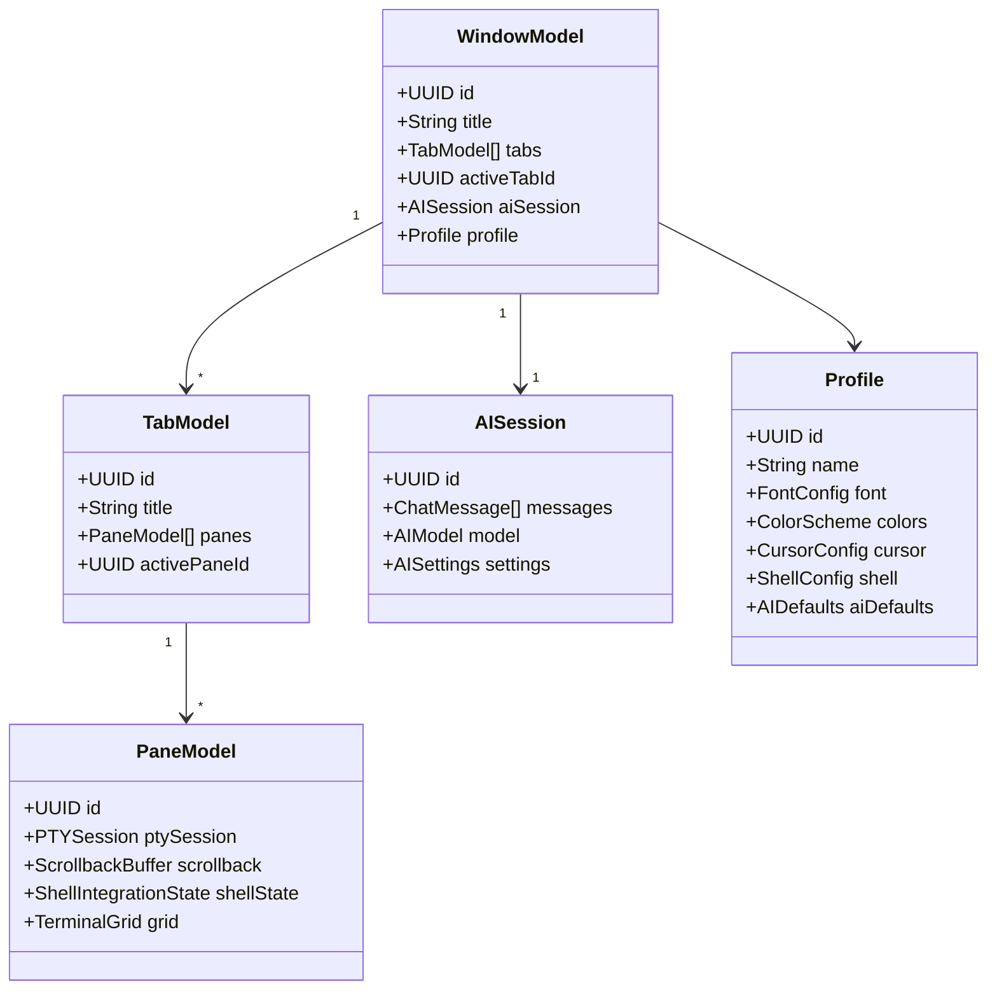

# Spell Caster - Data Models

## Overview

This document defines all data models used throughout the Spell Caster application. These models form the foundation of the application's state management and persistence layer.

## Model Hierarchy



## Core Models

### Window Model

Represents a single application window containing tabs and an AI session.

```swift
import Foundation
import SwiftUI

/// Represents a single terminal window
@MainActor
@Observable
final class WindowModel: Identifiable {
    // MARK: - Identity
    
    let id: UUID
    
    // MARK: - Window State
    
    /// Window title (derived from active terminal or custom)
    var title: String = "Terminal"
    
    /// All tabs in this window
    var tabs: [TabModel] = []
    
    /// Currently active tab
    var activeTabId: UUID? {
        didSet { updateWindowTitle() }
    }
    
    /// AI session for this window
    var aiSession: AISession
    
    /// Applied profile (can be overridden per tab)
    var profile: Profile
    
    /// Window frame for persistence
    var frame: CGRect?
    
    /// Whether the AI sidebar is visible
    var isAISidebarVisible: Bool = true
    
    /// Sidebar width
    var sidebarWidth: CGFloat = 350
    
    // MARK: - Computed Properties
    
    var activeTab: TabModel? {
        tabs.first { $0.id == activeTabId }
    }
    
    // MARK: - Initialization
    
    init(
        id: UUID = UUID(),
        profile: Profile = .default
    ) {
        self.id = id
        self.profile = profile
        self.aiSession = AISession()
    }
    
    // MARK: - Methods
    
    private func updateWindowTitle() {
        if let tab = activeTab {
            title = tab.title
        }
    }
    
    func createTab(profile: Profile? = nil) -> TabModel {
        let tab = TabModel(profile: profile ?? self.profile)
        tabs.append(tab)
        activeTabId = tab.id
        return tab
    }
    
    func closeTab(_ tabId: UUID) {
        tabs.removeAll { $0.id == tabId }
        if activeTabId == tabId {
            activeTabId = tabs.last?.id
        }
    }
}

// MARK: - Codable for Persistence

extension WindowModel: Codable {
    enum CodingKeys: String, CodingKey {
        case id, title, tabs, activeTabId, aiSession, profile, frame
        case isAISidebarVisible, sidebarWidth
    }
    
    convenience init(from decoder: Decoder) throws {
        let container = try decoder.container(keyedBy: CodingKeys.self)
        self.init(
            id: try container.decode(UUID.self, forKey: .id),
            profile: try container.decode(Profile.self, forKey: .profile)
        )
        title = try container.decode(String.self, forKey: .title)
        tabs = try container.decode([TabModel].self, forKey: .tabs)
        activeTabId = try container.decode(UUID?.self, forKey: .activeTabId)
        aiSession = try container.decode(AISession.self, forKey: .aiSession)
        frame = try container.decode(CGRect?.self, forKey: .frame)
        isAISidebarVisible = try container.decode(Bool.self, forKey: .isAISidebarVisible)
        sidebarWidth = try container.decode(CGFloat.self, forKey: .sidebarWidth)
    }
    
    func encode(to encoder: Encoder) throws {
        var container = encoder.container(keyedBy: CodingKeys.self)
        try container.encode(id, forKey: .id)
        try container.encode(title, forKey: .title)
        try container.encode(tabs, forKey: .tabs)
        try container.encode(activeTabId, forKey: .activeTabId)
        try container.encode(aiSession, forKey: .aiSession)
        try container.encode(profile, forKey: .profile)
        try container.encode(frame, forKey: .frame)
        try container.encode(isAISidebarVisible, forKey: .isAISidebarVisible)
        try container.encode(sidebarWidth, forKey: .sidebarWidth)
    }
}
```

### Tab Model

Represents a tab within a window, containing one or more panes.

```swift
/// Represents a tab within a window
@MainActor
@Observable
final class TabModel: Identifiable {
    // MARK: - Identity
    
    let id: UUID
    
    // MARK: - Tab State
    
    /// Tab title (derived from active pane or custom)
    var title: String = "Terminal"
    
    /// All panes in this tab (supports split panes)
    var panes: [PaneModel] = []
    
    /// Currently active pane
    var activePaneId: UUID?
    
    /// Custom tab color
    var color: Color?
    
    // MARK: - Split Configuration
    
    /// How panes are arranged
    var splitConfiguration: SplitConfiguration = .single
    
    // MARK: - Computed Properties
    
    var activePane: PaneModel? {
        panes.first { $0.id == activePaneId }
    }
    
    // MARK: - Initialization
    
    init(id: UUID = UUID(), profile: Profile = .default) {
        self.id = id
        // Create initial pane
        let pane = PaneModel(profile: profile)
        panes.append(pane)
        activePaneId = pane.id
    }
    
    // MARK: - Pane Management
    
    func splitPane(
        _ paneId: UUID,
        direction: SplitDirection,
        profile: Profile? = nil
    ) -> PaneModel {
        guard let index = panes.firstIndex(where: { $0.id == paneId }) else {
            preconditionFailure("Pane not found")
        }
        
        let newPane = PaneModel(profile: profile ?? panes[index].profile)
        panes.insert(newPane, at: index + 1)
        
        // Update split configuration
        updateSplitConfiguration()
        
        return newPane
    }
    
    func closePane(_ paneId: UUID) {
        panes.removeAll { $0.id == paneId }
        if activePaneId == paneId {
            activePaneId = panes.first?.id
        }
        updateSplitConfiguration()
    }
    
    private func updateSplitConfiguration() {
        switch panes.count {
        case 0:
            splitConfiguration = .single
        case 1:
            splitConfiguration = .single
        case 2:
            splitConfiguration = .splitTwo(.horizontal) // Default, can be changed
        default:
            splitConfiguration = .complex
        }
    }
}

// MARK: - Split Configuration

enum SplitDirection {
    case horizontal
    case vertical
}

enum SplitConfiguration: Codable {
    case single
    case splitTwo(SplitDirection)
    case complex
    
    var paneCount: Int {
        switch self {
        case .single: return 1
        case .splitTwo: return 2
        case .complex: return -1 // Variable
        }
    }
}

// MARK: - Codable

extension TabModel: Codable {
    enum CodingKeys: String, CodingKey {
        case id, title, panes, activePaneId, color, splitConfiguration
    }
}
```

### Pane Model

Represents a single terminal pane with its own PTY session.

```swift
/// Represents a single terminal pane
@MainActor
@Observable
final class PaneModel: Identifiable {
    // MARK: - Identity
    
    let id: UUID
    
    // MARK: - Terminal State
    
    /// PTY session handle
    var ptySession: PTYSession?
    
    /// Scrollback buffer
    var scrollback: ScrollbackBuffer
    
    /// Shell integration state
    var shellIntegration: ShellIntegrationState
    
    /// Current terminal grid state
    var grid: TerminalGrid
    
    /// Applied profile
    var profile: Profile
    
    // MARK: - View State
    
    /// Current scroll position (0 = bottom)
    var scrollPosition: Int = 0
    
    /// Selection state
    var selection: Selection?
    
    /// Whether this pane has focus
    var hasFocus: Bool = false
    
    /// Working directory (from shell integration)
    var currentWorkingDirectory: URL?
    
    /// Current command being executed (from shell integration)
    var currentCommand: String?
    
    // MARK: - Size
    
    /// Terminal size in columns and rows
    var size: TerminalSize = TerminalSize(columns: 80, rows: 24)
    
    // MARK: - Initialization
    
    init(id: UUID = UUID(), profile: Profile = .default) {
        self.id = id
        self.profile = profile
        self.scrollback = ScrollbackBuffer(maxLines: profile.scrollbackLines)
        self.shellIntegration = ShellIntegrationState()
        self.grid = TerminalGrid(columns: 80, rows: 24)
    }
}

// MARK: - Supporting Types

struct TerminalSize: Codable {
    let columns: Int
    let rows: Int
    
    var cellCount: Int { columns * rows }
}

/// Selection state in a terminal pane
struct Selection: Codable {
    let start: SelectionPoint
    let end: SelectionPoint
    let isBlockSelection: Bool
    
    var isNotEmpty: Bool {
        start != end
    }
}

struct SelectionPoint: Codable, Equatable {
    let row: Int
    let column: Int
}
```

### PTY Session

Represents the pseudo-terminal session.

```swift
/// Represents a PTY session
final class PTYSession {
    // MARK: - Process Information
    
    let processId: pid_t
    let masterFd: Int32
    let shellPath: String
    
    // MARK: - State
    
    var isRunning: Bool = true
    var exitCode: Int32?
    
    // MARK: - Environment
    
    var environment: [String: String]
    var workingDirectory: URL?
    
    // MARK: - Initialization
    
    init(
        processId: pid_t,
        masterFd: Int32,
        shellPath: String,
        environment: [String: String] = [:],
        workingDirectory: URL? = nil
    ) {
        self.processId = processId
        self.masterFd = masterFd
        self.shellPath = shellPath
        self.environment = environment
        self.workingDirectory = workingDirectory
    }
    
    // MARK: - Methods
    
    func terminate() {
        guard isRunning else { return }
        
        // Send SIGHUP to the process group
        kill(-processId, SIGHUP)
        isRunning = false
    }
    
    func sendSignal(_ signal: Int32) {
        guard isRunning else { return }
        kill(-processId, signal)
    }
}
```

## AI Models

### AI Session

Represents an AI chat session associated with a window.

```swift
/// AI chat session for a window
@MainActor
@Observable
final class AISession: Identifiable, Codable {
    // MARK: - Identity
    
    let id: UUID
    
    // MARK: - Chat History
    
    var messages: [ChatMessage] = []
    
    // MARK: - Settings
    
    var selectedModel: AIModel = .default
    var settings: AISettings = AISettings()
    
    // MARK: - State
    
    var isProcessing: Bool = false
    var currentStreamingMessage: String = ""
    
    // MARK: - Context
    
    var contextSettings: ContextSettings = ContextSettings()
    
    // MARK: - Initialization
    
    init(id: UUID = UUID()) {
        self.id = id
    }
    
    // MARK: - Methods
    
    func addMessage(_ message: ChatMessage) {
        messages.append(message)
    }
    
    func clearHistory() {
        messages.removeAll()
    }
    
    func lastUserMessage() -> ChatMessage? {
        messages.last { $0.role == .user }
    }
}

// MARK: - Chat Message

struct ChatMessage: Identifiable, Codable {
    let id: UUID
    let role: Role
    var content: String
    let timestamp: Date
    var attachments: [ContextAttachment]?
    var actions: [CommandAction]?
    
    init(
        id: UUID = UUID(),
        role: Role,
        content: String,
        attachments: [ContextAttachment]? = nil,
        actions: [CommandAction]? = nil
    ) {
        self.id = id
        self.role = role
        self.content = content
        self.timestamp = Date()
        self.attachments = attachments
        self.actions = actions
    }
    
    enum Role: String, Codable {
        case user
        case assistant
        case system
    }
}

// MARK: - AI Settings

struct AISettings: Codable {
    var temperature: Double = 0.7
    var maxTokens: Int = 4096
    var systemPrompt: String = ""
    var enableStreaming: Bool = true
    var autoContextCapture: Bool = true
}

// MARK: - AI Model

struct AIModel: Codable, Identifiable, Hashable {
    let id: String
    let name: String
    let provider: ProviderType
    let maxContextLength: Int
    let supportsStreaming: Bool
    
    static let `default` = AIModel(
        id: "gpt-4-turbo",
        name: "GPT-4 Turbo",
        provider: .openAI,
        maxContextLength: 128000,
        supportsStreaming: true
    )
}

enum ProviderType: String, Codable {
    case openAI
    case anthropic
    case local
}
```

### Command Actions

Represents actionable commands extracted from AI responses.

```swift
/// Actionable command from AI response
struct CommandAction: Identifiable, Codable {
    let id: UUID
    let type: ActionType
    let command: String
    let description: String?
    let riskLevel: RiskLevel
    
    init(
        id: UUID = UUID(),
        type: ActionType,
        command: String,
        description: String? = nil,
        riskLevel: RiskLevel = .low
    ) {
        self.id = id
        self.type = type
        self.command = command
        self.description = description
        self.riskLevel = riskLevel
    }
}

enum ActionType: String, Codable {
    case insert   // Insert into terminal input
    case run      // Execute directly
    case copy     // Copy to clipboard
}

enum RiskLevel: String, Codable {
    case low      // Safe commands (ls, cat, etc.)
    case medium   // File modifications
    case high     // System changes, deletions
    
    var color: Color {
        switch self {
        case .low: return .green
        case .medium: return .orange
        case .high: return .red
        }
    }
}
```

## Profile Model

### Profile

User-configurable terminal profile.

```swift
/// Terminal profile configuration
struct Profile: Identifiable, Codable, Hashable {
    let id: UUID
    var name: String
    
    // MARK: - Appearance
    
    var font: FontConfig
    var colors: ColorScheme
    var cursor: CursorConfig
    var windowStyle: WindowStyle
    
    // MARK: - Shell
    
    var shell: ShellConfig
    
    // MARK: - Behavior
    
    var scrollbackLines: Int
    var bellStyle: BellStyle
    var closeOnExit: Bool
    
    // MARK: - AI Defaults
    
    var aiDefaults: AIDefaults
    
    // MARK: - Default Profile
    
    static let `default` = Profile(
        id: UUID(),
        name: "Default",
        font: FontConfig(),
        colors: ColorScheme.default,
        cursor: CursorConfig(),
        windowStyle: WindowStyle(),
        shell: ShellConfig(),
        scrollbackLines: 10000,
        bellStyle: .system,
        closeOnExit: true,
        aiDefaults: AIDefaults()
    )
}

// MARK: - Font Configuration

struct FontConfig: Codable, Hashable {
    var family: String
    var size: CGFloat
    var weight: Font.Weight
    var ligatures: Bool
    var lineSpacing: CGFloat
    
    init(
        family: String = "SF Mono",
        size: CGFloat = 13,
        weight: Font.Weight = .regular,
        ligatures: Bool = true,
        lineSpacing: CGFloat = 1.0
    ) {
        self.family = family
        self.size = size
        self.weight = weight
        self.ligatures = ligatures
        self.lineSpacing = lineSpacing
    }
}

// MARK: - Color Scheme

struct ColorScheme: Codable, Hashable {
    var name: String
    var foreground: Color
    var background: Color
    var cursor: Color
    var cursorText: Color
    var selection: Color
    var selectionText: Color
    
    // ANSI Colors (0-15)
    var black: Color
    var red: Color
    var green: Color
    var yellow: Color
    var blue: Color
    var magenta: Color
    var cyan: Color
    var white: Color
    
    // Bright ANSI Colors (8-15)
    var brightBlack: Color
    var brightRed: Color
    var brightGreen: Color
    var brightYellow: Color
    var brightBlue: Color
    var brightMagenta: Color
    var brightCyan: Color
    var brightWhite: Color
    
    static let `default` = ColorScheme(
        name: "Default",
        foreground: Color(hex: "#FFFFFF"),
        background: Color(hex: "#1E1E1E"),
        cursor: Color(hex: "#FFFFFF"),
        cursorText: Color(hex: "#000000"),
        selection: Color(hex: "#264F78"),
        selectionText: Color(hex: "#FFFFFF"),
        black: Color(hex: "#000000"),
        red: Color(hex: "#CD3131"),
        green: Color(hex: "#0DBC79"),
        yellow: Color(hex: "#E5E510"),
        blue: Color(hex: "#2472C8"),
        magenta: Color(hex: "#BC3FBC"),
        cyan: Color(hex: "#11A8CD"),
        white: Color(hex: "#E5E5E5"),
        brightBlack: Color(hex: "#666666"),
        brightRed: Color(hex: "#F14C4C"),
        brightGreen: Color(hex: "#23D18B"),
        brightYellow: Color(hex: "#F5F543"),
        brightBlue: Color(hex: "#3B8EEA"),
        brightMagenta: Color(hex: "#D670D6"),
        brightCyan: Color(hex: "#29B8DB"),
        brightWhite: Color(hex: "#FFFFFF")
    )
}

// MARK: - Cursor Configuration

struct CursorConfig: Codable, Hashable {
    var style: CursorStyle
    var blink: Bool
    var blinkInterval: TimeInterval
    
    init(
        style: CursorStyle = .block,
        blink: Bool = true,
        blinkInterval: TimeInterval = 0.5
    ) {
        self.style = style
        self.blink = blink
        self.blinkInterval = blinkInterval
    }
}

enum CursorStyle: String, Codable {
    case block
    case underline
    case bar
}

// MARK: - Shell Configuration

struct ShellConfig: Codable, Hashable {
    var path: String
    var arguments: [String]
    var environment: [String: String]
    var workingDirectory: URL?
    var loginShell: Bool
    
    init(
        path: String = "/bin/zsh",
        arguments: [String] = [],
        environment: [String: String] = [:],
        workingDirectory: URL? = nil,
        loginShell: Bool = true
    ) {
        self.path = path
        self.arguments = arguments
        self.environment = environment
        self.workingDirectory = workingDirectory
        self.loginShell = loginShell
    }
}

// MARK: - Window Style

struct WindowStyle: Codable, Hashable {
    var transparency: CGFloat
    var blur: Bool
    var theme: WindowTheme
    
    init(
        transparency: CGFloat = 0,
        blur: Bool = false,
        theme: WindowTheme = .dark
    ) {
        self.transparency = transparency
        self.blur = blur
        self.theme = theme
    }
}

enum WindowTheme: String, Codable {
    case light
    case dark
    case system
}

// MARK: - Bell Style

enum BellStyle: String, Codable {
    case none
    case system
    case visual
    case both
}

// MARK: - AI Defaults

struct AIDefaults: Codable, Hashable {
    var defaultModel: String?
    var autoContextCapture: Bool
    var contextSettings: ContextSettings
    
    init(
        defaultModel: String? = nil,
        autoContextCapture: Bool = true,
        contextSettings: ContextSettings = ContextSettings()
    ) {
        self.defaultModel = defaultModel
        self.autoContextCapture = autoContextCapture
        self.contextSettings = contextSettings
    }
}
```

## Terminal Cell Model

### Terminal Grid

The terminal grid represents the visual state of the terminal.

```swift
/// Terminal grid containing cells
struct TerminalGrid: Codable {
    var columns: Int
    var rows: Int
    private var cells: [TerminalCell]
    
    init(columns: Int, rows: Int) {
        self.columns = columns
        self.rows = rows
        self.cells = Array(
            repeating: TerminalCell(),
            count: columns * rows
        )
    }
    
    subscript(row: Int, column: Int) -> TerminalCell {
        get {
            precondition(row >= 0 && row < rows && column >= 0 && column < columns)
            return cells[row * columns + column]
        }
        set {
            precondition(row >= 0 && row < rows && column >= 0 && column < columns)
            cells[row * columns + column] = newValue
        }
    }
    
    mutating func resize(columns: Int, rows: Int) {
        self.columns = columns
        self.rows = rows
        cells = Array(repeating: TerminalCell(), count: columns * rows)
    }
    
    mutating func clear() {
        cells = Array(repeating: TerminalCell(), count: columns * rows)
    }
}

// MARK: - Terminal Cell

/// Single cell in the terminal grid
struct TerminalCell: Codable, Equatable {
    var character: Character
    var attributes: CellAttributes
    var style: CellStyle
    
    init(
        character: Character = " ",
        attributes: CellAttributes = CellAttributes(),
        style: CellStyle = CellStyle()
    ) {
        self.character = character
        self.attributes = attributes
        self.style = style
    }
    
    static let empty = TerminalCell()
}

// MARK: - Cell Attributes

struct CellAttributes: Codable, Equatable {
    var foreground: ColorIndex
    var background: ColorIndex
    var isBold: Bool
    var isDim: Bool
    var isItalic: Bool
    var isUnderlined: Bool
    var isBlinking: Bool
    var isInverse: Bool
    var isHidden: Bool
    var isStrikethrough: Bool
    
    init(
        foreground: ColorIndex = .defaultForeground,
        background: ColorIndex = .defaultBackground,
        isBold: Bool = false,
        isDim: Bool = false,
        isItalic: Bool = false,
        isUnderlined: Bool = false,
        isBlinking: Bool = false,
        isInverse: Bool = false,
        isHidden: Bool = false,
        isStrikethrough: Bool = false
    ) {
        self.foreground = foreground
        self.background = background
        self.isBold = isBold
        self.isDim = isDim
        self.isItalic = isItalic
        self.isUnderlined = isUnderlined
        self.isBlinking = isBlinking
        self.isInverse = isInverse
        self.isHidden = isHidden
        self.isStrikethrough = isStrikethrough
    }
}

// MARK: - Color Index

enum ColorIndex: Codable, Equatable {
    case defaultForeground
    case defaultBackground
    case ansi(Int)        // 0-255
    case trueColor(Color) // 24-bit color
    
    // Convenience initializers
    static let black = ColorIndex.ansi(0)
    static let red = ColorIndex.ansi(1)
    static let green = ColorIndex.ansi(2)
    static let yellow = ColorIndex.ansi(3)
    static let blue = ColorIndex.ansi(4)
    static let magenta = ColorIndex.ansi(5)
    static let cyan = ColorIndex.ansi(6)
    static let white = ColorIndex.ansi(7)
}

// MARK: - Cell Style

struct CellStyle: Codable, Equatable {
    var isWide: Bool        // Double-width character
    var isCombining: Bool   // Combining character
    var isEmoji: Bool       // Emoji character
    
    init(isWide: Bool = false, isCombining: Bool = false, isEmoji: Bool = false) {
        self.isWide = isWide
        self.isCombining = isCombining
        self.isEmoji = isEmoji
    }
}
```

## Scrollback Buffer

### Scrollback Buffer Model

```swift
/// Scrollback buffer for terminal history
final class ScrollbackBuffer {
    // MARK: - Properties
    
    private var lines: [ScrollbackLine]
    private let maxLines: Int
    private var trimThreshold: Int
    
    // MARK: - Computed Properties
    
    var count: Int { lines.count }
    var isEmpty: Bool { lines.isEmpty }
    
    // MARK: - Initialization
    
    init(maxLines: Int = 10000) {
        self.maxLines = maxLines
        self.trimThreshold = maxLines + 1000
        self.lines = []
    }
    
    // MARK: - Methods
    
    func append(_ line: ScrollbackLine) {
        lines.append(line)
        
        // Trim if needed
        if lines.count > trimThreshold {
            lines.removeFirst(lines.count - maxLines)
        }
    }
    
    func append(contentsOf newLines: [ScrollbackLine]) {
        lines.append(contentsOf: newLines)
        
        if lines.count > trimThreshold {
            lines.removeFirst(lines.count - maxLines)
        }
    }
    
    func getLine(at index: Int) -> ScrollbackLine? {
        guard index >= 0 && index < lines.count else { return nil }
        return lines[index]
    }
    
    func getLines(range: Range<Int>) -> [ScrollbackLine] {
        guard range.lowerBound >= 0 && range.upperBound <= lines.count else { return [] }
        return Array(lines[range])
    }
    
    func clear() {
        lines.removeAll(keepingCapacity: true)
    }
    
    func search(query: String, options: SearchOptions = .default) -> [SearchResult] {
        var results: [SearchResult] = []
        
        for (index, line) in lines.enumerated() {
            let matches = line.search(query: query, options: options)
            for match in matches {
                results.append(SearchResult(lineIndex: index, range: match))
            }
        }
        
        return results
    }
}

// MARK: - Scrollback Line

struct ScrollbackLine: Codable {
    var cells: [TerminalCell]
    var timestamp: Date
    var isWrapped: Bool
    
    init(cells: [TerminalCell], isWrapped: Bool = false) {
        self.cells = cells
        self.timestamp = Date()
        self.isWrapped = isWrapped
    }
    
    func search(query: String, options: SearchOptions) -> [Range<Int>] {
        let text = String(cells.map { $0.character })
        var ranges: [Range<Int>] = []
        
        var searchRange = text.startIndex..<text.endIndex
        while let range = text.range(of: query, options: options.textSearchOptions, range: searchRange) {
            let lower = text.distance(from: text.startIndex, to: range.lowerBound)
            let upper = text.distance(from: text.startIndex, to: range.upperBound)
            ranges.append(lower..<upper)
            searchRange = range.upperBound..<text.endIndex
        }
        
        return ranges
    }
}

// MARK: - Search Options

struct SearchOptions {
    var caseSensitive: Bool
    var wholeWord: Bool
    var regex: Bool
    
    static let `default` = SearchOptions(caseSensitive: false, wholeWord: false, regex: false)
    
    var textSearchOptions: String.CompareOptions {
        var options: String.CompareOptions = []
        if !caseSensitive { options.insert(.caseInsensitive) }
        if regex { options.insert(.regularExpression) }
        return options
    }
}

// MARK: - Search Result

struct SearchResult {
    let lineIndex: Int
    let range: Range<Int>
}
```

## Shell Integration State

### Shell Integration Model

```swift
/// Shell integration state for enhanced features
struct ShellIntegrationState: Codable {
    var isEnabled: Bool = false
    var lastCommand: String?
    var lastExitCode: Int?
    var currentWorkingDirectory: URL?
    var shellType: ShellType?
    var integrationVersion: String?
    
    // MARK: - Semantic Prompts
    
    var currentPromptRegion: PromptRegion?
    var commandStartTime: Date?
    
    mutating func updateFromMarker(_ marker: ShellMarker) {
        switch marker.type {
        case .promptStart:
            currentPromptRegion = PromptRegion()
            commandStartTime = Date()
            
        case .commandStart:
            currentPromptRegion?.command = marker.content
            
        case .commandExecuted:
            currentPromptRegion?.isExecuting = true
            
        case .commandFinished:
            currentPromptRegion?.exitCode = marker.exitCode
            lastExitCode = marker.exitCode
            lastCommand = currentPromptRegion?.command
            
        case .workingDirectory:
            if let path = marker.content {
                currentWorkingDirectory = URL(fileURLWithPath: path)
            }
        }
    }
}

// MARK: - Shell Types

enum ShellType: String, Codable {
    case bash
    case zsh
    case fish
    case unknown
}

// MARK: - Shell Marker

struct ShellMarker {
    let type: MarkerType
    let content: String?
    let exitCode: Int?
    
    enum MarkerType {
        case promptStart
        case commandStart
        case commandExecuted
        case commandFinished
        case workingDirectory
    }
}

// MARK: - Prompt Region

struct PromptRegion: Codable {
    var command: String?
    var output: String?
    var exitCode: Int?
    var isExecuting: Bool = false
    var startTime: Date = Date()
    var endTime: Date?
}
```

## Context Models

### AI Context

Context information sent to AI for queries.

```swift
/// Context for AI queries
struct AIContext: Codable {
    var workingDirectory: URL?
    var shell: ShellType?
    var recentOutput: String?
    var lastCommand: String?
    var lastExitCode: Int?
    var selection: String?
    var gitStatus: GitStatus?
    var environment: [String: String]?
    var timestamp: Date
    
    init(
        workingDirectory: URL? = nil,
        shell: ShellType? = nil,
        recentOutput: String? = nil,
        lastCommand: String? = nil,
        lastExitCode: Int? = nil,
        selection: String? = nil,
        gitStatus: GitStatus? = nil,
        environment: [String: String]? = nil
    ) {
        self.workingDirectory = workingDirectory
        self.shell = shell
        self.recentOutput = recentOutput
        self.lastCommand = lastCommand
        self.lastExitCode = lastExitCode
        self.selection = selection
        self.gitStatus = gitStatus
        self.environment = environment
        self.timestamp = Date()
    }
}

// MARK: - Context Settings

struct ContextSettings: Codable, Hashable {
    var includeWorkingDirectory: Bool
    var includeRecentOutput: Bool
    var includeLastCommand: Bool
    var includeGitStatus: Bool
    var includeEnvironment: Bool
    var recentOutputLines: Int
    var redactSecrets: Bool
    
    init(
        includeWorkingDirectory: Bool = true,
        includeRecentOutput: Bool = true,
        includeLastCommand: Bool = true,
        includeGitStatus: Bool = true,
        includeEnvironment: Bool = false,
        recentOutputLines: Int = 50,
        redactSecrets: Bool = true
    ) {
        self.includeWorkingDirectory = includeWorkingDirectory
        self.includeRecentOutput = includeRecentOutput
        self.includeLastCommand = includeLastCommand
        self.includeGitStatus = includeGitStatus
        self.includeEnvironment = includeEnvironment
        self.recentOutputLines = recentOutputLines
        self.redactSecrets = redactSecrets
    }
}

// MARK: - Context Attachment

struct ContextAttachment: Codable, Identifiable {
    let id: UUID
    let type: AttachmentType
    let content: String
    let isRedacted: Bool
    
    init(type: AttachmentType, content: String, isRedacted: Bool = false) {
        self.id = UUID()
        self.type = type
        self.content = content
        self.isRedacted = isRedacted
    }
}

enum AttachmentType: String, Codable {
    case terminalOutput
    case selection
    case gitStatus
    case workingDirectory
    case command
}

// MARK: - Git Status

struct GitStatus: Codable {
    var branch: String?
    var isClean: Bool
    var ahead: Int
    var behind: Int
    var staged: Int
    var unstaged: Int
    var untracked: Int
    var conflicts: Int
    
    static let clean = GitStatus(
        branch: nil,
        isClean: true,
        ahead: 0,
        behind: 0,
        staged: 0,
        unstaged: 0,
        untracked: 0,
        conflicts: 0
    )
}
```

## Color Extensions

### Color Helper Extensions

```swift
import SwiftUI

extension Color {
    init(hex: String) {
        let hex = hex.trimmingCharacters(in: CharacterSet.alphanumerics.inverted)
        var int: UInt64 = 0
        Scanner(string: hex).scanHexInt64(&int)
        
        let a, r, g, b: UInt64
        switch hex.count {
        case 3: // RGB (12-bit)
            (a, r, g, b) = (255, (int >> 8) * 17, (int >> 4 & 0xF) * 17, (int & 0xF) * 17)
        case 6: // RGB (24-bit)
            (a, r, g, b) = (255, int >> 16, int >> 8 & 0xFF, int & 0xFF)
        case 8: // ARGB (32-bit)
            (a, r, g, b) = (int >> 24, int >> 16 & 0xFF, int >> 8 & 0xFF, int & 0xFF)
        default:
            (a, r, g, b) = (255, 0, 0, 0)
        }
        
        self.init(
            .sRGB,
            red: Double(r) / 255,
            green: Double(g) / 255,
            blue: Double(b) / 255,
            opacity: Double(a) / 255
        )
    }
    
    func toHex() -> String {
        guard let components = NSColor(self).cgColor.components, components.count >= 3 else {
            return "#000000"
        }
        
        let r = Int(components[0] * 255)
        let g = Int(components[1] * 255)
        let b = Int(components[2] * 255)
        
        return String(format: "#%02X%02X%02X", r, g, b)
    }
}
```

## Summary

This document defines the core data models for Spell Caster:

| Model | Purpose | Persistence |
|-------|---------|-------------|
| [`WindowModel`](#window-model) | Window state | Session restore |
| [`TabModel`](#tab-model) | Tab state | Session restore |
| [`PaneModel`](#pane-model) | Terminal pane | Session restore |
| [`PTYSession`](#pty-session) | Shell process | Runtime only |
| [`AISession`](#ai-session) | AI chat state | Session restore |
| [`Profile`](#profile-model) | User preferences | UserDefaults + files |
| [`TerminalGrid`](#terminal-grid) | Visual state | Runtime only |
| [`ScrollbackBuffer`](#scrollback-buffer) | History | Runtime only |
| [`AIContext`](#ai-context) | Query context | Runtime only |

## Next Steps

Continue to [03-terminal-engine.md](03-terminal-engine.md) for the terminal engine specification.
