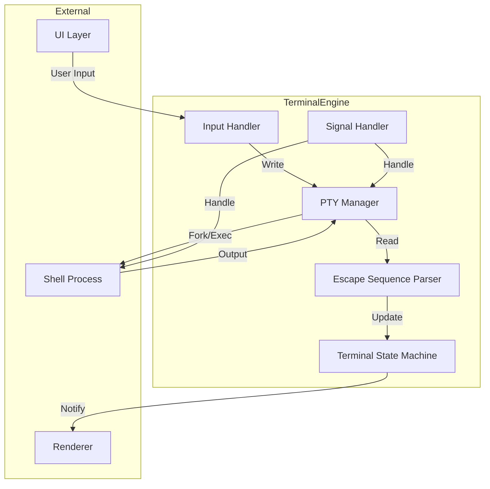
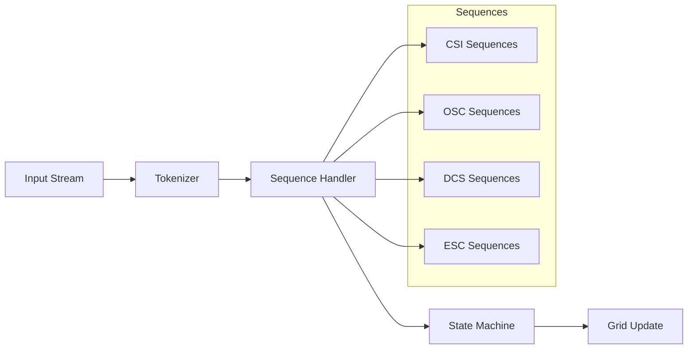

# Spell Caster - Terminal Engine

## Overview

The TerminalEngine module is the core of Spell Caster, responsible for managing PTY sessions, parsing escape sequences, and maintaining terminal state. This document provides the technical specification for implementing a fully-featured terminal emulator.

## Architecture



## PTY Management

### Creating a PTY Session

```swift
import Foundation
import Darwin

/// PTY session manager
final class PTYManager {
    // MARK: - Properties
    
    private(set) var masterFd: Int32 = -1
    private(set) var slaveFd: Int32 = -1
    private(set) var processId: pid_t = -1
    
    private var readSource: DispatchSourceRead?
    private let readQueue = DispatchQueue(label: "com.spellcaster.pty.read", qos: .userInteractive)
    private let writeQueue = DispatchQueue(label: "com.spellcaster.pty.write", qos: .userInteractive)
    
    /// Output callback
    var onOutput: ((Data) -> Void)?
    
    /// Process termination callback
    var onTerminate: ((Int32) -> Void)?
    
    // MARK: - Session Creation
    
    /// Create a new PTY session
    func createSession(
        shell: String,
        environment: [String: String],
        workingDirectory: URL?,
        size: TerminalSize
    ) throws -> PTYSession {
        // Open PTY master/slave pair
        var masterFD: Int32 = -1
        var slaveFD: Int32 = -1
        
        // Use openpty to create the pair
        let result = openpty(&masterFD, &slaveFD, nil, nil, nil)
        guard result == 0 else {
            throw PTYError.openptyFailed(errno: errno)
        }
        
        self.masterFd = masterFD
        self.slaveFd = slaveFD
        
        // Set initial window size
        var winSize = winsize()
        winSize.ws_col = UInt16(size.columns)
        winSize.ws_row = UInt16(size.rows)
        ioctl(masterFD, TIOCSWINSZ, &winSize)
        
        // Fork process
        let pid = fork()
        
        switch pid {
        case -1:
            // Fork failed
            close(masterFD)
            close(slaveFD)
            throw PTYError.forkFailed(errno: errno)
            
        case 0:
            // Child process
            try setupChildProcess(
                slaveFD: slaveFD,
                masterFD: masterFD,
                shell: shell,
                environment: environment,
                workingDirectory: workingDirectory
            )
            
        default:
            // Parent process
            self.processId = pid
            close(slaveFD)
            slaveFd = -1
            
            // Set up read monitoring
            setupReadSource()
            
            // Set up termination monitoring
            setupTerminationMonitor()
            
            return PTYSession(
                processId: pid,
                masterFd: masterFD,
                shellPath: shell,
                environment: environment,
                workingDirectory: workingDirectory
            )
        }
    }
    
    // MARK: - Child Process Setup
    
    private func setupChildProcess(
        slaveFD: Int32,
        masterFD: Int32,
        shell: String,
        environment: [String: String],
        workingDirectory: URL?
    ) throws -> Never {
        // Close master FD in child
        close(masterFD)
        
        // Create new session
        setsid()
        
        // Set controlling terminal
        ioctl(slaveFD, TIOCSCTTY, 0)
        
        // Duplicate slave FD to stdin/stdout/stderr
        dup2(slaveFD, STDIN_FILENO)
        dup2(slaveFD, STDOUT_FILENO)
        dup2(slaveFD, STDERR_FILENO)
        
        // Close original slave FD
        if slaveFD > STDERR_FILENO {
            close(slaveFD)
        }
        
        // Change working directory
        if let wd = workingDirectory {
            chdir(wd.path)
        }
        
        // Set up environment
        for (key, value) in environment {
            setenv(key, value, 1)
        }
        
        // Execute shell
        let shellPath = strdup(shell)
        let args = [shellPath, nil]
        
        execve(shell, args, environ)
        
        // If we get here, exec failed
        _exit(1)
    }
    
    // MARK: - Read Monitoring
    
    private func setupReadSource() {
        readSource = DispatchSource.makeReadSource(
            fileDescriptor: masterFd,
            queue: readQueue
        )
        
        readSource?.setEventHandler { [weak self] in
            self?.readAvailableData()
        }
        
        readSource?.resume()
    }
    
    private func readAvailableData() {
        var buffer = [UInt8](repeating: 0, count: 4096)
        let bytesRead = read(masterFd, &buffer, buffer.count)
        
        guard bytesRead > 0 else {
            if bytesRead == 0 {
                // EOF - process terminated
                handleTermination()
            }
            return
        }
        
        let data = Data(buffer[0..<bytesRead])
        onOutput?(data)
    }
    
    // MARK: - Termination Monitoring
    
    private func setupTerminationMonitor() {
        // Use kqueue to monitor process termination
        let kq = kqueue()
        var ke = kevent(
            ident: UInt(processId),
            filter: Int16(EVFILT_PROC),
            flags: UInt16(EV_ADD | EV_ENABLE),
            fflags: UInt32(NOTE_EXIT),
            data: 0,
            udata: nil
        )
        
        DispatchQueue.global(qos: .default).async { [weak self] in
            while kevent(kq, &ke, 1, &ke, 1, nil) > 0 {
                if ke.filter == Int16(EVFILT_PROC) {
                    var status: Int32 = 0
                    waitpid(self?.processId ?? 0, &status, 0)
                    DispatchQueue.main.async {
                        self?.handleTermination()
                    }
                    break
                }
            }
            close(kq)
        }
    }
    
    private func handleTermination() {
        readSource?.cancel()
        readSource = nil
        
        var status: Int32 = 0
        waitpid(processId, &status, 0)
        
        let exitCode = WIFEXITED(status) ? WEXITSTATUS(status) : -1
        onTerminate?(exitCode)
        
        close(masterFd)
        masterFd = -1
        processId = -1
    }
    
    // MARK: - Writing
    
    func write(_ data: Data) {
        writeQueue.async { [weak self] in
            guard let self = self, self.masterFd >= 0 else { return }
            _ = Darwin.write(self.masterFd, data.bytes, data.count)
        }
    }
    
    func write(_ string: String) {
        if let data = string.data(using: .utf8) {
            write(data)
        }
    }
    
    // MARK: - Window Size
    
    func setWindowSize(columns: Int, rows: Int) {
        var winSize = winsize()
        winSize.ws_col = UInt16(columns)
        winSize.ws_row = UInt16(rows)
        ioctl(masterFd, TIOCSWINSZ, &winSize)
    }
    
    // MARK: - Cleanup
    
    deinit {
        readSource?.cancel()
        if masterFd >= 0 {
            close(masterFd)
        }
        if slaveFd >= 0 {
            close(slaveFd)
        }
    }
}

// MARK: - Errors

enum PTYError: Error, LocalizedError {
    case openptyFailed(errno: Int32)
    case forkFailed(errno: Int32)
    case execFailed(errno: Int32)
    case notRunning
    
    var errorDescription: String? {
        switch self {
        case .openptyFailed(let errno):
            return "Failed to open PTY: \(String(cString: strerror(errno)))"
        case .forkFailed(let errno):
            return "Failed to fork process: \(String(cString: strerror(errno)))"
        case .execFailed(let errno):
            return "Failed to execute shell: \(String(cString: strerror(errno)))"
        case .notRunning:
            return "PTY session is not running"
        }
    }
}
```

## Escape Sequence Parser

### Parser Architecture



### Parser Implementation

```swift
/// Terminal escape sequence parser
final class EscapeSequenceParser {
    // MARK: - Types
    
    typealias OutputHandler = (ParserOutput) -> Void
    
    enum ParserOutput {
        case print(Character)
        case execute(UInt8)
        case csi(CSISequence)
        case osc(OSCSequence)
        case dcs(DCSSequence)
        case esc(ESCSequence)
    }
    
    // MARK: - State Machine
    
    private enum State {
        case ground
        case escape
        case escapeIntermediate
        case csiEntry
        case csiParam
        case csiIntermediate
        case oscString
        case dcsEntry
        case dcsParam
        case dcsIntermediate
        case dcsPassthrough
        case sosString
        case pmString
        case apcString
    }
    
    private var state: State = .ground
    private var currentSequence: Any?
    
    // MARK: - Parsing
    
    func parse(_ data: Data, handler: OutputHandler) {
        for byte in data {
            parse(byte, handler: handler)
        }
    }
    
    func parse(_ byte: UInt8, handler: OutputHandler) {
        switch state {
        case .ground:
            handleGround(byte, handler: handler)
        case .escape:
            handleEscape(byte, handler: handler)
        case .escapeIntermediate:
            handleEscapeIntermediate(byte, handler: handler)
        case .csiEntry:
            handleCSIEntry(byte, handler: handler)
        case .csiParam:
            handleCSIParam(byte, handler: handler)
        case .csiIntermediate:
            handleCSIIntermediate(byte, handler: handler)
        case .oscString:
            handleOSCString(byte, handler: handler)
        case .dcsEntry:
            handleDCSEntry(byte, handler: handler)
        case .dcsParam:
            handleDCSParam(byte, handler: handler)
        case .dcsIntermediate:
            handleDCSIntermediate(byte, handler: handler)
        case .dcsPassthrough:
            handleDCSPassthrough(byte, handler: handler)
        case .sosString, .pmString, .apcString:
            handleStringTerminator(byte)
        }
    }
    
    // MARK: - State Handlers
    
    private func handleGround(_ byte: UInt8, handler: OutputHandler) {
        switch byte {
        case 0x00...0x1F:
            // Control characters
            handler(.execute(byte))
        case 0x20...0x7F:
            // Printable characters
            handler(.print(Character(UnicodeScalar(byte))))
        case 0x80...0x9F:
            // C1 control characters (treated as escape sequences)
            handleC1(byte, handler: handler)
        default:
            // UTF-8 continuation or invalid
            break
        }
    }
    
    private func handleEscape(_ byte: UInt8, handler: OutputHandler) {
        switch byte {
        case 0x30...0x4F, 0x51...0x57, 0x59, 0x5A, 0x5C, 0x60...0x7E:
            // Final character
            let sequence = ESCSequence(finalByte: byte)
            handler(.esc(sequence))
            state = .ground
            
        case 0x5B:
            // CSI
            state = .csiEntry
            currentSequence = CSISequence()
            
        case 0x5D:
            // OSC
            state = .oscString
            currentSequence = OSCSequence()
            
        case 0x50:
            // DCS
            state = .dcsEntry
            currentSequence = DCSSequence()
            
        case 0x58, 0x5E, 0x5F:
            // SOS, PM, APC
            state = byte == 0x58 ? .sosString : (byte == 0x5E ? .pmString : .apcString)
            
        case 0x20...0x2F:
            // Intermediate character
            state = .escapeIntermediate
            
        default:
            state = .ground
        }
    }
    
    private func handleCSIEntry(_ byte: UInt8, handler: OutputHandler) {
        guard var csi = currentSequence as? CSISequence else { return }
        
        switch byte {
        case 0x40...0x7E:
            // Final character
            csi.finalByte = byte
            handler(.csi(csi))
            state = .ground
            
        case 0x30...0x39, 0x3B:
            // Parameter
            csi.parameters.append(Character(UnicodeScalar(byte)))
            currentSequence = csi
            state = .csiParam
            
        case 0x3A:
            // Parameter separator (rarely used)
            csi.parameters.append(":")
            currentSequence = csi
            state = .csiParam
            
        case 0x20...0x2F:
            // Intermediate
            csi.intermediates.append(Character(UnicodeScalar(byte)))
            currentSequence = csi
            state = .csiIntermediate
            
        case 0x3C...0x3F:
            // Private marker
            csi.privateMarker = Character(UnicodeScalar(byte))
            currentSequence = csi
            
        default:
            state = .ground
        }
    }
    
    private func handleCSIParam(_ byte: UInt8, handler: OutputHandler) {
        guard var csi = currentSequence as? CSISequence else { return }
        
        switch byte {
        case 0x30...0x39, 0x3A, 0x3B:
            // Parameter continuation
            csi.parameters.append(Character(UnicodeScalar(byte)))
            currentSequence = csi
            
        case 0x20...0x2F:
            // Intermediate
            csi.intermediates.append(Character(UnicodeScalar(byte)))
            currentSequence = csi
            state = .csiIntermediate
            
        case 0x40...0x7E:
            // Final
            csi.finalByte = byte
            handler(.csi(csi))
            state = .ground
            
        default:
            state = .ground
        }
    }
    
    private func handleOSCString(_ byte: UInt8, handler: OutputHandler) {
        guard var osc = currentSequence as? OSCSequence else { return }
        
        switch byte {
        case 0x07:
            // BEL terminates
            handler(.osc(osc))
            state = .ground
            
        case 0x5C:
            // ST terminates (if preceded by ESC)
            handler(.osc(osc))
            state = .ground
            
        default:
            osc.data.append(Character(UnicodeScalar(byte)))
            currentSequence = osc
        }
    }
    
    // Additional handlers omitted for brevity...
}

// MARK: - Sequence Types

struct CSISequence {
    var privateMarker: Character?
    var parameters: String = ""
    var intermediates: String = ""
    var finalByte: UInt8 = 0
    
    var parameterList: [Int] {
        parameters.split(separator: ";").compactMap { Int($0) }
    }
}

struct OSCSequence {
    var data: String = ""
    
    var command: Int? {
        let parts = data.split(separator: ";", maxSplits: 1)
        return Int(parts.first ?? "")
    }
    
    var payload: String? {
        let parts = data.split(separator: ";", maxSplits: 1)
        return parts.count > 1 ? String(parts[1]) : nil
    }
}

struct DCSSequence {
    var parameters: String = ""
    var data: String = ""
    var finalByte: UInt8 = 0
}

struct ESCSequence {
    let finalByte: UInt8
    
    var command: Character {
        Character(UnicodeScalar(finalByte))
    }
}
```

### CSI Sequence Handler

```swift
/// CSI sequence handler
final class CSIHandler {
    private weak var state: TerminalState?
    
    init(state: TerminalState) {
        self.state = state
    }
    
    func handle(_ sequence: CSISequence) {
        guard let state = state else { return }
        
        let params = sequence.parameterList
        let cmd = Character(UnicodeScalar(sequence.finalByte))
        
        switch cmd {
        // Cursor movement
        case "A": // CUU - Cursor Up
            state.moveCursorUp(params.first ?? 1)
        case "B": // CUD - Cursor Down
            state.moveCursorDown(params.first ?? 1)
        case "C": // CUF - Cursor Forward
            state.moveCursorForward(params.first ?? 1)
        case "D": // CUB - Cursor Back
            state.moveCursorBack(params.first ?? 1)
        case "E": // CNL - Cursor Next Line
            state.cursorNextLine(params.first ?? 1)
        case "F": // CPL - Cursor Previous Line
            state.cursorPreviousLine(params.first ?? 1)
        case "G": // CHA - Cursor Horizontal Absolute
            state.setCursorColumn((params.first ?? 1) - 1)
        case "H", "f": // CUP - Cursor Position
            state.setCursorPosition(
                row: (params.first ?? 1) - 1,
                column: (params.count > 1 ? params[1] : 1) - 1
            )
        case "J": // ED - Erase Display
            handleEraseDisplay(params.first ?? 0)
        case "K": // EL - Erase Line
            handleEraseLine(params.first ?? 0)
        case "L": // IL - Insert Lines
            state.insertLines(params.first ?? 1)
        case "M": // DL - Delete Lines
            state.deleteLines(params.first ?? 1)
        case "P": // DCH - Delete Characters
            state.deleteCharacters(params.first ?? 1)
        case "@": // ICH - Insert Characters
            state.insertCharacters(params.first ?? 1)
        case "S": // SU - Scroll Up
            state.scrollUp(params.first ?? 1)
        case "T": // SD - Scroll Down
            state.scrollDown(params.first ?? 1)
        case "X": // ECH - Erase Characters
            state.eraseCharacters(params.first ?? 1)
        case "d": // VPA - Vertical Position Absolute
            state.setCursorRow((params.first ?? 1) - 1)
        case "m": // SGR - Select Graphic Rendition
            handleSGR(params)
        case "r": // DECSTBM - Set Scrolling Region
            state.setScrollRegion(
                top: (params.first ?? 1) - 1,
                bottom: (params.count > 1 ? params[1] : state.rows) - 1
            )
        case "s": // SCP - Save Cursor Position
            state.saveCursorPosition()
        case "u": // RCP - Restore Cursor Position
            state.restoreCursorPosition()
        case "h": // SM - Set Mode
            handleSetMode(params, privateMarker: sequence.privateMarker)
        case "l": // RM - Reset Mode
            handleResetMode(params, privateMarker: sequence.privateMarker)
        case "n": // DSR - Device Status Report
            handleDeviceStatusReport(params)
        case "c": // DA - Device Attributes
            handleDeviceAttributes()
        default:
            // Unknown or unimplemented
            break
        }
    }
    
    // MARK: - SGR Handler
    
    private func handleSGR(_ params: [Int]) {
        guard let state = state else { return }
        
        if params.isEmpty {
            state.resetAttributes()
            return
        }
        
        var i = 0
        while i < params.count {
            let p = params[i]
            
            switch p {
            case 0:
                state.resetAttributes()
            case 1:
                state.setBold(true)
            case 2:
                state.setDim(true)
            case 3:
                state.setItalic(true)
            case 4:
                state.setUnderline(true)
            case 5, 6:
                state.setBlinking(true)
            case 7:
                state.setInverse(true)
            case 8:
                state.setHidden(true)
            case 9:
                state.setStrikethrough(true)
            case 22:
                state.setBold(false)
                state.setDim(false)
            case 23:
                state.setItalic(false)
            case 24:
                state.setUnderline(false)
            case 25:
                state.setBlinking(false)
            case 27:
                state.setInverse(false)
            case 28:
                state.setHidden(false)
            case 29:
                state.setStrikethrough(false)
            case 30...37:
                state.setForegroundColor(.ansi(p - 30))
            case 38:
                // Extended foreground color
                if i + 1 < params.count {
                    if params[i + 1] == 5 && i + 2 < params.count {
                        // 256-color
                        state.setForegroundColor(.ansi(params[i + 2]))
                        i += 2
                    } else if params[i + 1] == 2 && i + 4 < params.count {
                        // True color
                        let r = params[i + 2]
                        let g = params[i + 3]
                        let b = params[i + 4]
                        state.setForegroundColor(.trueColor(Color(red: Double(r)/255, green: Double(g)/255, blue: Double(b)/255)))
                        i += 4
                    }
                }
            case 39:
                state.setForegroundColor(.defaultForeground)
            case 40...47:
                state.setBackgroundColor(.ansi(p - 40))
            case 48:
                // Extended background color
                if i + 1 < params.count {
                    if params[i + 1] == 5 && i + 2 < params.count {
                        state.setBackgroundColor(.ansi(params[i + 2]))
                        i += 2
                    } else if params[i + 1] == 2 && i + 4 < params.count {
                        let r = params[i + 2]
                        let g = params[i + 3]
                        let b = params[i + 4]
                        state.setBackgroundColor(.trueColor(Color(red: Double(r)/255, green: Double(g)/255, blue: Double(b)/255)))
                        i += 4
                    }
                }
            case 49:
                state.setBackgroundColor(.defaultBackground)
            case 90...97:
                state.setForegroundColor(.ansi(p - 90 + 8))
            case 100...107:
                state.setBackgroundColor(.ansi(p - 100 + 8))
            default:
                break
            }
            
            i += 1
        }
    }
    
    // Additional handlers...
}
```

## Terminal State Machine

### State Management

```swift
/// Terminal state machine
final class TerminalState: @unchecked Sendable {
    // MARK: - Grid State
    
    private(set) var grid: TerminalGrid
    private(set) var columns: Int
    private(set) var rows: Int
    
    // MARK: - Cursor State
    
    private(set) var cursorX: Int = 0
    private(set) var cursorY: Int = 0
    private var savedCursorX: Int = 0
    private var savedCursorY: Int = 0
    
    // MARK: - Attributes
    
    private(set) var currentAttributes: CellAttributes = CellAttributes()
    
    // MARK: - Scroll Region
    
    private(set) var scrollTop: Int = 0
    private(set) var scrollBottom: Int
    
    // MARK: - Modes
    
    private(set) var modes: TerminalModes = TerminalModes()
    
    // MARK: - Tabs
    
    private var tabStops: Set<Int> = []
    
    // MARK: - Thread Safety
    
    private let lock = NSLock()
    
    // MARK: - Initialization
    
    init(columns: Int = 80, rows: Int = 24) {
        self.columns = columns
        self.rows = rows
        self.grid = TerminalGrid(columns: columns, rows: rows)
        self.scrollBottom = rows - 1
        
        // Initialize default tab stops (every 8 columns)
        for i in stride(from: 0, to: columns, by: 8) {
            tabStops.insert(i)
        }
    }
    
    // MARK: - Cursor Movement
    
    func moveCursorUp(_ count: Int = 1) {
        lock.lock()
        defer { lock.unlock() }
        cursorY = max(scrollTop, cursorY - count)
    }
    
    func moveCursorDown(_ count: Int = 1) {
        lock.lock()
        defer { lock.unlock() }
        cursorY = min(scrollBottom, cursorY + count)
    }
    
    func moveCursorForward(_ count: Int = 1) {
        lock.lock()
        defer { lock.unlock() }
        cursorX = min(columns - 1, cursorX + count)
    }
    
    func moveCursorBack(_ count: Int = 1) {
        lock.lock()
        defer { lock.unlock() }
        cursorX = max(0, cursorX - count)
    }
    
    func setCursorPosition(row: Int, column: Int) {
        lock.lock()
        defer { lock.unlock() }
        cursorY = min(max(0, row), rows - 1)
        cursorX = min(max(0, column), columns - 1)
    }
    
    func setCursorColumn(_ column: Int) {
        lock.lock()
        defer { lock.unlock() }
        cursorX = min(max(0, column), columns - 1)
    }
    
    func setCursorRow(_ row: Int) {
        lock.lock()
        defer { lock.unlock() }
        cursorY = min(max(0, row), rows - 1)
    }
    
    func saveCursorPosition() {
        lock.lock()
        defer { lock.unlock() }
        savedCursorX = cursorX
        savedCursorY = cursorY
    }
    
    func restoreCursorPosition() {
        lock.lock()
        defer { lock.unlock() }
        cursorX = savedCursorX
        cursorY = savedCursorY
    }
    
    // MARK: - Character Output
    
    func putCharacter(_ char: Character) {
        lock.lock()
        defer { lock.unlock() }
        
        // Handle wide characters
        let isWide = char.isWideCharacter
        if isWide && cursorX >= columns - 1 {
            // Not enough room for wide character
            cursorX = 0
            cursorY += 1
            if cursorY > scrollBottom {
                scrollUp()
                cursorY = scrollBottom
            }
        }
        
        // Put the character
        grid[cursorY, cursorX] = TerminalCell(
            character: char,
            attributes: currentAttributes,
            style: CellStyle(isWide: isWide)
        )
        
        // Advance cursor
        cursorX += isWide ? 2 : 1
        
        // Handle line wrap
        if cursorX >= columns {
            if modes.autoWrap {
                cursorX = 0
                cursorY += 1
                if cursorY > scrollBottom {
                    scrollUp()
                    cursorY = scrollBottom
                }
            } else {
                cursorX = columns - 1
            }
        }
    }
    
    // MARK: - Scrolling
    
    func scrollUp(_ count: Int = 1) {
        lock.lock()
        defer { lock.unlock() }
        
        for _ in 0..<count {
            // Move lines up within scroll region
            for row in scrollTop..<scrollBottom {
                for col in 0..<columns {
                    grid[row, col] = grid[row + 1, col]
                }
            }
            
            // Clear bottom line
            for col in 0..<columns {
                grid[scrollBottom, col] = TerminalCell()
            }
        }
    }
    
    func scrollDown(_ count: Int = 1) {
        lock.lock()
        defer { lock.unlock() }
        
        for _ in 0..<count {
            // Move lines down within scroll region
            for row in stride(from: scrollBottom, through: scrollTop + 1, by: -1) {
                for col in 0..<columns {
                    grid[row, col] = grid[row - 1, col]
                }
            }
            
            // Clear top line
            for col in 0..<columns {
                grid[scrollTop, col] = TerminalCell()
            }
        }
    }
    
    // MARK: - Erasing
    
    func eraseDisplay(_ mode: Int) {
        lock.lock()
        defer { lock.unlock() }
        
        switch mode {
        case 0: // Erase from cursor to end
            // Clear rest of current line
            for col in cursorX..<columns {
                grid[cursorY, col] = TerminalCell()
            }
            // Clear lines below
            for row in (cursorY + 1)..<rows {
                for col in 0..<columns {
                    grid[row, col] = TerminalCell()
                }
            }
        case 1: // Erase from start to cursor
            // Clear lines above
            for row in 0..<cursorY {
                for col in 0..<columns {
                    grid[row, col] = TerminalCell()
                }
            }
            // Clear start of current line
            for col in 0...cursorX {
                grid[cursorY, col] = TerminalCell()
            }
        case 2, 3: // Erase entire display
            for row in 0..<rows {
                for col in 0..<columns {
                    grid[row, col] = TerminalCell()
                }
            }
        default:
            break
        }
    }
    
    func eraseLine(_ mode: Int) {
        lock.lock()
        defer { lock.unlock() }
        
        switch mode {
        case 0: // Erase from cursor to end
            for col in cursorX..<columns {
                grid[cursorY, col] = TerminalCell()
            }
        case 1: // Erase from start to cursor
            for col in 0...cursorX {
                grid[cursorY, col] = TerminalCell()
            }
        case 2: // Erase entire line
            for col in 0..<columns {
                grid[cursorY, col] = TerminalCell()
            }
        default:
            break
        }
    }
    
    // MARK: - Resize
    
    func resize(columns: Int, rows: Int) {
        lock.lock()
        defer { lock.unlock() }
        
        self.columns = columns
        self.rows = rows
        grid.resize(columns: columns, rows: rows)
        scrollBottom = rows - 1
        
        // Adjust cursor if needed
        cursorX = min(cursorX, columns - 1)
        cursorY = min(cursorY, rows - 1)
    }
    
    // MARK: - Attributes
    
    func resetAttributes() {
        lock.lock()
        defer { lock.unlock() }
        currentAttributes = CellAttributes()
    }
    
    func setBold(_ value: Bool) {
        lock.lock()
        defer { lock.unlock() }
        currentAttributes.isBold = value
    }
    
    func setForegroundColor(_ color: ColorIndex) {
        lock.lock()
        defer { lock.unlock() }
        currentAttributes.foreground = color
    }
    
    func setBackgroundColor(_ color: ColorIndex) {
        lock.lock()
        defer { lock.unlock() }
        currentAttributes.background = color
    }
    
    // Additional attribute setters...
}

// MARK: - Terminal Modes

struct TerminalModes {
    // Cursor modes
    var cursorVisible: Bool = true
    var cursorBlinking: Bool = true
    
    // Input modes
    var applicationCursorKeys: Bool = false
    var applicationKeypad: Bool = false
    
    // Display modes
    var autoWrap: Bool = true
    var originMode: Bool = false
    
    // Special modes
    var bracketedPaste: Bool = false
    var focusTracking: Bool = false
    var alternateScreenBuffer: Bool = false
    
    // Mouse modes
    var mouseTracking: MouseTrackingMode = .none
}

enum MouseTrackingMode: Int {
    case none = 0
    case x10 = 9
    case normal = 1000
    case buttonEvent = 1002
    case anyEvent = 1003
}

// MARK: - Character Extensions

extension Character {
    var isWideCharacter: Bool {
        guard let scalar = unicodeScalars.first else { return false }
        
        // Wide character ranges
        if scalar.value >= 0x1100 && scalar.value <= 0x115F { return true }
        if scalar.value >= 0x2329 && scalar.value <= 0x232A { return true }
        if scalar.value >= 0x2E80 && scalar.value <= 0x303E { return true }
        if scalar.value >= 0x3040 && scalar.value <= 0xA4CF { return true }
        if scalar.value >= 0xAC00 && scalar.value <= 0xD7A3 { return true }
        if scalar.value >= 0xF900 && scalar.value <= 0xFAFF { return true }
        if scalar.value >= 0xFE10 && scalar.value <= 0xFE1F { return true }
        if scalar.value >= 0xFE30 && scalar.value <= 0xFE6F { return true }
        if scalar.value >= 0xFF00 && scalar.value <= 0xFF60 { return true }
        if scalar.value >= 0xFFE0 && scalar.value <= 0xFFE6 { return true }
        if scalar.value >= 0x20000 && scalar.value <= 0x2FFFD { return true }
        if scalar.value >= 0x30000 && scalar.value <= 0x3FFFD { return true }
        
        return false
    }
}
```

## Input Handling

### Keyboard Input

```swift
/// Terminal input handler
final class InputHandler {
    private weak var pty: PTYManager?
    private weak var state: TerminalState?
    
    init(pty: PTYManager, state: TerminalState) {
        self.pty = pty
        self.state = state
    }
    
    // MARK: - Keyboard Input
    
    func sendKey(_ event: KeyEvent) {
        guard let pty = pty else { return }
        
        var data = Data()
        
        // Check for modifier keys
        let modifiers = event.modifiers
        let isOption = modifiers.contains(.option)
        let isCommand = modifiers.contains(.command)
        
        // Handle special keys
        switch event.key {
        case .enter, .return:
            data.append(contentsOf: [0x0D])
            
        case .tab:
            data.append(contentsOf: [0x09])
            
        case .delete, .backspace:
            let del = state?.modes.backspaceSendsDelete ?? false
            data.append(contentsOf: [del ? 0x7F : 0x08])
            
        case .escape:
            data.append(contentsOf: [0x1B])
            
        case .arrowUp:
            data.append(contentsOf: cursorKeySequence("A", modifiers: modifiers))
            
        case .arrowDown:
            data.append(contentsOf: cursorKeySequence("B", modifiers: modifiers))
            
        case .arrowRight:
            data.append(contentsOf: cursorKeySequence("C", modifiers: modifiers))
            
        case .arrowLeft:
            data.append(contentsOf: cursorKeySequence("D", modifiers: modifiers))
            
        case .home:
            data.append(contentsOf: cursorKeySequence("H", modifiers: modifiers))
            
        case .end:
            data.append(contentsOf: cursorKeySequence("F", modifiers: modifiers))
            
        case .pageUp:
            data.append(contentsOf: [0x1B, 0x5B, 0x35, 0x7E])
            
        case .pageDown:
            data.append(contentsOf: [0x1B, 0x5B, 0x36, 0x7E])
            
        case .functionKey(let num):
            data.append(contentsOf: functionKeySequence(num))
            
        case .character(let char):
            if isOption {
                // Option key sends escape prefix
                data.append(contentsOf: [0x1B])
            }
            if let charData = String(char).data(using: .utf8) {
                data.append(charData)
            }
        }
        
        if !data.isEmpty {
            pty.write(data)
        }
    }
    
    private func cursorKeySequence(_ final: String, modifiers: NSEvent.ModifierFlags) -> [UInt8] {
        guard let state = state else { return [] }
        
        var sequence: [UInt8] = [0x1B] // ESC
        
        if state.modes.applicationCursorKeys {
            sequence.append(0x4F) // O
            sequence.append(contentsOf: final.utf8)
        } else {
            sequence.append(0x5B) // [
            
            // Add modifier prefix if needed
            if modifiers.contains(.shift) || modifiers.contains(.option) || modifiers.contains(.control) {
                let mod = modifierValue(modifiers)
                sequence.append(contentsOf: "1;\(mod)".utf8)
            }
            
            sequence.append(contentsOf: final.utf8)
        }
        
        return sequence
    }
    
    private func modifierValue(_ modifiers: NSEvent.ModifierFlags) -> Int {
        var value = 1
        if modifiers.contains(.shift) { value += 1 }
        if modifiers.contains(.option) { value += 2 }
        if modifiers.contains(.control) { value += 4 }
        return value
    }
    
    private func functionKeySequence(_ num: Int) -> [UInt8] {
        switch num {
        case 1: return [0x1B, 0x4F, 0x50]      // F1: ESC O P
        case 2: return [0x1B, 0x4F, 0x51]      // F2: ESC O Q
        case 3: return [0x1B, 0x4F, 0x52]      // F3: ESC O R
        case 4: return [0x1B, 0x4F, 0x53]      // F4: ESC O S
        case 5: return [0x1B, 0x5B, 0x31, 0x35, 0x7E]  // F5
        case 6: return [0x1B, 0x5B, 0x31, 0x37, 0x7E]  // F6
        case 7: return [0x1B, 0x5B, 0x31, 0x38, 0x7E]  // F7
        case 8: return [0x1B, 0x5B, 0x31, 0x39, 0x7E]  // F8
        case 9: return [0x1B, 0x5B, 0x32, 0x30, 0x7E]  // F9
        case 10: return [0x1B, 0x5B, 0x32, 0x31, 0x7E] // F10
        case 11: return [0x1B, 0x5B, 0x32, 0x33, 0x7E] // F11
        case 12: return [0x1B, 0x5B, 0x32, 0x34, 0x7E] // F12
        default: return []
        }
    }
    
    // MARK: - Bracketed Paste
    
    func beginPaste() {
        guard let pty = pty, state?.modes.bracketedPaste == true else { return }
        pty.write(Data([0x1B, 0x5B, 0x32, 0x30, 0x30, 0x7E])) // ESC [ 2 0 0 ~
    }
    
    func endPaste() {
        guard let pty = pty, state?.modes.bracketedPaste == true else { return }
        pty.write(Data([0x1B, 0x5B, 0x32, 0x30, 0x31, 0x7E])) // ESC [ 2 0 1 ~
    }
    
    func paste(_ text: String) {
        guard let pty = pty else { return }
        
        if state?.modes.bracketedPaste == true {
            beginPaste()
        }
        
        pty.write(text)
        
        if state?.modes.bracketedPaste == true {
            endPaste()
        }
    }
}

// MARK: - Key Event

struct KeyEvent {
    enum Key {
        case character(Character)
        case enter
        case `return`
        case tab
        case delete
        case backspace
        case escape
        case arrowUp
        case arrowDown
        case arrowLeft
        case arrowRight
        case home
        case end
        case pageUp
        case pageDown
        case functionKey(Int)
    }
    
    let key: Key
    let modifiers: NSEvent.ModifierFlags
    let characters: String?
    let charactersIgnoringModifiers: String?
}
```

### Mouse Input

```swift
/// Mouse input handler
final class MouseHandler {
    private weak var pty: PTYManager?
    private weak var state: TerminalState?
    
    init(pty: PTYManager, state: TerminalState) {
        self.pty = pty
        self.state = state
    }
    
    func handleMouseEvent(
        type: MouseEventType,
        button: MouseButton,
        position: CGPoint,
        modifiers: NSEvent.ModifierFlags
    ) {
        guard let pty = pty,
              let state = state,
              state.modes.mouseTracking != .none else { return }
        
        let col = Int(position.x)
        let row = Int(position.y)
        
        // Clamp to terminal bounds
        let clampedCol = min(max(col + 1, 1), state.columns)
        let clampedRow = min(max(row + 1, 1), state.rows)
        
        // Build mouse event code
        var code = 0
        
        // Button
        switch button {
        case .left: code = 0
        case .middle: code = 1
        case .right: code = 2
        case .none: code = 3
        case .scrollUp: code = 64
        case .scrollDown: code = 65
        }
        
        // Modifiers
        if modifiers.contains(.shift) { code += 4 }
        if modifiers.contains(.option) { code += 8 }
        if modifiers.contains(.control) { code += 16 }
        
        // Event type prefix
        let prefix: String
        switch type {
        case .down: prefix = "M"
        case .up: prefix = "M"
        case .drag: prefix = "M"
        case .motion: prefix = "M"
        case .scroll: prefix = "M"
        }
        
        // Encode and send
        let sequence: String
        if state.modes.mouseTracking == .x10 {
            // X10 mode: only button press
            if type == .down {
                sequence = "\u{1B}[M\(UnicodeScalar(code + 32)!)\(UnicodeScalar(clampedCol + 32)!)\(UnicodeScalar(clampedRow + 32)!)"
            } else {
                return
            }
        } else {
            // Extended mode
            if type == .up {
                code += 3 // Release
            } else if type == .drag {
                code += 32 // Motion with button held
            } else if type == .motion && button == .none {
                code = 35 // Motion without button
            }
            
            sequence = "\u{1B}[M\(UnicodeScalar(code + 32)!)\(UnicodeScalar(clampedCol + 32)!)\(UnicodeScalar(clampedRow + 32)!)"
        }
        
        pty.write(sequence)
    }
}

enum MouseEventType {
    case down
    case up
    case drag
    case motion
    case scroll
}

enum MouseButton {
    case left
    case middle
    case right
    case none
    case scrollUp
    case scrollDown
}
```

## Signal Handling

```swift
/// Signal handler for terminal
final class SignalHandler {
    private weak var pty: PTYManager?
    private weak var state: TerminalState?
    
    init(pty: PTYManager, state: TerminalState) {
        self.pty = pty
        self.state = state
    }
    
    // MARK: - Signal Sending
    
    func sendInterrupt() {
        // SIGINT (Ctrl+C)
        pty?.write(Data([0x03]))
    }
    
    func sendSuspend() {
        // SIGTSTP (Ctrl+Z)
        pty?.write(Data([0x1A]))
    }
    
    func sendQuit() {
        // SIGQUIT (Ctrl+\)
        pty?.write(Data([0x1C]))
    }
    
    func sendEOF() {
        // EOF (Ctrl+D)
        pty?.write(Data([0x04]))
    }
    
    // MARK: - Window Size Change
    
    func handleResize(columns: Int, rows: Int) {
        pty?.setWindowSize(columns: columns, rows: rows)
        state?.resize(columns: columns, rows: rows)
    }
}
```

## Unicode Handling

### UTF-8 Decoder

```swift
/// UTF-8 decoder for terminal input
final class UTF8Decoder {
    private var buffer: [UInt8] = []
    private var expectedLength: Int = 0
    
    func decode(_ byte: UInt8) -> Character? {
        if expectedLength == 0 {
            // Start of new sequence
            if byte & 0x80 == 0 {
                // ASCII
                return Character(UnicodeScalar(byte))
            } else if byte & 0xE0 == 0xC0 {
                // 2-byte sequence
                expectedLength = 1
                buffer = [byte]
            } else if byte & 0xF0 == 0xE0 {
                // 3-byte sequence
                expectedLength = 2
                buffer = [byte]
            } else if byte & 0xF8 == 0xF0 {
                // 4-byte sequence
                expectedLength = 3
                buffer = [byte]
            } else {
                // Invalid start byte
                return nil
            }
        } else {
            // Continuation byte
            if byte & 0xC0 == 0x80 {
                buffer.append(byte)
                expectedLength -= 1
                
                if expectedLength == 0 {
                    // Complete sequence
                    if let scalar = decodeBuffer() {
                        return Character(scalar)
                    }
                }
            } else {
                // Invalid continuation
                buffer = []
                expectedLength = 0
                return nil
            }
        }
        
        return nil
    }
    
    private func decodeBuffer() -> UnicodeScalar? {
        guard !buffer.isEmpty else { return nil }
        
        var codePoint: UInt32 = 0
        
        switch buffer.count {
        case 2:
            codePoint = UInt32(buffer[0] & 0x1F) << 6
            codePoint |= UInt32(buffer[1] & 0x3F)
        case 3:
            codePoint = UInt32(buffer[0] & 0x0F) << 12
            codePoint |= UInt32(buffer[1] & 0x3F) << 6
            codePoint |= UInt32(buffer[2] & 0x3F)
        case 4:
            codePoint = UInt32(buffer[0] & 0x07) << 18
            codePoint |= UInt32(buffer[1] & 0x3F) << 12
            codePoint |= UInt32(buffer[2] & 0x3F) << 6
            codePoint |= UInt32(buffer[3] & 0x3F)
        default:
            return nil
        }
        
        buffer = []
        
        return UnicodeScalar(codePoint)
    }
    
    func reset() {
        buffer = []
        expectedLength = 0
    }
}
```

### Combining Characters

```swift
/// Combining character handler
final class CombiningCharacterHandler {
    private var baseCharacter: Character?
    private var combiningMarks: [Character] = []
    
    func addCharacter(_ char: Character) -> Character? {
        if char.isCombiningMark {
            combiningMarks.append(char)
            return nil
        } else {
            let result = combine()
            baseCharacter = char
            combiningMarks = []
            return result
        }
    }
    
    func flush() -> Character? {
        return combine()
    }
    
    private func combine() -> Character? {
        guard let base = baseCharacter, !combiningMarks.isEmpty else {
            return baseCharacter
        }
        
        // Build combined character
        var combined = String(base)
        for mark in combiningMarks {
            combined.append(mark)
        }
        
        // Normalize
        let normalized = combined.precomposedStringWithCanonicalMapping
        return normalized.first
    }
}

extension Character {
    var isCombiningMark: Bool {
        guard let scalar = unicodeScalars.first else { return false }
        return CharacterSet.combiningDiacriticalMarks.contains(scalar)
    }
}
```

## Shell Integration

### Semantic Prompts

```swift
/// Shell integration handler
final class ShellIntegrationHandler {
    private weak var state: TerminalState?
    private weak var shellState: ShellIntegrationState?
    
    // Shell integration markers
    private let OSC7_PREFIX = "7;"  // Working directory
    private let OSC133_PREFIX = "133;"  // Semantic prompts
    
    init(state: TerminalState, shellState: ShellIntegrationState) {
        self.state = state
        self.shellState = shellState
    }
    
    func handleOSC(_ osc: OSCSequence) {
        guard let command = osc.command,
              let payload = osc.payload else { return }
        
        switch command {
        case 7:
            // OSC 7: Working directory
            handleWorkingDirectory(payload)
        case 133:
            // OSC 133: Semantic prompts
            handleSemanticPrompt(payload)
        default:
            break
        }
    }
    
    private func handleWorkingDirectory(_ payload: String) {
        // Format: file://host/path
        if let url = URL(string: payload) {
            shellState?.currentWorkingDirectory = url
        }
    }
    
    private func handleSemanticPrompt(_ payload: String) {
        let parts = payload.split(separator: ";", maxSplits: 1)
        guard let type = parts.first else { return }
        
        let marker: ShellMarker
        switch type {
        case "A":
            marker = ShellMarker(type: .promptStart, content: nil, exitCode: nil)
        case "B":
            marker = ShellMarker(type: .commandStart, content: parts.count > 1 ? String(parts[1]) : nil, exitCode: nil)
        case "C":
            marker = ShellMarker(type: .commandExecuted, content: nil, exitCode: nil)
        case "D":
            let exitCode = parts.count > 1 ? Int(parts[1]) : nil
            marker = ShellMarker(type: .commandFinished, content: nil, exitCode: exitCode)
        default:
            return
        }
        
        shellState?.updateFromMarker(marker)
    }
}
```

## Summary

The TerminalEngine module provides:

| Component | Purpose |
|-----------|---------|
| [`PTYManager`](#pty-management) | Fork/exec shell processes, manage file descriptors |
| [`EscapeSequenceParser`](#escape-sequence-parser) | Parse ANSI/VT100/VT220/xterm sequences |
| [`TerminalState`](#terminal-state-machine) | Maintain terminal grid and cursor state |
| [`InputHandler`](#keyboard-input) | Handle keyboard and mouse input |
| [`SignalHandler`](#signal-handling) | Send signals to shell process |
| [`UTF8Decoder`](#utf-8-decoder) | Decode UTF-8 input streams |
| [`ShellIntegrationHandler`](#shell-integration) | Parse semantic prompt markers |

## Next Steps

Continue to [04-rendering-layer.md](04-rendering-layer.md) for the rendering layer specification.
