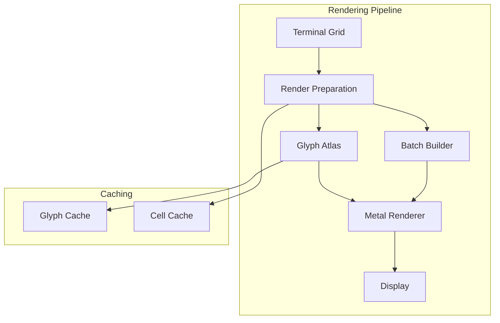

# Spell Caster - Rendering Layer

## Overview

The Rendering Layer is responsible for high-performance visualization of terminal content using Metal and CoreText. This document specifies the architecture for rendering terminal grids with support for 100k+ lines of scrollback, smooth scrolling, and rich text attributes.

## Architecture



## Metal Renderer

### Renderer Core

```swift
import Metal
import MetalKit
import CoreText

/// High-performance Metal-based terminal renderer
final class MetalTerminalRenderer {
    // MARK: - Metal Resources
    
    private let device: MTLDevice
    private let commandQueue: MTLCommandQueue
    private var pipelineState: MTLRenderPipelineState!
    private var depthState: MTLDepthStencilState!
    
    // MARK: - Rendering Resources
    
    private var glyphAtlas: GlyphAtlas
    private var cellBuffer: MTLBuffer?
    private var uniformBuffer: MTLBuffer?
    
    // MARK: - Configuration
    
    private var cellSize: CGSize
    private var gridSize: TerminalSize
    private var colorScheme: ColorScheme
    
    // MARK: - Performance
    
    private var frameCount: Int = 0
    private var lastFrameTime: CFTimeInterval = 0
    
    // MARK: - Initialization
    
    init(device: MTLDevice, colorScheme: ColorScheme) throws {
        self.device = device
        guard let queue = device.makeCommandQueue() else {
            throw RendererError.failedToCreateCommandQueue
        }
        self.commandQueue = queue
        self.colorScheme = colorScheme
        self.cellSize = CGSize(width: 10, height: 20)
        self.gridSize = TerminalSize(columns: 80, rows: 24)
        self.glyphAtlas = try GlyphAtlas(device: device)
        
        try setupPipeline()
    }
    
    // MARK: - Pipeline Setup
    
    private func setupPipeline() throws {
        // Load shaders
        guard let library = device.makeDefaultLibrary() else {
            throw RendererError.failedToLoadShaders
        }
        
        guard let vertexFunction = library.makeFunction(name: "terminalVertexShader"),
              let fragmentFunction = library.makeFunction(name: "terminalFragmentShader") else {
            throw RendererError.failedToLoadShaders
        }
        
        // Create pipeline descriptor
        let pipelineDescriptor = MTLRenderPipelineDescriptor()
        pipelineDescriptor.vertexFunction = vertexFunction
        pipelineDescriptor.fragmentFunction = fragmentFunction
        pipelineDescriptor.colorAttachments[0].pixelFormat = .bgra8Unorm
        
        // Enable blending for transparency
        pipelineDescriptor.colorAttachments[0].isBlendingEnabled = true
        pipelineDescriptor.colorAttachments[0].rgbBlendOperation = .add
        pipelineDescriptor.colorAttachments[0].alphaBlendOperation = .add
        pipelineDescriptor.colorAttachments[0].sourceRGBBlendFactor = .sourceAlpha
        pipelineDescriptor.colorAttachments[0].sourceAlphaBlendFactor = .sourceAlpha
        pipelineDescriptor.colorAttachments[0].destinationRGBBlendFactor = .oneMinusSourceAlpha
        pipelineDescriptor.colorAttachments[0].destinationAlphaBlendFactor = .oneMinusSourceAlpha
        
        pipelineState = try device.makeRenderPipelineState(descriptor: pipelineDescriptor)
        
        // Create depth stencil state
        let depthDescriptor = MTLDepthStencilDescriptor()
        depthDescriptor.depthCompareFunction = .less
        depthDescriptor.isDepthWriteEnabled = true
        depthState = device.makeDepthStencilState(descriptor: depthDescriptor)
    }
    
    // MARK: - Rendering
    
    func render(
        grid: TerminalGrid,
        scrollOffset: Int,
        selection: Selection?,
        cursor: CursorPosition,
        viewport: CGRect,
        drawable: CAMetalDrawable
    ) throws {
        let startTime = CACurrentMediaTime()
        
        // Create command buffer
        guard let commandBuffer = commandQueue.makeCommandBuffer() else {
            throw RendererError.failedToCreateCommandBuffer
        }
        
        // Create render pass
        let renderPassDescriptor = MTLRenderPassDescriptor()
        renderPassDescriptor.colorAttachments[0].texture = drawable.texture
        renderPassDescriptor.colorAttachments[0].loadAction = .clear
        renderPassDescriptor.colorAttachments[0].clearColor = MTLClearColor(
            red: Double(colorScheme.background.components.red),
            green: Double(colorScheme.background.components.green),
            blue: Double(colorScheme.background.components.blue),
            alpha: 1.0
        )
        renderPassDescriptor.colorAttachments[0].storeAction = .store
        
        guard let renderEncoder = commandBuffer.makeRenderCommandEncoder(descriptor: renderPassDescriptor) else {
            throw RendererError.failedToCreateRenderEncoder
        }
        
        renderEncoder.setRenderPipelineState(pipelineState)
        
        // Update uniforms
        var uniforms = Uniforms(
            viewportSize: SIMD2<Float>(Float(viewport.width), Float(viewport.height)),
            cellSize: SIMD2<Float>(Float(cellSize.width), Float(cellSize.height)),
            scrollOffset: Float(scrollOffset)
        )
        
        if uniformBuffer == nil || uniformBuffer!.length < MemoryLayout<Uniforms>.stride {
            uniformBuffer = device.makeBuffer(
                bytes: &uniforms,
                length: MemoryLayout<Uniforms>.stride,
                options: .storageModeShared
            )
        } else {
            memcpy(uniformBuffer!.contents(), &uniforms, MemoryLayout<Uniforms>.stride)
        }
        
        renderEncoder.setVertexBuffer(uniformBuffer, offset: 0, index: 0)
        renderEncoder.setFragmentBuffer(uniformBuffer, offset: 0, index: 0)
        
        // Render background
        try renderBackground(grid: grid, scrollOffset: scrollOffset, encoder: renderEncoder)
        
        // Render selection
        if let selection = selection {
            try renderSelection(selection: selection, scrollOffset: scrollOffset, encoder: renderEncoder)
        }
        
        // Render text
        try renderText(grid: grid, scrollOffset: scrollOffset, encoder: renderEncoder)
        
        // Render cursor
        try renderCursor(cursor: cursor, scrollOffset: scrollOffset, encoder: renderEncoder)
        
        renderEncoder.endEncoding()
        
        commandBuffer.present(drawable)
        commandBuffer.commit()
        
        // Performance tracking
        frameCount += 1
        let frameTime = CACurrentMediaTime() - startTime
        if frameTime > 0.016 { // 60 FPS threshold
            print("Warning: Frame took \(frameTime * 1000)ms")
        }
    }
    
    // MARK: - Background Rendering
    
    private func renderBackground(
        grid: TerminalGrid,
        scrollOffset: Int,
        encoder: MTLRenderCommandEncoder
    ) throws {
        var vertices: [BackgroundVertex] = []
        
        let visibleRows = Int(ceil(viewport.height / cellSize.height))
        let startRow = max(0, scrollOffset)
        let endRow = min(grid.rows, startRow + visibleRows)
        
        for row in startRow..<endRow {
            for col in 0..<grid.columns {
                let cell = grid[row, col]
                
                // Skip default background
                if cell.attributes.background == .defaultBackground {
                    continue
                }
                
                let color = resolveColor(cell.attributes.background)
                let x = Float(col) * Float(cellSize.width)
                let y = Float(row - scrollOffset) * Float(cellSize.height)
                
                // Create quad for background
                let quad = createQuad(
                    x: x,
                    y: y,
                    width: Float(cellSize.width),
                    height: Float(cellSize.height),
                    color: color
                )
                vertices.append(contentsOf: quad)
            }
        }
        
        if !vertices.isEmpty {
            let buffer = device.makeBuffer(
                bytes: vertices,
                length: vertices.count * MemoryLayout<BackgroundVertex>.stride,
                options: .storageModeShared
            )
            encoder.setVertexBuffer(buffer, offset: 0, index: 1)
            encoder.drawPrimitives(type: .triangle, vertexStart: 0, vertexCount: vertices.count)
        }
    }
    
    // MARK: - Text Rendering
    
    private func renderText(
        grid: TerminalGrid,
        scrollOffset: Int,
        encoder: MTLRenderCommandEncoder
    ) throws {
        var glyphInstances: [GlyphInstance] = []
        
        let visibleRows = Int(ceil(viewport.height / cellSize.height))
        let startRow = max(0, scrollOffset)
        let endRow = min(grid.rows, startRow + visibleRows)
        
        for row in startRow..<endRow {
            for col in 0..<grid.columns {
                let cell = grid[row, col]
                
                // Skip empty cells
                if cell.character == " " {
                    continue
                }
                
                // Get glyph from atlas
                guard let glyphInfo = try glyphAtlas.getGlyph(
                    character: cell.character,
                    attributes: cell.attributes
                ) else {
                    continue
                }
                
                let x = Float(col) * Float(cellSize.width)
                let y = Float(row - scrollOffset) * Float(cellSize.height)
                
                let foregroundColor = resolveColor(cell.attributes.foreground)
                
                let instance = GlyphInstance(
                    position: SIMD2<Float>(x, y),
                    texCoords: glyphInfo.texCoords,
                    color: foregroundColor,
                    size: SIMD2<Float>(Float(cellSize.width), Float(cellSize.height))
                )
                
                glyphInstances.append(instance)
                
                // Handle wide characters
                if cell.style.isWide {
                    // Skip next column
                    col += 1
                }
            }
        }
        
        if !glyphInstances.isEmpty {
            let buffer = device.makeBuffer(
                bytes: glyphInstances,
                length: glyphInstances.count * MemoryLayout<GlyphInstance>.stride,
                options: .storageModeShared
            )
            encoder.setVertexBuffer(buffer, offset: 0, index: 1)
            encoder.setFragmentTexture(glyphAtlas.texture, index: 0)
            encoder.drawPrimitives(type: .triangleStrip, vertexStart: 0, vertexCount: glyphInstances.count * 4)
        }
    }
    
    // MARK: - Selection Rendering
    
    private func renderSelection(
        selection: Selection,
        scrollOffset: Int,
        encoder: MTLRenderCommandEncoder
    ) throws {
        var vertices: [BackgroundVertex] = []
        
        let selectionColor = colorScheme.selection
        
        // Calculate selection bounds
        let startRow = min(selection.start.row, selection.end.row)
        let endRow = max(selection.start.row, selection.end.row)
        let startCol = min(selection.start.column, selection.end.column)
        let endCol = max(selection.start.column, selection.end.column)
        
        for row in startRow...endRow {
            let colStart = (row == startRow) ? startCol : 0
            let colEnd = (row == endRow) ? endCol : gridSize.columns - 1
            
            let x = Float(colStart) * Float(cellSize.width)
            let y = Float(row - scrollOffset) * Float(cellSize.height)
            let width = Float(colEnd - colStart + 1) * Float(cellSize.width)
            
            let quad = createQuad(
                x: x,
                y: y,
                width: width,
                height: Float(cellSize.height),
                color: selectionColor
            )
            vertices.append(contentsOf: quad)
        }
        
        if !vertices.isEmpty {
            let buffer = device.makeBuffer(
                bytes: vertices,
                length: vertices.count * MemoryLayout<BackgroundVertex>.stride,
                options: .storageModeShared
            )
            encoder.setVertexBuffer(buffer, offset: 0, index: 1)
            encoder.drawPrimitives(type: .triangle, vertexStart: 0, vertexCount: vertices.count)
        }
    }
    
    // MARK: - Cursor Rendering
    
    private func renderCursor(
        cursor: CursorPosition,
        scrollOffset: Int,
        encoder: MTLRenderCommandEncoder
    ) throws {
        let x = Float(cursor.column) * Float(cellSize.width)
        let y = Float(cursor.row - scrollOffset) * Float(cellSize.height)
        
        var vertices: [BackgroundVertex]
        
        switch cursor.style {
        case .block:
            vertices = createQuad(
                x: x,
                y: y,
                width: Float(cellSize.width),
                height: Float(cellSize.height),
                color: colorScheme.cursor
            )
        case .underline:
            vertices = createQuad(
                x: x,
                y: y + Float(cellSize.height) - 2,
                width: Float(cellSize.width),
                height: 2,
                color: colorScheme.cursor
            )
        case .bar:
            vertices = createQuad(
                x: x,
                y: y,
                width: 2,
                height: Float(cellSize.height),
                color: colorScheme.cursor
            )
        }
        
        let buffer = device.makeBuffer(
            bytes: vertices,
            length: vertices.count * MemoryLayout<BackgroundVertex>.stride,
            options: .storageModeShared
        )
        encoder.setVertexBuffer(buffer, offset: 0, index: 1)
        encoder.drawPrimitives(type: .triangle, vertexStart: 0, vertexCount: vertices.count)
    }
    
    // MARK: - Helpers
    
    private func createQuad(x: Float, y: Float, width: Float, height: Float, color: Color) -> [BackgroundVertex] {
        let r = Float(color.components.red)
        let g = Float(color.components.green)
        let b = Float(color.components.blue)
        let a = Float(color.components.alpha)
        
        return [
            BackgroundVertex(position: SIMD2(x, y), color: SIMD4(r, g, b, a)),
            BackgroundVertex(position: SIMD2(x + width, y), color: SIMD4(r, g, b, a)),
            BackgroundVertex(position: SIMD2(x, y + height), color: SIMD4(r, g, b, a)),
            BackgroundVertex(position: SIMD2(x + width, y), color: SIMD4(r, g, b, a)),
            BackgroundVertex(position: SIMD2(x + width, y + height), color: SIMD4(r, g, b, a)),
            BackgroundVertex(position: SIMD2(x, y + height), color: SIMD4(r, g, b, a))
        ]
    }
    
    private func resolveColor(_ colorIndex: ColorIndex) -> Color {
        switch colorIndex {
        case .defaultForeground:
            return colorScheme.foreground
        case .defaultBackground:
            return colorScheme.background
        case .ansi(let index):
            return colorScheme.ansiColor(at: index)
        case .trueColor(let color):
            return color
        }
    }
}

// MARK: - Vertex Structures

struct BackgroundVertex {
    let position: SIMD2<Float>
    let color: SIMD4<Float>
}

struct GlyphInstance {
    let position: SIMD2<Float>
    let texCoords: SIMD4<Float>
    let color: SIMD4<Float>
    let size: SIMD2<Float>
}

struct Uniforms {
    let viewportSize: SIMD2<Float>
    let cellSize: SIMD2<Float>
    let scrollOffset: Float
}

// MARK: - Cursor Position

struct CursorPosition {
    let row: Int
    let column: Int
    let style: CursorStyle
    let isVisible: Bool
}
```

## Glyph Atlas

### Atlas Management

```swift
import CoreText
import Metal

/// Glyph atlas for efficient text rendering
final class GlyphAtlas {
    // MARK: - Properties
    
    private let device: MTLDevice
    private(set) var texture: MTLTexture!
    
    private var glyphCache: [GlyphKey: GlyphInfo] = [:]
    private var atlasSize: Int = 2048
    private var currentX: Int = 0
    private var currentY: Int = 0
    private var rowHeight: Int = 0
    
    // MARK: - Font
    
    private var font: CTFont
    private var boldFont: CTFont
    private var italicFont: CTFont
    
    // MARK: - Initialization
    
    init(device: MTLDevice, fontFamily: String = "SF Mono", fontSize: CGFloat = 13) throws {
        self.device = device
        
        // Create fonts
        let fontDescriptor = CTFontDescriptorCreateWithNameAndSize(fontFamily as CFString, fontSize)
        self.font = CTFontCreateWithFontDescriptor(fontDescriptor, fontSize, nil)
        
        // Bold variant
        let boldTraits = [kCTFontSymbolicTrait: CTFontSymbolicTraits.boldTrait.rawValue]
        if let boldDescriptor = CTFontDescriptorCreateCopyWithAttributes(
            fontDescriptor,
            boldTraits as CFDictionary
        ) {
            self.boldFont = CTFontCreateWithFontDescriptor(boldDescriptor, fontSize, nil)
        } else {
            self.boldFont = font
        }
        
        // Italic variant
        let italicTraits = [kCTFontSymbolicTrait: CTFontSymbolicTraits.italicTrait.rawValue]
        if let italicDescriptor = CTFontDescriptorCreateCopyWithAttributes(
            fontDescriptor,
            italicTraits as CFDictionary
        ) {
            self.italicFont = CTFontCreateWithFontDescriptor(italicDescriptor, fontSize, nil)
        } else {
            self.italicFont = font
        }
        
        try createTexture()
    }
    
    // MARK: - Texture Creation
    
    private func createTexture() throws {
        let descriptor = MTLTextureDescriptor.texture2DDescriptor(
            pixelFormat: .r8Unorm,
            width: atlasSize,
            height: atlasSize,
            mipmapped: false
        )
        descriptor.usage = [.shaderRead, .shaderWrite]
        descriptor.storageMode = .private
        
        guard let texture = device.makeTexture(descriptor: descriptor) else {
            throw RendererError.failedToCreateTexture
        }
        
        self.texture = texture
    }
    
    // MARK: - Glyph Retrieval
    
    func getGlyph(character: Character, attributes: CellAttributes) throws -> GlyphInfo? {
        let key = GlyphKey(character: character, attributes: attributes)
        
        // Check cache
        if let cached = glyphCache[key] {
            return cached
        }
        
        // Render glyph
        guard let info = try renderGlyph(character: character, attributes: attributes) else {
            return nil
        }
        
        glyphCache[key] = info
        return info
    }
    
    // MARK: - Glyph Rendering
    
    private func renderGlyph(character: Character, attributes: CellAttributes) throws -> GlyphInfo? {
        // Select font based on attributes
        var selectedFont = font
        if attributes.isBold {
            selectedFont = boldFont
        } else if attributes.isItalic {
            selectedFont = italicFont
        }
        
        // Get glyph
        let string = String(character) as CFString
        var glyphs = [CGGlyph](repeating: 0, count: 1)
        var characters = [UniChar](String(character).utf16)
        
        guard CTFontGetGlyphsForCharacters(selectedFont, &characters, &glyphs, 1) else {
            return nil
        }
        
        let glyph = glyphs[0]
        
        // Get glyph bounds
        var boundingRect = CGRect.zero
        CTFontGetBoundingRectsForGlyphs(selectedFont, .horizontal, &glyph, &boundingRect, 1)
        
        let width = Int(ceil(boundingRect.width)) + 2
        let height = Int(ceil(boundingRect.height)) + 2
        
        // Check if we need to move to next row
        if currentX + width > atlasSize {
            currentX = 0
            currentY += rowHeight
            rowHeight = 0
        }
        
        // Check if we need to expand atlas
        if currentY + height > atlasSize {
            try expandAtlas()
        }
        
        // Create bitmap context
        let colorSpace = CGColorSpaceCreateDeviceGray()
        guard let context = CGContext(
            data: nil,
            width: width,
            height: height,
            bitsPerComponent: 8,
            bytesPerRow: width,
            space: colorSpace,
            bitmapInfo: CGImageAlphaInfo.none.rawValue
        ) else {
            return nil
        }
        
        // Clear context
        context.setFillColor(gray: 0, alpha: 1)
        context.fill(CGRect(x: 0, y: 0, width: width, height: height))
        
        // Draw glyph
        context.setFillColor(gray: 1, alpha: 1)
        
        var position = CGPoint(x: -boundingRect.origin.x + 1, y: -boundingRect.origin.y + 1)
        CTFontDrawGlyphs(selectedFont, &glyph, &position, 1, context)
        
        // Upload to texture
        guard let data = context.data else { return nil }
        
        let region = MTLRegion(
            origin: MTLOrigin(x: currentX, y: currentY, z: 0),
            size: MTLSize(width: width, height: height, depth: 1)
        )
        
        texture.replace(
            region: region,
            mipmapLevel: 0,
            withBytes: data,
            bytesPerRow: width
        )
        
        // Calculate texture coordinates
        let texCoords = SIMD4<Float>(
            Float(currentX) / Float(atlasSize),
            Float(currentY) / Float(atlasSize),
            Float(currentX + width) / Float(atlasSize),
            Float(currentY + height) / Float(atlasSize)
        )
        
        let info = GlyphInfo(
            texCoords: texCoords,
            size: CGSize(width: width, height: height),
            offset: CGPoint(x: boundingRect.origin.x, y: boundingRect.origin.y)
        )
        
        // Update position
        currentX += width
        rowHeight = max(rowHeight, height)
        
        return info
    }
    
    private func expandAtlas() throws {
        // Double atlas size
        atlasSize *= 2
        
        // Create new texture
        try createTexture()
        
        // Clear cache (glyphs will be re-rendered)
        glyphCache.removeAll()
        currentX = 0
        currentY = 0
        rowHeight = 0
    }
}

// MARK: - Glyph Key

struct GlyphKey: Hashable {
    let character: Character
    let isBold: Bool
    let isItalic: Bool
    let isUnderlined: Bool
    
    init(character: Character, attributes: CellAttributes) {
        self.character = character
        self.isBold = attributes.isBold
        self.isItalic = attributes.isItalic
        self.isUnderlined = attributes.isUnderlined
    }
}

// MARK: - Glyph Info

struct GlyphInfo {
    let texCoords: SIMD4<Float>
    let size: CGSize
    let offset: CGPoint
}
```

## Metal Shaders

### Shader Code

```metal
#include <metal_stdlib>
using namespace metal;

// MARK: - Vertex Structures

struct Uniforms {
    float2 viewportSize;
    float2 cellSize;
    float scrollOffset;
};

struct BackgroundVertex {
    float2 position;
    float4 color;
};

struct GlyphInstance {
    float2 position;
    float4 texCoords;
    float4 color;
    float2 size;
};

struct VertexOut {
    float4 position [[position]];
    float4 color;
    float2 texCoord;
};

// MARK: - Background Vertex Shader

vertex VertexOut backgroundVertexShader(
    const device BackgroundVertex* vertices [[buffer(1)]],
    constant Uniforms& uniforms [[buffer(0)]],
    uint vertexID [[vertex_id]]
) {
    BackgroundVertex in = vertices[vertexID];
    
    VertexOut out;
    
    // Convert to normalized device coordinates
    float2 position = in.position;
    position.x = (position.x / uniforms.viewportSize.x) * 2.0 - 1.0;
    position.y = 1.0 - (position.y / uniforms.viewportSize.y) * 2.0;
    
    out.position = float4(position, 0.0, 1.0);
    out.color = in.color;
    out.texCoord = float2(0.0);
    
    return out;
}

// MARK: - Background Fragment Shader

fragment float4 backgroundFragmentShader(
    VertexOut in [[stage_in]]
) {
    return in.color;
}

// MARK: - Glyph Vertex Shader

vertex VertexOut glyphVertexShader(
    const device GlyphInstance* instances [[buffer(1)]],
    constant Uniforms& uniforms [[buffer(0)]],
    uint vertexID [[vertex_id]],
    uint instanceID [[instance_id]]
) {
    GlyphInstance instance = instances[instanceID];
    
    // Generate quad vertices
    float2 quadVertices[4] = {
        float2(0.0, 0.0),
        float2(1.0, 0.0),
        float2(0.0, 1.0),
        float2(1.0, 1.0)
    };
    
    float2 quadVertex = quadVertices[vertexID];
    
    // Calculate position
    float2 position = instance.position + quadVertex * instance.size;
    
    // Convert to NDC
    position.x = (position.x / uniforms.viewportSize.x) * 2.0 - 1.0;
    position.y = 1.0 - (position.y / uniforms.viewportSize.y) * 2.0;
    
    // Calculate texture coordinates
    float2 texCoord = mix(
        instance.texCoords.xy,
        instance.texCoords.zw,
        quadVertex
    );
    
    VertexOut out;
    out.position = float4(position, 0.0, 1.0);
    out.color = instance.color;
    out.texCoord = texCoord;
    
    return out;
}

// MARK: - Glyph Fragment Shader

fragment float4 glyphFragmentShader(
    VertexOut in [[stage_in]],
    texture2d<float> glyphTexture [[texture(0)]]
) {
    constexpr sampler textureSampler(
        mag_filter::linear,
        min_filter::linear
    );
    
    float alpha = glyphTexture.sample(textureSampler, in.texCoord).r;
    return float4(in.color.rgb, in.color.a * alpha);
}
```

## Smooth Scrolling

### Scroll Animation

```swift
import QuartzCore

/// Smooth scrolling controller
final class SmoothScrollController {
    // MARK: - Properties
    
    private var targetOffset: CGFloat = 0
    private var currentOffset: CGFloat = 0
    private var velocity: CGFloat = 0
    
    private let friction: CGFloat = 0.85
    private let springConstant: CGFloat = 0.3
    
    private var displayLink: CVDisplayLink?
    private var isAnimating: Bool = false
    
    // MARK: - Callbacks
    
    var onOffsetChanged: ((CGFloat) -> Void)?
    
    // MARK: - Initialization
    
    init() {
        setupDisplayLink()
    }
    
    // MARK: - Display Link
    
    private func setupDisplayLink() {
        CVDisplayLinkCreateWithActiveCGDisplays(&displayLink)
        
        guard let displayLink = displayLink else { return }
        
        CVDisplayLinkSetOutputCallback(displayLink, { (_, _, _, _, _, userInfo) -> CVReturn in
            guard let controller = unsafeBitCast(userInfo, to: SmoothScrollController.self) else {
                return kCVReturnSuccess
            }
            controller.tick()
            return kCVReturnSuccess
        }, Unmanaged.passUnretained(self).toOpaque())
    }
    
    // MARK: - Scrolling
    
    func scrollTo(_ offset: CGFloat, animated: Bool = true) {
        targetOffset = offset
        
        if !animated {
            currentOffset = offset
            velocity = 0
            onOffsetChanged?(currentOffset)
            return
        }
        
        if !isAnimating {
            startAnimation()
        }
    }
    
    func scrollBy(_ delta: CGFloat) {
        scrollTo(targetOffset + delta)
    }
    
    // MARK: - Animation
    
    private func startAnimation() {
        guard let displayLink = displayLink else { return }
        isAnimating = true
        CVDisplayLinkStart(displayLink)
    }
    
    private func stopAnimation() {
        guard let displayLink = displayLink else { return }
        isAnimating = false
        CVDisplayLinkStop(displayLink)
    }
    
    private func tick() {
        // Spring physics
        let displacement = targetOffset - currentOffset
        let springForce = displacement * springConstant
        
        velocity += springForce
        velocity *= friction
        
        currentOffset += velocity
        
        // Check if animation is complete
        if abs(displacement) < 0.1 && abs(velocity) < 0.1 {
            currentOffset = targetOffset
            velocity = 0
            stopAnimation()
        }
        
        DispatchQueue.main.async { [weak self] in
            guard let self = self else { return }
            self.onOffsetChanged?(self.currentOffset)
        }
    }
    
    deinit {
        if let displayLink = displayLink {
            CVDisplayLinkStop(displayLink)
        }
    }
}
```

## Performance Optimization

### Cell Dirty Tracking

```swift
/// Tracks which cells have changed for incremental rendering
final class DirtyRegionTracker {
    private var dirtyRegions: [DirtyRegion] = []
    private var isFullyDirty: Bool = false
    
    struct DirtyRegion {
        let startRow: Int
        let endRow: Int
        let startCol: Int
        let endCol: Int
    }
    
    func markDirty(row: Int, col: Int) {
        if isFullyDirty { return }
        
        dirtyRegions.append(DirtyRegion(
            startRow: row,
            endRow: row,
            startCol: col,
            endCol: col
        ))
        
        // Merge overlapping regions
        mergeRegions()
    }
    
    func markDirty(region: DirtyRegion) {
        if isFullyDirty { return }
        dirtyRegions.append(region)
        mergeRegions()
    }
    
    func markFullyDirty() {
        isFullyDirty = true
        dirtyRegions.removeAll()
    }
    
    func getDirtyRegions() -> [DirtyRegion] {
        return dirtyRegions
    }
    
    func clear() {
        dirtyRegions.removeAll()
        isFullyDirty = false
    }
    
    private func mergeRegions() {
        // Simple merge: if we have too many regions, mark fully dirty
        if dirtyRegions.count > 100 {
            markFullyDirty()
        }
    }
}
```

### Render Batching

```swift
/// Batches render operations for efficiency
final class RenderBatcher {
    private var backgroundBatches: [BackgroundBatch] = []
    private var glyphBatches: [GlyphBatch] = []
    
    struct BackgroundBatch {
        var vertices: [BackgroundVertex]
        var color: Color
    }
    
    struct GlyphBatch {
        var instances: [GlyphInstance]
        var font: CTFont
    }
    
    func addBackground(vertices: [BackgroundVertex], color: Color) {
        // Try to merge with existing batch
        if let index = backgroundBatches.firstIndex(where: { $0.color == color }) {
            backgroundBatches[index].vertices.append(contentsOf: vertices)
        } else {
            backgroundBatches.append(BackgroundBatch(vertices: vertices, color: color))
        }
    }
    
    func addGlyphs(instances: [GlyphInstance], font: CTFont) {
        // Try to merge with existing batch
        if let index = glyphBatches.firstIndex(where: { $0.font == font }) {
            glyphBatches[index].instances.append(contentsOf: instances)
        } else {
            glyphBatches.append(GlyphBatch(instances: instances, font: font))
        }
    }
    
    func flush() {
        backgroundBatches.removeAll(keepingCapacity: true)
        glyphBatches.removeAll(keepingCapacity: true)
    }
}
```

## Color Management

### Color Resolution

```swift
extension ColorScheme {
    func ansiColor(at index: Int) -> Color {
        switch index {
        case 0: return black
        case 1: return red
        case 2: return green
        case 3: return yellow
        case 4: return blue
        case 5: return magenta
        case 6: return cyan
        case 7: return white
        case 8: return brightBlack
        case 9: return brightRed
        case 10: return brightGreen
        case 11: return brightYellow
        case 12: return brightBlue
        case 13: return brightMagenta
        case 14: return brightCyan
        case 15: return brightWhite
        case 16...231:
            // 216-color cube
            let index = index - 16
            let r = (index / 36) * 51
            let g = ((index % 36) / 6) * 51
            let b = (index % 6) * 51
            return Color(red: Double(r) / 255, green: Double(g) / 255, blue: Double(b) / 255)
        case 232...255:
            // Grayscale
            let gray = (index - 232) * 10 + 8
            return Color(red: Double(gray) / 255, green: Double(gray) / 255, blue: Double(gray) / 255)
        default:
            return foreground
        }
    }
}

extension Color {
    var components: (red: CGFloat, green: CGFloat, blue: CGFloat, alpha: CGFloat) {
        let nsColor = NSColor(self)
        var r: CGFloat = 0, g: CGFloat = 0, b: CGFloat = 0, a: CGFloat = 0
        nsColor.getRed(&r, green: &g, blue: &b, alpha: &a)
        return (r, g, b, a)
    }
}
```

## Error Handling

```swift
enum RendererError: Error, LocalizedError {
    case failedToCreateCommandQueue
    case failedToLoadShaders
    case failedToCreateCommandBuffer
    case failedToCreateRenderEncoder
    case failedToCreateTexture
    case failedToRenderGlyph
    
    var errorDescription: String? {
        switch self {
        case .failedToCreateCommandQueue:
            return "Failed to create Metal command queue"
        case .failedToLoadShaders:
            return "Failed to load Metal shaders"
        case .failedToCreateCommandBuffer:
            return "Failed to create command buffer"
        case .failedToCreateRenderEncoder:
            return "Failed to create render encoder"
        case .failedToCreateTexture:
            return "Failed to create texture"
        case .failedToRenderGlyph:
            return "Failed to render glyph"
        }
    }
}
```

## Summary

The Rendering Layer provides:

| Component | Purpose | Performance |
|-----------|---------|-------------|
| [`MetalTerminalRenderer`](#metal-renderer) | Core rendering engine | 60+ FPS |
| [`GlyphAtlas`](#glyph-atlas) | Glyph caching | O(1) lookup |
| [Metal Shaders](#metal-shaders) | GPU rendering | Hardware accelerated |
| [`SmoothScrollController`](#smooth-scrolling) | Smooth scrolling | 60 FPS animations |
| [`DirtyRegionTracker`](#cell-dirty-tracking) | Incremental updates | Minimal redraws |
| [`RenderBatcher`](#render-batching) | Batch operations | Reduced draw calls |

## Next Steps

Continue to [05-window-management.md](05-window-management.md) for the window management specification.
