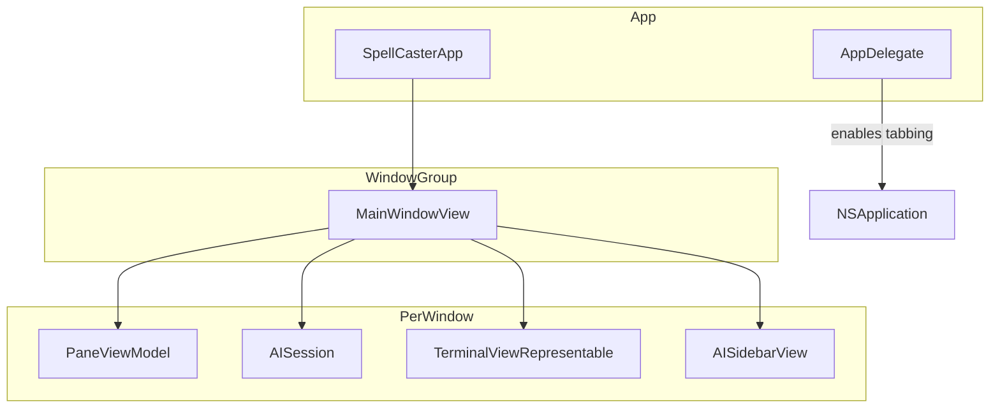

# Spell Caster - Window Management

## Overview

Spell Caster uses **native macOS window tabbing** for a streamlined, familiar user experience. Instead of implementing custom tab bars and window managers, the app leverages macOS's built-in window tabbing features, providing users with the same tab management they expect from other macOS applications like Safari, Terminal, and Finder.

## Architecture Decision

### Why Native Tabs?

1. **Familiar UX**: Users already know how to use macOS tabs - ⌘T for new tab, dragging tabs to reorder, etc.
2. **Reduced Complexity**: No need to maintain custom tab bar UI, drag-and-drop logic, or tab state management
3. **Better Integration**: Native tabs work seamlessly with macOS features like:
   - Window → Merge All Windows
   - Window → Move Tab to New Window
   - System window management shortcuts
4. **Consistent Behavior**: Native tabs behave identically across all macOS versions

### Architecture Diagram



## App Entry Point

### SpellCasterApp.swift

```swift
import SwiftUI
import AppKit

@main
struct SpellCasterApp: App {
    @NSApplicationDelegateAdaptor(AppDelegate.self) var appDelegate
    
    var body: some Scene {
        WindowGroup {
            MainWindowView()
                .navigationTitle("Spell Caster")
        }
        .windowStyle(.automatic)
        .commands {
            // Replace default new item with new window (uses native tabs)
            CommandGroup(replacing: .newItem) {
                Button("New Window") {
                    // Create new window - macOS will handle tabbing
                    NSApp.sendAction(#selector(NSApplication.newWindowForTab(_:)), to: nil, from: nil)
                }
                .keyboardShortcut("n", modifiers: .command)
                
                Button("New Tab") {
                    // Create new tab in current window
                    NSApp.sendAction(#selector(NSApplication.newWindowForTab(_:)), to: nil, from: nil)
                }
                .keyboardShortcut("t", modifiers: .command)
            }
            
            // Add window menu commands for tab management
            CommandGroup(after: .windowArrangement) {
                Button("Merge All Windows") {
                    // Trigger merge via first responder
                    NSApp.sendAction(#selector(NSWindow.toggleTabBar(_:)), to: nil, from: nil)
                }
                
                Divider()
                
                Button("Toggle Tab Bar") {
                    NSApp.sendAction(#selector(NSWindow.toggleTabBar(_:)), to: nil, from: nil)
                }
                .keyboardShortcut("t", modifiers: [.command, .shift])
            }
        }
        
        Settings {
            PreferencesView()
        }
    }
}
```

### AppDelegate.swift

```swift
import AppKit
import SwiftUI

class AppDelegate: NSObject, NSApplicationDelegate {
    
    // MARK: - Application Lifecycle
    
    func applicationDidFinishLaunching(_ notification: Notification) {
        // Enable native window tabbing - this is the key setting
        NSWindow.allowsAutomaticWindowTabbing = true
        
        // Set activation policy
        NSApp.setActivationPolicy(.regular)
    }
    
    func applicationWillTerminate(_ notification: Notification) {
        // Clean up any running PTY processes
        // PTY processes will be cleaned up when their views are deallocated
    }
    
    func applicationShouldTerminateAfterLastWindowClosed(_ sender: NSApplication) -> Bool {
        return true
    }
    
    func applicationSupportsSecureRestorableState(_ app: NSApplication) -> Bool {
        return true
    }
}
```

## Main Window View

### MainWindowView.swift

Each window (tab) is completely independent with its own terminal session and AI sidebar:

```swift
import SwiftUI

/// Main window layout with terminal area and AI sidebar
struct MainWindowView: View {
    @StateObject private var paneViewModel: PaneViewModel
    @StateObject private var aiSession: AISession
    @State private var sidebarVisible: Bool = true
    
    init() {
        let profile = ProfileManager.shared.getDefaultProfile()
        _paneViewModel = StateObject(wrappedValue: PaneViewModel(profile: profile))
        _aiSession = StateObject(wrappedValue: AISession(
            selectedModel: profile.aiModel,
            systemPromptPreset: profile.aiSystemPromptPreset
        ))
    }
    
    var body: some View {
        HSplitView {
            // Terminal area
            TerminalViewRepresentable(paneViewModel: paneViewModel)
                .frame(minWidth: 400)
            
            // AI Sidebar (toggleable)
            if sidebarVisible {
                AISidebarView(session: aiSession, paneViewModel: paneViewModel)
                    .frame(minWidth: 300, idealWidth: 350, maxWidth: 500)
                    .transition(.move(edge: .trailing))
            }
        }
        .frame(minWidth: 800, minHeight: 600)
        .toolbar {
            ToolbarItemGroup(placement: .automatic) {
                // Toggle sidebar button
                Button(action: {
                    withAnimation {
                        sidebarVisible.toggle()
                    }
                }) {
                    Label("Toggle AI Sidebar", systemImage: sidebarVisible ? "sidebar.right" : "sidebar.left")
                }
                .help("Toggle AI Sidebar")
            }
        }
        .onAppear {
            // Launch the shell when view appears
            paneViewModel.launchLazily()
        }
    }
}
```

## Per-Window State Isolation

### Key Design Principle

Each `MainWindowView` instance creates its own state objects via `@StateObject`:

| State Object | Purpose | Isolation |
|--------------|---------|-----------|
| `PaneViewModel` | Terminal session (PTY), scrollback buffer, current directory | Per-window |
| `AISession` | AI chat history, model selection, system prompt | Per-window |
| `sidebarVisible` | Sidebar visibility toggle | Per-window |

This ensures:
- Each tab has an independent terminal session
- AI conversations are isolated per window
- Settings changes in one window don't affect others

## Native Tab Features

### User Actions

| Action | Shortcut | Result |
|--------|----------|--------|
| New Window/Tab | ⌘N or ⌘T | Creates new window (macOS may auto-tab) |
| Toggle Tab Bar | ⇧⌘T | Shows/hides the tab bar |
| Close Tab | ⌘W | Closes current tab/window |
| Move Tab to New Window | Window menu | Detaches tab to separate window |
| Merge All Windows | Window menu | Combines all windows into tabs |

### Tab Bar Behavior

macOS automatically shows the tab bar when:
1. A window has multiple tabs
2. The user explicitly shows it via ⇧⌘T
3. `NSWindow.tabbingMode` is set to `.preferred`

### Programmatic Control

```swift
// Enable/disable automatic tabbing globally
NSWindow.allowsAutomaticWindowTabbing = true

// Control per-window tabbing behavior
window.tabbingMode = .preferred  // Auto-tab when possible
window.tabbingMode = .disallowed // Never tab this window
window.tabbingMode = .automatic  // Use system default

// Toggle tab bar visibility
window.toggleTabBar(nil)
```

## Removed Components

The following components from the original architecture have been **removed** in favor of native tabs:

| Removed Component | Replacement |
|-------------------|-------------|
| `WindowManager.swift` | Native `WindowGroup` |
| `WindowViewModel.swift` | Per-view `@StateObject` |
| `TabBarView.swift` | Native macOS tab bar |
| `SplitPaneView.swift` | Future: Native split view or separate feature |
| `WindowController` | SwiftUI `WindowGroup` |

## Future: Split Panes (Optional)

Split panes within a window are not currently implemented. If needed in the future, they can be added as a separate feature within `MainWindowView`:

```swift
// Future implementation concept
struct MainWindowView: View {
    @State private var splitPanes: [PaneViewModel] = []
    @State private var splitDirection: SplitDirection? = nil
    
    var body: some View {
        HSplitView {
            if let direction = splitDirection {
                // Render split panes
                ForEach(splitPanes) { pane in
                    TerminalViewRepresentable(paneViewModel: pane)
                }
            } else {
                // Single pane
                TerminalViewRepresentable(paneViewModel: paneViewModel)
            }
            
            // AI Sidebar
            if sidebarVisible {
                AISidebarView(session: aiSession, paneViewModel: activePane)
            }
        }
    }
}
```

## Session Persistence (Future)

Session persistence can be implemented using SwiftUI's state restoration:

```swift
// Future: Session persistence
struct SessionState: Codable {
    let windows: [WindowState]
    
    struct WindowState: Codable {
        let workingDirectory: URL?
        let aiHistory: [AIMessage]
        let sidebarVisible: Bool
    }
}
```

## Summary

| Aspect | Implementation |
|--------|----------------|
| Window Management | Native `WindowGroup` |
| Tab Management | Native macOS tabs (`NSWindow.allowsAutomaticWindowTabbing`) |
| Per-Window State | `@StateObject` in `MainWindowView` |
| Terminal Session | `PaneViewModel` (one per window) |
| AI Session | `AISession` (one per window) |
| Sidebar | Toggleable via toolbar button |

## Benefits of This Approach

1. **Simplicity**: ~500 lines of code removed vs custom implementation
2. **Native Feel**: Users get the exact behavior they expect from macOS
3. **Maintainability**: No custom tab bar to maintain or debug
4. **Performance**: Native tabs are optimized by Apple
5. **Accessibility**: Native tabs work with VoiceOver and other assistive technologies

## Next Steps

Continue to [06-ai-sidebar.md](06-ai-sidebar.md) for the AI sidebar specification.
