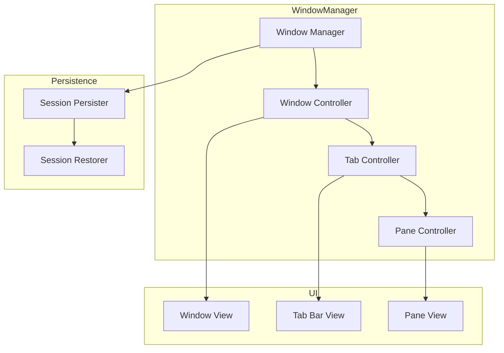

# Spell Caster - Window Management

## Overview

The WindowManager module handles the lifecycle and organization of windows, tabs, and panes. This document specifies the architecture for managing multiple terminal sessions with split panes, tab management, and session persistence.

## Architecture



## Window Manager

### Core Manager

```swift
import SwiftUI
import Combine

/// Manages all application windows
@MainActor
@Observable
final class WindowManager {
    // MARK: - Singleton
    
    static let shared = WindowManager()
    
    // MARK: - Properties
    
    private(set) var windows: [WindowModel] = []
    private var windowControllers: [UUID: WindowController] = [:]
    
    // MARK: - Publishers
    
    private let windowsSubject = PassthroughSubject<[WindowModel], Never>()
    var windowsPublisher: AnyPublisher<[WindowModel], Never> {
        windowsSubject.eraseToAnyPublisher()
    }
    
    // MARK: - Dependencies
    
    private let sessionPersister: SessionPersister
    private let preferences: Preferences
    
    // MARK: - Initialization
    
    private init() {
        self.sessionPersister = SessionPersister()
        self.preferences = Preferences.shared
    }
    
    // MARK: - Window Creation
    
    @discardableResult
    func createWindow(profile: Profile? = nil) -> WindowModel {
        let profile = profile ?? preferences.defaultProfile
        let window = WindowModel(profile: profile)
        
        // Create initial tab
        window.createTab(profile: profile)
        
        windows.append(window)
        
        // Create window controller
        let controller = WindowController(window: window)
        windowControllers[window.id] = controller
        controller.show()
        
        windowsSubject.send(windows)
        
        return window
    }
    
    // MARK: - Window Management
    
    func closeWindow(_ windowId: UUID) {
        guard let index = windows.firstIndex(where: { $0.id == windowId }) else {
            return
        }
        
        let window = windows[index]
        
        // Clean up window controller
        windowControllers[windowId]?.close()
        windowControllers.removeValue(forKey: windowId)
        
        // Remove from array
        windows.remove(at: index)
        
        windowsSubject.send(windows)
        
        // Quit if no windows remain
        if windows.isEmpty && preferences.quitWhenLastWindowClosed {
            NSApplication.shared.terminate(nil)
        }
    }
    
    func window(id: UUID) -> WindowModel? {
        windows.first { $0.id == id }
    }
    
    func windowController(id: UUID) -> WindowController? {
        windowControllers[id]
    }
    
    // MARK: - Focus Management
    
    func focusWindow(_ windowId: UUID) {
        guard let controller = windowControllers[windowId] else { return }
        controller.makeKeyAndOrderFront()
    }
    
    func activeWindow() -> WindowModel? {
        guard let keyWindow = NSApplication.shared.keyWindow else { return nil }
        return windows.first { window in
            windowControllers[window.id]?.window == keyWindow
        }
    }
    
    // MARK: - Session Persistence
    
    func saveSessions() {
        sessionPersister.save(windows: windows)
    }
    
    func restoreSessions() {
        guard preferences.restoreSessionsOnLaunch else { return }
        
        let restoredWindows = sessionPersister.restore()
        
        for windowModel in restoredWindows {
            windows.append(windowModel)
            
            let controller = WindowController(window: windowModel)
            windowControllers[windowModel.id] = controller
            controller.show()
            
            // Restore terminal sessions
            for tab in windowModel.tabs {
                for pane in tab.panes {
                    restorePane(pane, profile: windowModel.profile)
                }
            }
        }
        
        windowsSubject.send(windows)
    }
    
    private func restorePane(_ pane: PaneModel, profile: Profile) {
        // Create new PTY session
        let ptyManager = PTYManager()
        
        do {
            let session = try ptyManager.createSession(
                shell: profile.shell.path,
                environment: profile.shell.environment,
                workingDirectory: pane.currentWorkingDirectory ?? profile.shell.workingDirectory,
                size: pane.size
            )
            pane.ptySession = session
        } catch {
            print("Failed to restore pane session: \(error)")
        }
    }
    
    // MARK: - Cleanup
    
    func closeAllWindows() {
        for window in windows {
            windowControllers[window.id]?.close()
        }
        windows.removeAll()
        windowControllers.removeAll()
    }
}
```

## Window Controller

### NSWindowController Integration

```swift
import AppKit
import SwiftUI

/// Controls a single window
final class WindowController: NSWindowController {
    // MARK: - Properties
    
    private let windowModel: WindowModel
    private var hostingController: NSHostingController<WindowContentView>?
    
    // MARK: - Initialization
    
    init(window: WindowModel) {
        self.windowModel = window
        
        // Create NSWindow
        let nsWindow = NSWindow(
            contentRect: window.frame ?? NSRect(x: 0, y: 0, width: 1200, height: 800),
            styleMask: [.titled, .closable, .miniaturizable, .resizable, .fullSizeContentView],
            backing: .buffered,
            defer: false
        )
        
        super.init(window: nsWindow)
        
        setupWindow()
        setupContent()
    }
    
    required init?(coder: NSCoder) {
        fatalError("init(coder:) has not been implemented")
    }
    
    // MARK: - Setup
    
    private func setupWindow() {
        guard let window = window else { return }
        
        window.title = windowModel.title
        window.titlebarAppearsTransparent = true
        window.titleVisibility = .hidden
        
        // Set minimum size
        window.minSize = NSSize(width: 400, height: 300)
        
        // Center window if no frame saved
        if windowModel.frame == nil {
            window.center()
        }
        
        // Window delegate
        window.delegate = self
        
        // Apply window style
        applyWindowStyle()
    }
    
    private func setupContent() {
        guard let window = window else { return }
        
        // Create SwiftUI view
        let contentView = WindowContentView(window: windowModel)
        
        // Create hosting controller
        let hosting = NSHostingController(rootView: contentView)
        hostingController = hosting
        
        window.contentView = hosting.view
    }
    
    private func applyWindowStyle() {
        guard let window = window else { return }
        
        let style = windowModel.profile.windowStyle
        
        // Apply transparency
        if style.transparency > 0 {
            window.isOpaque = false
            window.backgroundColor = NSColor.clear
            
            if style.blur {
                // Add vibrancy effect
                let visualEffect = NSVisualEffectView()
                visualEffect.blendingMode = .behindWindow
                visualEffect.state = .active
                visualEffect.material = .hudWindow
                
                if let contentView = window.contentView {
                    visualEffect.frame = contentView.bounds
                    visualEffect.autoresizingMask = [.width, .height]
                    contentView.addSubview(visualEffect, positioned: .below, relativeTo: nil)
                }
            }
        }
    }
    
    // MARK: - Window Management
    
    func show() {
        window?.makeKeyAndOrderFront(nil)
    }
    
    func makeKeyAndOrderFront() {
        window?.makeKeyAndOrderFront(nil)
    }
    
    override func close() {
        // Save window frame
        if let frame = window?.frame {
            windowModel.frame = frame
        }
        
        // Terminate all terminal sessions
        for tab in windowModel.tabs {
            for pane in tab.panes {
                pane.ptySession?.terminate()
            }
        }
        
        super.close()
    }
}

// MARK: - Window Delegate

extension WindowController: NSWindowDelegate {
    func windowWillClose(_ notification: Notification) {
        WindowManager.shared.closeWindow(windowModel.id)
    }
    
    func windowDidResize(_ notification: Notification) {
        // Save frame
        if let frame = window?.frame {
            windowModel.frame = frame
        }
    }
    
    func windowDidMove(_ notification: Notification) {
        // Save frame
        if let frame = window?.frame {
            windowModel.frame = frame
        }
    }
    
    func windowDidBecomeKey(_ notification: Notification) {
        // Update active window
        NotificationCenter.default.post(
            name: .windowDidBecomeActive,
            object: windowModel
        )
    }
}

// MARK: - Notifications

extension Notification.Name {
    static let windowDidBecomeActive = Notification.Name("windowDidBecomeActive")
}
```

## Window Content View

### SwiftUI Window Layout

```swift
import SwiftUI

/// Main window content view
struct WindowContentView: View {
    @ObservedObject var window: WindowModel
    @State private var selectedTabId: UUID?
    
    var body: some View {
        HSplitView {
            // Terminal area
            VStack(spacing: 0) {
                // Tab bar
                TabBarView(
                    tabs: window.tabs,
                    activeTabId: $window.activeTabId,
                    onNewTab: { window.createTab() },
                    onCloseTab: { window.closeTab($0) }
                )
                
                // Active tab content
                if let activeTab = window.activeTab {
                    TabContentView(tab: activeTab)
                } else {
                    EmptyTerminalView()
                }
            }
            .frame(minWidth: 400)
            
            // AI Sidebar
            if window.isAISidebarVisible {
                AISidebarView(session: window.aiSession)
                    .frame(width: window.sidebarWidth)
            }
        }
        .background(window.profile.colors.background)
    }
}

/// Empty terminal placeholder
struct EmptyTerminalView: View {
    var body: some View {
        VStack {
            Image(systemName: "terminal")
                .font(.system(size: 64))
                .foregroundColor(.secondary)
            Text("No Terminal Session")
                .font(.title2)
                .foregroundColor(.secondary)
        }
        .frame(maxWidth: .infinity, maxHeight: .infinity)
    }
}
```

## Tab Management

### Tab Controller

```swift
import SwiftUI

/// Tab bar view
struct TabBarView: View {
    let tabs: [TabModel]
    @Binding var activeTabId: UUID?
    let onNewTab: () -> Void
    let onCloseTab: (UUID) -> Void
    
    @State private var draggedTab: TabModel?
    
    var body: some View {
        HStack(spacing: 0) {
            // Tab items
            ForEach(tabs) { tab in
                TabItemView(
                    tab: tab,
                    isActive: tab.id == activeTabId,
                    onSelect: { activeTabId = tab.id },
                    onClose: { onCloseTab(tab.id) }
                )
                .onDrag {
                    draggedTab = tab
                    return NSItemProvider(object: tab.id.uuidString as NSString)
                }
                .onDrop(of: [.text], delegate: TabDropDelegate(
                    tab: tab,
                    tabs: tabs,
                    draggedTab: $draggedTab
                ))
            }
            
            Spacer()
            
            // New tab button
            Button(action: onNewTab) {
                Image(systemName: "plus")
                    .font(.system(size: 12))
            }
            .buttonStyle(.plain)
            .padding(.horizontal, 8)
        }
        .frame(height: 32)
        .background(Color(nsColor: .controlBackgroundColor))
    }
}

/// Individual tab item
struct TabItemView: View {
    let tab: TabModel
    let isActive: Bool
    let onSelect: () -> Void
    let onClose: () -> Void
    
    @State private var isHovered = false
    
    var body: some View {
        HStack(spacing: 4) {
            // Tab color indicator
            if let color = tab.color {
                Circle()
                    .fill(color)
                    .frame(width: 8, height: 8)
            }
            
            // Tab title
            Text(tab.title)
                .font(.system(size: 12))
                .lineLimit(1)
                .foregroundColor(isActive ? .primary : .secondary)
            
            // Close button
            if isHovered || isActive {
                Button(action: onClose) {
                    Image(systemName: "xmark")
                        .font(.system(size: 10))
                }
                .buttonStyle(.plain)
            }
        }
        .padding(.horizontal, 12)
        .padding(.vertical, 6)
        .background(isActive ? Color(nsColor: .selectedControlColor) : Color.clear)
        .cornerRadius(4)
        .onHover { isHovered = $0 }
        .onTapGesture(perform: onSelect)
        .contextMenu {
            Button("Duplicate Tab") {
                // TODO: Implement
            }
            Button("Move to New Window") {
                // TODO: Implement
            }
            Divider()
            Button("Close Tab", action: onClose)
            Button("Close Other Tabs") {
                // TODO: Implement
            }
        }
    }
}

/// Drop delegate for tab reordering
struct TabDropDelegate: DropDelegate {
    let tab: TabModel
    let tabs: [TabModel]
    @Binding var draggedTab: TabModel?
    
    func performDrop(info: DropInfo) -> Bool {
        draggedTab = nil
        return true
    }
    
    func dropEntered(info: DropInfo) {
        guard let draggedTab = draggedTab,
              draggedTab.id != tab.id,
              let fromIndex = tabs.firstIndex(where: { $0.id == draggedTab.id }),
              let toIndex = tabs.firstIndex(where: { $0.id == tab.id }) else {
            return
        }
        
        // Reorder tabs
        withAnimation {
            var updatedTabs = tabs
            updatedTabs.move(fromOffsets: IndexSet(integer: fromIndex), toOffset: toIndex)
            // Update parent model
        }
    }
}
```

### Tab Content View

```swift
import SwiftUI

/// Content view for a single tab
struct TabContentView: View {
    @ObservedObject var tab: TabModel
    
    var body: some View {
        GeometryReader { geometry in
            switch tab.splitConfiguration {
            case .single:
                if let pane = tab.panes.first {
                    PaneView(pane: pane)
                }
                
            case .splitTwo(let direction):
                if direction == .horizontal {
                    HSplitView {
                        ForEach(tab.panes) { pane in
                            PaneView(pane: pane)
                        }
                    }
                } else {
                    VSplitView {
                        ForEach(tab.panes) { pane in
                            PaneView(pane: pane)
                        }
                    }
                }
                
            case .complex:
                // Complex layout with multiple splits
                ComplexSplitView(panes: tab.panes)
            }
        }
    }
}

/// Complex split view for multiple panes
struct ComplexSplitView: View {
    let panes: [PaneModel]
    
    var body: some View {
        // TODO: Implement complex layout algorithm
        Text("Complex layout not yet implemented")
    }
}
```

## Pane Management

### Pane Controller

```swift
import SwiftUI

/// View for a single terminal pane
struct PaneView: View {
    @ObservedObject var pane: PaneModel
    @State private var isFocused = false
    
    var body: some View {
        ZStack {
            // Terminal view (AppKit bridge)
            TerminalView(
                engine: pane.terminalEngine,
                selection: $pane.selection
            )
            .focused($isFocused)
            
            // Focus indicator
            if isFocused {
                Rectangle()
                    .stroke(Color.accentColor, lineWidth: 2)
                    .allowsHitTesting(false)
            }
        }
        .contextMenu {
            PaneContextMenu(pane: pane)
        }
    }
}

/// Context menu for pane
struct PaneContextMenu: View {
    let pane: PaneModel
    
    var body: some View {
        Button("Split Horizontally") {
            // TODO: Implement
        }
        Button("Split Vertically") {
            // TODO: Implement
        }
        Divider()
        Button("Copy") {
            if let selection = pane.selection {
                // Copy selection to clipboard
            }
        }
        Button("Paste") {
            // Paste from clipboard
        }
        Divider()
        Button("Clear Scrollback") {
            pane.scrollback.clear()
        }
        Button("Reset Terminal") {
            // Reset terminal state
        }
        Divider()
        Button("Close Pane") {
            // Close this pane
        }
    }
}
```

### Split Pane Implementation

```swift
extension TabModel {
    /// Split a pane horizontally or vertically
    func splitPane(
        _ paneId: UUID,
        direction: SplitDirection,
        profile: Profile? = nil
    ) -> PaneModel {
        guard let index = panes.firstIndex(where: { $0.id == paneId }) else {
            preconditionFailure("Pane not found")
        }
        
        let existingPane = panes[index]
        let newPane = PaneModel(profile: profile ?? existingPane.profile)
        
        // Insert new pane
        panes.insert(newPane, at: index + 1)
        
        // Update split configuration
        updateSplitConfiguration(direction: direction)
        
        // Start terminal session for new pane
        startPaneSession(newPane)
        
        return newPane
    }
    
    private func updateSplitConfiguration(direction: SplitDirection) {
        switch panes.count {
        case 0, 1:
            splitConfiguration = .single
        case 2:
            splitConfiguration = .splitTwo(direction)
        default:
            splitConfiguration = .complex
        }
    }
    
    private func startPaneSession(_ pane: PaneModel) {
        let ptyManager = PTYManager()
        
        do {
            let session = try ptyManager.createSession(
                shell: pane.profile.shell.path,
                environment: pane.profile.shell.environment,
                workingDirectory: pane.profile.shell.workingDirectory,
                size: pane.size
            )
            pane.ptySession = session
        } catch {
            print("Failed to start pane session: \(error)")
        }
    }
}
```

## Session Persistence

### Session Persister

```swift
import Foundation

/// Persists and restores window sessions
final class SessionPersister {
    private let fileURL: URL
    
    init() {
        let appSupport = FileManager.default.urls(
            for: .applicationSupportDirectory,
            in: .userDomainMask
        ).first!
        
        let appDir = appSupport.appendingPathComponent("SpellCaster")
        try? FileManager.default.createDirectory(at: appDir, withIntermediateDirectories: true)
        
        fileURL = appDir.appendingPathComponent("sessions.json")
    }
    
    // MARK: - Save
    
    func save(windows: [WindowModel]) {
        let encoder = JSONEncoder()
        encoder.outputFormatting = .prettyPrinted
        
        do {
            let data = try encoder.encode(windows)
            try data.write(to: fileURL)
        } catch {
            print("Failed to save sessions: \(error)")
        }
    }
    
    // MARK: - Restore
    
    func restore() -> [WindowModel] {
        guard FileManager.default.fileExists(atPath: fileURL.path) else {
            return []
        }
        
        let decoder = JSONDecoder()
        
        do {
            let data = try Data(contentsOf: fileURL)
            let windows = try decoder.decode([WindowModel].self, from: data)
            return windows
        } catch {
            print("Failed to restore sessions: \(error)")
            return []
        }
    }
    
    // MARK: - Clear
    
    func clear() {
        try? FileManager.default.removeItem(at: fileURL)
    }
}
```

### Session State

```swift
/// Serializable session state
struct SessionState: Codable {
    let windows: [WindowState]
    let timestamp: Date
    
    struct WindowState: Codable {
        let id: UUID
        let frame: CGRect?
        let tabs: [TabState]
        let activeTabId: UUID?
        let profile: Profile
        
        struct TabState: Codable {
            let id: UUID
            let title: String
            let panes: [PaneState]
            let activePaneId: UUID?
            
            struct PaneState: Codable {
                let id: UUID
                let workingDirectory: URL?
                let size: TerminalSize
                let scrollPosition: Int
            }
        }
    }
}
```

## Profile Management

### Profile Application

```swift
extension WindowModel {
    /// Apply a profile to the window
    func applyProfile(_ profile: Profile) {
        self.profile = profile
        
        // Apply to all tabs
        for tab in tabs {
            tab.applyProfile(profile)
        }
    }
}

extension TabModel {
    /// Apply a profile to the tab
    func applyProfile(_ profile: Profile) {
        // Apply to all panes
        for pane in panes {
            pane.applyProfile(profile)
        }
    }
}

extension PaneModel {
    /// Apply a profile to the pane
    func applyProfile(_ profile: Profile) {
        self.profile = profile
        
        // Update terminal appearance
        // This would trigger renderer updates
    }
}
```

## Focus Management

### Focus Tracking

```swift
/// Tracks focus across windows, tabs, and panes
@MainActor
final class FocusManager: ObservableObject {
    static let shared = FocusManager()
    
    @Published private(set) var focusedWindow: UUID?
    @Published private(set) var focusedTab: UUID?
    @Published private(set) var focusedPane: UUID?
    
    private init() {
        setupNotifications()
    }
    
    private func setupNotifications() {
        NotificationCenter.default.addObserver(
            self,
            selector: #selector(windowDidBecomeActive),
            name: .windowDidBecomeActive,
            object: nil
        )
    }
    
    @objc private func windowDidBecomeActive(_ notification: Notification) {
        guard let window = notification.object as? WindowModel else { return }
        focusedWindow = window.id
        focusedTab = window.activeTabId
        focusedPane = window.activeTab?.activePaneId
    }
    
    func setFocus(window: UUID, tab: UUID, pane: UUID) {
        focusedWindow = window
        focusedTab = tab
        focusedPane = pane
    }
    
    func clearFocus() {
        focusedWindow = nil
        focusedTab = nil
        focusedPane = nil
    }
}
```

## Keyboard Shortcuts

### Window Commands

```swift
import SwiftUI

/// Window management commands
struct WindowCommands: Commands {
    var body: some Commands {
        CommandGroup(replacing: .newItem) {
            Button("New Window") {
                WindowManager.shared.createWindow()
            }
            .keyboardShortcut("n", modifiers: [.command])
            
            Button("New Tab") {
                if let window = WindowManager.shared.activeWindow() {
                    window.createTab()
                }
            }
            .keyboardShortcut("t", modifiers: [.command])
        }
        
        CommandMenu("Tab") {
            Button("Close Tab") {
                if let window = WindowManager.shared.activeWindow(),
                   let tabId = window.activeTabId {
                    window.closeTab(tabId)
                }
            }
            .keyboardShortcut("w", modifiers: [.command])
            
            Button("Next Tab") {
                // TODO: Implement
            }
            .keyboardShortcut("]", modifiers: [.command, .shift])
            
            Button("Previous Tab") {
                // TODO: Implement
            }
            .keyboardShortcut("[", modifiers: [.command, .shift])
            
            Divider()
            
            Button("Split Horizontally") {
                // TODO: Implement
            }
            .keyboardShortcut("d", modifiers: [.command])
            
            Button("Split Vertically") {
                // TODO: Implement
            }
            .keyboardShortcut("d", modifiers: [.command, .shift])
        }
    }
}
```

## Window Restoration

### State Restoration

```swift
extension WindowManager {
    /// Restore application state
    func restoreApplicationState() {
        // Restore windows
        restoreSessions()
        
        // If no windows restored, create default window
        if windows.isEmpty {
            createWindow()
        }
    }
    
    /// Save application state
    func saveApplicationState() {
        saveSessions()
    }
}

// MARK: - App Delegate Integration

extension AppDelegate {
    func applicationWillFinishLaunching(_ notification: Notification) {
        WindowManager.shared.restoreApplicationState()
    }
    
    func applicationWillTerminate(_ notification: Notification) {
        WindowManager.shared.saveApplicationState()
    }
}
```

## Error Handling

```swift
enum WindowManagementError: Error, LocalizedError {
    case windowNotFound
    case tabNotFound
    case paneNotFound
    case failedToCreateWindow
    case failedToRestoreSession
    
    var errorDescription: String? {
        switch self {
        case .windowNotFound:
            return "Window not found"
        case .tabNotFound:
            return "Tab not found"
        case .paneNotFound:
            return "Pane not found"
        case .failedToCreateWindow:
            return "Failed to create window"
        case .failedToRestoreSession:
            return "Failed to restore session"
        }
    }
}
```

## Summary

The WindowManager module provides:

| Component | Purpose |
|-----------|---------|
| [`WindowManager`](#window-manager) | Manages all windows and their lifecycle |
| [`WindowController`](#window-controller) | Controls individual NSWindow instances |
| [`TabBarView`](#tab-management) | Tab bar UI and management |
| [`PaneView`](#pane-management) | Individual terminal pane views |
| [`SessionPersister`](#session-persistence) | Saves and restores sessions |
| [`FocusManager`](#focus-management) | Tracks focus across UI hierarchy |

## Next Steps

Continue to [06-ai-sidebar.md](06-ai-sidebar.md) for the AI sidebar specification.
