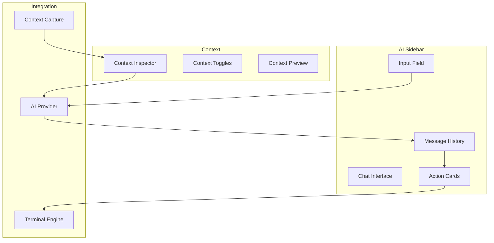

# Spell Caster - AI Sidebar

## Overview

The AISidebar module provides a per-window AI assistant interface with chat history, context capture, and actionable command cards. This document specifies the architecture for the AI co-pilot experience.

## Architecture



## AI Sidebar View

### Main Sidebar Component

```swift
import SwiftUI
import Combine

/// AI sidebar view for a window
struct AISidebarView: View {
    @ObservedObject var session: AISession
    @StateObject private var viewModel: AISidebarViewModel
    @State private var inputText: String = ""
    @State private var isContextInspectorVisible: Bool = false
    
    init(session: AISession) {
        self._session = ObservedObject(wrappedValue: session)
        self._viewModel = StateObject(wrappedValue: AISidebarViewModel(session: session))
    }
    
    var body: some View {
        VStack(spacing: 0) {
            // Header
            sidebarHeader
            
            Divider()
            
            // Messages
            ScrollViewReader { proxy in
                ScrollView {
                    LazyVStack(spacing: 12) {
                        ForEach(session.messages) { message in
                            MessageView(message: message)
                                .id(message.id)
                        }
                        
                        // Streaming message
                        if session.isProcessing && !session.currentStreamingMessage.isEmpty {
                            StreamingMessageView(content: session.currentStreamingMessage)
                        }
                    }
                    .padding()
                }
                .onChange(of: session.messages.count) { _ in
                    if let lastMessage = session.messages.last {
                        withAnimation {
                            proxy.scrollTo(lastMessage.id, anchor: .bottom)
                        }
                    }
                }
            }
            
            Divider()
            
            // Input area
            inputArea
        }
        .background(Color(nsColor: .controlBackgroundColor))
        .sheet(isPresented: $isContextInspectorVisible) {
            ContextInspectorView(
                context: viewModel.currentContext,
                settings: $session.contextSettings
            )
        }
    }
    
    // MARK: - Header
    
    private var sidebarHeader: some View {
        HStack {
            Text("AI Assistant")
                .font(.headline)
            
            Spacer()
            
            // Model selector
            Menu {
                ForEach(viewModel.availableModels, id: \.id) { model in
                    Button(model.name) {
                        session.selectedModel = model
                    }
                }
            } label: {
                HStack(spacing: 4) {
                    Text(session.selectedModel.name)
                        .font(.caption)
                    Image(systemName: "chevron.down")
                        .font(.caption2)
                }
            }
            .menuStyle(.borderlessButton)
            
            // Context inspector button
            Button(action: { isContextInspectorVisible.toggle() }) {
                Image(systemName: "doc.text.magnifyingglass")
            }
            .buttonStyle(.plain)
            
            // Clear history button
            Button(action: { viewModel.clearHistory() }) {
                Image(systemName: "trash")
            }
            .buttonStyle(.plain)
        }
        .padding()
    }
    
    // MARK: - Input Area
    
    private var inputArea: some View {
        VStack(spacing: 8) {
            // Context toggles
            contextToggles
            
            // Input field
            HStack(alignment: .bottom, spacing: 8) {
                TextEditor(text: $inputText)
                    .font(.body)
                    .frame(minHeight: 40, maxHeight: 120)
                    .padding(8)
                    .background(Color(nsColor: .textBackgroundColor))
                    .cornerRadius(8)
                    .overlay(
                        RoundedRectangle(cornerRadius: 8)
                            .stroke(Color.gray.opacity(0.3), lineWidth: 1)
                    )
                
                Button(action: sendMessage) {
                    Image(systemName: "arrow.up.circle.fill")
                        .font(.system(size: 28))
                        .foregroundColor(inputText.isEmpty ? .gray : .accentColor)
                }
                .buttonStyle(.plain)
                .disabled(inputText.isEmpty || session.isProcessing)
            }
            .padding(.horizontal)
            .padding(.bottom, 8)
        }
    }
    
    // MARK: - Context Toggles
    
    private var contextToggles: some View {
        HStack(spacing: 12) {
            ContextToggle(
                icon: "folder",
                isEnabled: $session.contextSettings.includeWorkingDirectory,
                tooltip: "Include working directory"
            )
            
            ContextToggle(
                icon: "terminal",
                isEnabled: $session.contextSettings.includeRecentOutput,
                tooltip: "Include recent output"
            )
            
            ContextToggle(
                icon: "command",
                isEnabled: $session.contextSettings.includeLastCommand,
                tooltip: "Include last command"
            )
            
            ContextToggle(
                icon: "arrow.branch",
                isEnabled: $session.contextSettings.includeGitStatus,
                tooltip: "Include git status"
            )
            
            Spacer()
        }
        .padding(.horizontal)
        .padding(.top, 8)
    }
    
    // MARK: - Actions
    
    private func sendMessage() {
        guard !inputText.isEmpty else { return }
        
        let message = inputText
        inputText = ""
        
        viewModel.sendMessage(message)
    }
}

/// Context toggle button
struct ContextToggle: View {
    let icon: String
    @Binding var isEnabled: Bool
    let tooltip: String
    
    var body: some View {
        Button(action: { isEnabled.toggle() }) {
            Image(systemName: icon)
                .font(.system(size: 14))
                .foregroundColor(isEnabled ? .accentColor : .gray)
                .frame(width: 24, height: 24)
        }
        .buttonStyle(.plain)
        .help(tooltip)
    }
}
```

## Message Views

### Message Display

```swift
import SwiftUI

/// Individual message view
struct MessageView: View {
    let message: ChatMessage
    
    var body: some View {
        HStack(alignment: .top, spacing: 12) {
            // Avatar
            messageAvatar
            
            // Content
            VStack(alignment: .leading, spacing: 8) {
                // Header
                HStack {
                    Text(message.role == .user ? "You" : "Assistant")
                        .font(.caption)
                        .fontWeight(.semibold)
                    
                    Spacer()
                    
                    Text(message.timestamp, style: .time)
                        .font(.caption2)
                        .foregroundColor(.secondary)
                }
                
                // Message content
                Text(message.content)
                    .font(.body)
                    .textSelection(.enabled)
                
                // Context attachments
                if let attachments = message.attachments, !attachments.isEmpty {
                    ContextAttachmentsView(attachments: attachments)
                }
                
                // Action cards
                if let actions = message.actions, !actions.isEmpty {
                    ActionCardsView(actions: actions)
                }
            }
            .frame(maxWidth: .infinity, alignment: .leading)
        }
        .padding()
        .background(messageBackground)
        .cornerRadius(8)
    }
    
    private var messageAvatar: some View {
        Circle()
            .fill(message.role == .user ? Color.blue : Color.purple)
            .frame(width: 32, height: 32)
            .overlay(
                Image(systemName: message.role == .user ? "person.fill" : "sparkles")
                    .font(.system(size: 14))
                    .foregroundColor(.white)
            )
    }
    
    private var messageBackground: Color {
        message.role == .user
            ? Color(nsColor: .controlBackgroundColor)
            : Color(nsColor: .textBackgroundColor)
    }
}

/// Streaming message view
struct StreamingMessageView: View {
    let content: String
    @State private var cursorVisible = true
    
    var body: some View {
        HStack(alignment: .top, spacing: 12) {
            // Avatar
            Circle()
                .fill(Color.purple)
                .frame(width: 32, height: 32)
                .overlay(
                    Image(systemName: "sparkles")
                        .font(.system(size: 14))
                        .foregroundColor(.white)
                )
            
            // Content with cursor
            VStack(alignment: .leading, spacing: 8) {
                HStack {
                    Text("Assistant")
                        .font(.caption)
                        .fontWeight(.semibold)
                    
                    Spacer()
                    
                    ProgressView()
                        .scaleEffect(0.7)
                }
                
                HStack(spacing: 0) {
                    Text(content)
                        .font(.body)
                    
                    Text(cursorVisible ? "▊" : "")
                        .font(.body)
                        .foregroundColor(.accentColor)
                }
            }
            .frame(maxWidth: .infinity, alignment: .leading)
        }
        .padding()
        .background(Color(nsColor: .textBackgroundColor))
        .cornerRadius(8)
        .onAppear {
            withAnimation(.easeInOut(duration: 0.5).repeatForever()) {
                cursorVisible.toggle()
            }
        }
    }
}
```

### Context Attachments

```swift
import SwiftUI

/// Context attachments view
struct ContextAttachmentsView: View {
    let attachments: [ContextAttachment]
    @State private var expandedAttachments: Set<UUID> = []
    
    var body: some View {
        VStack(alignment: .leading, spacing: 8) {
            ForEach(attachments) { attachment in
                ContextAttachmentCard(
                    attachment: attachment,
                    isExpanded: expandedAttachments.contains(attachment.id),
                    onToggle: {
                        if expandedAttachments.contains(attachment.id) {
                            expandedAttachments.remove(attachment.id)
                        } else {
                            expandedAttachments.insert(attachment.id)
                        }
                    }
                )
            }
        }
    }
}

/// Individual context attachment card
struct ContextAttachmentCard: View {
    let attachment: ContextAttachment
    let isExpanded: Bool
    let onToggle: () -> Void
    
    var body: some View {
        VStack(alignment: .leading, spacing: 4) {
            // Header
            Button(action: onToggle) {
                HStack {
                    Image(systemName: attachmentIcon)
                        .font(.caption)
                    
                    Text(attachmentTitle)
                        .font(.caption)
                        .fontWeight(.medium)
                    
                    Spacer()
                    
                    Image(systemName: isExpanded ? "chevron.up" : "chevron.down")
                        .font(.caption2)
                }
            }
            .buttonStyle(.plain)
            
            // Content (when expanded)
            if isExpanded {
                Text(attachment.content)
                    .font(.caption)
                    .fontFamily(.monospaced)
                    .padding(8)
                    .background(Color(nsColor: .textBackgroundColor))
                    .cornerRadius(4)
                    .textSelection(.enabled)
            }
        }
        .padding(8)
        .background(Color.gray.opacity(0.1))
        .cornerRadius(6)
    }
    
    private var attachmentIcon: String {
        switch attachment.type {
        case .terminalOutput: return "terminal"
        case .selection: return "selection.pin.in.out"
        case .gitStatus: return "arrow.branch"
        case .workingDirectory: return "folder"
        case .command: return "command"
        }
    }
    
    private var attachmentTitle: String {
        switch attachment.type {
        case .terminalOutput: return "Terminal Output"
        case .selection: return "Selection"
        case .gitStatus: return "Git Status"
        case .workingDirectory: return "Working Directory"
        case .command: return "Last Command"
        }
    }
}
```

### Action Cards

```swift
import SwiftUI

/// Action cards view
struct ActionCardsView: View {
    let actions: [CommandAction]
    
    var body: some View {
        VStack(alignment: .leading, spacing: 8) {
            ForEach(actions) { action in
                ActionCard(action: action)
            }
        }
    }
}

/// Individual action card
struct ActionCard: View {
    let action: CommandAction
    @State private var isHovered = false
    
    var body: some View {
        VStack(alignment: .leading, spacing: 8) {
            // Header
            HStack {
                // Risk indicator
                Circle()
                    .fill(action.riskLevel.color)
                    .frame(width: 8, height: 8)
                
                Text(action.type.displayName)
                    .font(.caption)
                    .fontWeight(.semibold)
                
                Spacer()
                
                // Action buttons
                actionButtons
            }
            
            // Command
            Text(action.command)
                .font(.system(.body, design: .monospaced))
                .padding(8)
                .frame(maxWidth: .infinity, alignment: .leading)
                .background(Color(nsColor: .textBackgroundColor))
                .cornerRadius(4)
                .textSelection(.enabled)
            
            // Description
            if let description = action.description {
                Text(description)
                    .font(.caption)
                    .foregroundColor(.secondary)
            }
        }
        .padding(12)
        .background(
            RoundedRectangle(cornerRadius: 8)
                .fill(Color(nsColor: .controlBackgroundColor))
                .shadow(color: .black.opacity(0.1), radius: 2, x: 0, y: 1)
        )
        .overlay(
            RoundedRectangle(cornerRadius: 8)
                .stroke(isHovered ? Color.accentColor : Color.clear, lineWidth: 2)
        )
        .onHover { isHovered = $0 }
    }
    
    private var actionButtons: some View {
        HStack(spacing: 8) {
            switch action.type {
            case .insert:
                Button(action: { insertCommand() }) {
                    Label("Insert", systemImage: "arrow.down.doc")
                        .font(.caption)
                }
                .buttonStyle(.bordered)
                
            case .run:
                Button(action: { runCommand() }) {
                    Label("Run", systemImage: "play.fill")
                        .font(.caption)
                }
                .buttonStyle(.borderedProminent)
                
            case .copy:
                Button(action: { copyCommand() }) {
                    Label("Copy", systemImage: "doc.on.doc")
                        .font(.caption)
                }
                .buttonStyle(.bordered)
            }
        }
    }
    
    // MARK: - Actions
    
    private func insertCommand() {
        // Insert command into terminal input
        NotificationCenter.default.post(
            name: .insertCommandIntoTerminal,
            object: action.command
        )
    }
    
    private func runCommand() {
        // Execute command directly
        NotificationCenter.default.post(
            name: .executeCommandInTerminal,
            object: action.command
        )
    }
    
    private func copyCommand() {
        // Copy to clipboard
        NSPasteboard.general.clearContents()
        NSPasteboard.general.setString(action.command, forType: .string)
    }
}

// MARK: - Extensions

extension ActionType {
    var displayName: String {
        switch self {
        case .insert: return "Insert"
        case .run: return "Run"
        case .copy: return "Copy"
        }
    }
}

extension Notification.Name {
    static let insertCommandIntoTerminal = Notification.Name("insertCommandIntoTerminal")
    static let executeCommandInTerminal = Notification.Name("executeCommandInTerminal")
}
```

## Context Inspector

### Inspector View

```swift
import SwiftUI

/// Context inspector view
struct ContextInspectorView: View {
    let context: AIContext
    @Binding var settings: ContextSettings
    @Environment(\.dismiss) private var dismiss
    
    var body: some View {
        NavigationView {
            Form {
                Section("Context Settings") {
                    Toggle("Working Directory", isOn: $settings.includeWorkingDirectory)
                    Toggle("Recent Output", isOn: $settings.includeRecentOutput)
                    Toggle("Last Command", isOn: $settings.includeLastCommand)
                    Toggle("Git Status", isOn: $settings.includeGitStatus)
                    Toggle("Environment Variables", isOn: $settings.includeEnvironment)
                }
                
                Section("Output Settings") {
                    Stepper("Recent Output Lines: \(settings.recentOutputLines)",
                            value: $settings.recentOutputLines,
                            in: 10...200,
                            step: 10)
                }
                
                Section("Security") {
                    Toggle("Redact Secrets", isOn: $settings.redactSecrets)
                }
                
                Section("Current Context") {
                    contextPreview
                }
            }
            .formStyle(.grouped)
            .navigationTitle("Context Inspector")
            .toolbar {
                ToolbarItem(placement: .confirmationAction) {
                    Button("Done") {
                        dismiss()
                    }
                }
            }
        }
        .frame(width: 500, height: 600)
    }
    
    private var contextPreview: some View {
        VStack(alignment: .leading, spacing: 12) {
            if let cwd = context.workingDirectory {
                ContextPreviewItem(
                    title: "Working Directory",
                    value: cwd.path
                )
            }
            
            if let shell = context.shell {
                ContextPreviewItem(
                    title: "Shell",
                    value: shell.rawValue
                )
            }
            
            if let lastCommand = context.lastCommand {
                ContextPreviewItem(
                    title: "Last Command",
                    value: lastCommand
                )
            }
            
            if let exitCode = context.lastExitCode {
                ContextPreviewItem(
                    title: "Exit Code",
                    value: "\(exitCode)"
                )
            }
            
            if let output = context.recentOutput {
                ContextPreviewItem(
                    title: "Recent Output",
                    value: output,
                    isMultiline: true
                )
            }
            
            if let gitStatus = context.gitStatus {
                ContextPreviewItem(
                    title: "Git Status",
                    value: formatGitStatus(gitStatus)
                )
            }
        }
    }
    
    private func formatGitStatus(_ status: GitStatus) -> String {
        var parts: [String] = []
        if let branch = status.branch {
            parts.append("Branch: \(branch)")
        }
        if status.staged > 0 {
            parts.append("Staged: \(status.staged)")
        }
        if status.unstaged > 0 {
            parts.append("Unstaged: \(status.unstaged)")
        }
        if status.untracked > 0 {
            parts.append("Untracked: \(status.untracked)")
        }
        return parts.joined(separator: ", ")
    }
}

/// Context preview item
struct ContextPreviewItem: View {
    let title: String
    let value: String
    var isMultiline: Bool = false
    
    var body: some View {
        VStack(alignment: .leading, spacing: 4) {
            Text(title)
                .font(.caption)
                .fontWeight(.semibold)
                .foregroundColor(.secondary)
            
            if isMultiline {
                Text(value)
                    .font(.system(.caption, design: .monospaced))
                    .padding(8)
                    .frame(maxWidth: .infinity, alignment: .leading)
                    .background(Color(nsColor: .textBackgroundColor))
                    .cornerRadius(4)
                    .textSelection(.enabled)
            } else {
                Text(value)
                    .font(.system(.body, design: .monospaced))
                    .textSelection(.enabled)
            }
        }
    }
}
```

## View Model

### AI Sidebar View Model

```swift
import Foundation
import Combine

/// View model for AI sidebar
@MainActor
final class AISidebarViewModel: ObservableObject {
    // MARK: - Properties
    
    private let session: AISession
    private let aiProvider: AIProviderProtocol
    private let contextCapture: ContextCaptureProtocol
    
    @Published var availableModels: [AIModel] = []
    @Published var currentContext: AIContext = AIContext()
    
    private var cancellables = Set<AnyCancellable>()
    
    // MARK: - Initialization
    
    init(session: AISession) {
        self.session = session
        self.aiProvider = DependencyContainer.shared.createAIProvider(type: .openAI)
        self.contextCapture = DependencyContainer.shared.createContextCapture(
            engine: /* terminal engine */
        )
        
        loadAvailableModels()
        setupContextUpdates()
    }
    
    // MARK: - Setup
    
    private func loadAvailableModels() {
        availableModels = aiProvider.availableModels
    }
    
    private func setupContextUpdates() {
        contextCapture.contextPublisher
            .receive(on: DispatchQueue.main)
            .sink { [weak self] context in
                self?.currentContext = context
            }
            .store(in: &cancellables)
    }
    
    // MARK: - Message Handling
    
    func sendMessage(_ text: String) {
        // Create user message
        let userMessage = ChatMessage(
            role: .user,
            content: text,
            attachments: createContextAttachments()
        )
        session.addMessage(userMessage)
        
        // Capture context
        let context = contextCapture.captureContext(selection: nil)
        
        // Send to AI provider
        session.isProcessing = true
        session.currentStreamingMessage = ""
        
        aiProvider.sendPrompt(text, context: context)
            .receive(on: DispatchQueue.main)
            .sink(
                receiveCompletion: { [weak self] completion in
                    self?.handleCompletion(completion)
                },
                receiveValue: { [weak self] chunk in
                    self?.handleChunk(chunk)
                }
            )
            .store(in: &cancellables)
    }
    
    private func handleChunk(_ chunk: AIResponseChunk) {
        switch chunk {
        case .content(let text):
            session.currentStreamingMessage += text
            
        case .done(let fullResponse):
            // Parse response for commands
            let actions = parseCommandActions(from: fullResponse)
            
            // Create assistant message
            let assistantMessage = ChatMessage(
                role: .assistant,
                content: fullResponse,
                actions: actions.isEmpty ? nil : actions
            )
            session.addMessage(assistantMessage)
            
            session.isProcessing = false
            session.currentStreamingMessage = ""
            
        case .error(let error):
            handleError(error)
        }
    }
    
    private func handleCompletion(_ completion: Subscribers.Completion<Error>) {
        session.isProcessing = false
        
        if case .failure(let error) = completion {
            handleError(error)
        }
    }
    
    private func handleError(_ error: Error) {
        let errorMessage = ChatMessage(
            role: .assistant,
            content: "Error: \(error.localizedDescription)"
        )
        session.addMessage(errorMessage)
    }
    
    // MARK: - Context
    
    private func createContextAttachments() -> [ContextAttachment] {
        var attachments: [ContextAttachment] = []
        
        if session.contextSettings.includeWorkingDirectory,
           let cwd = currentContext.workingDirectory {
            attachments.append(ContextAttachment(
                type: .workingDirectory,
                content: cwd.path
            ))
        }
        
        if session.contextSettings.includeLastCommand,
           let command = currentContext.lastCommand {
            attachments.append(ContextAttachment(
                type: .command,
                content: command
            ))
        }
        
        if session.contextSettings.includeRecentOutput,
           let output = currentContext.recentOutput {
            attachments.append(ContextAttachment(
                type: .terminalOutput,
                content: output
            ))
        }
        
        if session.contextSettings.includeGitStatus,
           let gitStatus = currentContext.gitStatus {
            attachments.append(ContextAttachment(
                type: .gitStatus,
                content: formatGitStatus(gitStatus)
            ))
        }
        
        return attachments
    }
    
    private func formatGitStatus(_ status: GitStatus) -> String {
        var lines: [String] = []
        if let branch = status.branch {
            lines.append("Branch: \(branch)")
        }
        lines.append("Staged: \(status.staged)")
        lines.append("Unstaged: \(status.unstaged)")
        lines.append("Untracked: \(status.untracked)")
        return lines.joined(separator: "\n")
    }
    
    // MARK: - Command Parsing
    
    private func parseCommandActions(from response: String) -> [CommandAction] {
        var actions: [CommandAction] = []
        
        // Parse code blocks with shell commands
        let pattern = "```(?:bash|sh|shell)?\\n([^`]+)```"
        guard let regex = try? NSRegularExpression(pattern: pattern, options: []) else {
            return actions
        }
        
        let nsString = response as NSString
        let matches = regex.matches(in: response, options: [], range: NSRange(location: 0, length: nsString.length))
        
        for match in matches {
            if match.numberOfRanges > 1 {
                let commandRange = match.range(at: 1)
                let command = nsString.substring(with: commandRange).trimmingCharacters(in: .whitespacesAndNewlines)
                
                // Determine risk level
                let riskLevel = assessRiskLevel(command: command)
                
                // Determine action type based on risk
                let actionType: ActionType = riskLevel == .high ? .insert : .run
                
                actions.append(CommandAction(
                    type: actionType,
                    command: command,
                    riskLevel: riskLevel
                ))
            }
        }
        
        return actions
    }
    
    private func assessRiskLevel(command: String) -> RiskLevel {
        let lowercased = command.lowercased()
        
        // High risk commands
        let highRiskPatterns = ["rm -rf", "sudo rm", "dd if=", "mkfs", "> /dev/"]
        for pattern in highRiskPatterns {
            if lowercased.contains(pattern) {
                return .high
            }
        }
        
        // Medium risk commands
        let mediumRiskPatterns = ["rm ", "mv ", "chmod", "chown", "sudo"]
        for pattern in mediumRiskPatterns {
            if lowercased.contains(pattern) {
                return .medium
            }
        }
        
        return .low
    }
    
    // MARK: - History Management
    
    func clearHistory() {
        session.clearHistory()
    }
}

// MARK: - AI Response Chunk

enum AIResponseChunk {
    case content(String)
    case done(String)
    case error(Error)
}
```

## Keyboard Shortcuts

### Sidebar Commands

```swift
import SwiftUI

/// AI sidebar commands
struct AISidebarCommands: Commands {
    var body: some Commands {
        CommandMenu("AI") {
            Button("Toggle AI Sidebar") {
                NotificationCenter.default.post(name: .toggleAISidebar, object: nil)
            }
            .keyboardShortcut("k", modifiers: [.command])
            
            Button("Focus AI Input") {
                NotificationCenter.default.post(name: .focusAIInput, object: nil)
            }
            .keyboardShortcut("l", modifiers: [.command])
            
            Divider()
            
            Button("Clear Chat History") {
                NotificationCenter.default.post(name: .clearAIHistory, object: nil)
            }
            .keyboardShortcut("k", modifiers: [.command, .shift])
            
            Button("Open Context Inspector") {
                NotificationCenter.default.post(name: .openContextInspector, object: nil)
            }
            .keyboardShortcut("i", modifiers: [.command, .option])
        }
    }
}

extension Notification.Name {
    static let toggleAISidebar = Notification.Name("toggleAISidebar")
    static let focusAIInput = Notification.Name("focusAIInput")
    static let clearAIHistory = Notification.Name("clearAIHistory")
    static let openContextInspector = Notification.Name("openContextInspector")
}
```

## Accessibility

### VoiceOver Support

```swift
extension MessageView {
    var accessibilityLabel: String {
        let role = message.role == .user ? "You" : "Assistant"
        return "\(role): \(message.content)"
    }
    
    var accessibilityHint: String? {
        if message.actions != nil {
            return "Contains actionable commands"
        }
        return nil
    }
}

extension ActionCard {
    var accessibilityLabel: String {
        "\(action.type.displayName) command: \(action.command)"
    }
    
    var accessibilityHint: String? {
        "Risk level: \(action.riskLevel.rawValue)"
    }
}
```

## Summary

The AISidebar module provides:

| Component | Purpose |
|-----------|---------|
| [`AISidebarView`](#ai-sidebar-view) | Main sidebar UI component |
| [`MessageView`](#message-views) | Chat message display |
| [`ActionCard`](#action-cards) | Executable command cards |
| [`ContextInspectorView`](#context-inspector) | Context settings and preview |
| [`AISidebarViewModel`](#view-model) | Business logic and state management |

## Next Steps

Continue to [07-ai-provider.md](07-ai-provider.md) for the AI provider specification.
