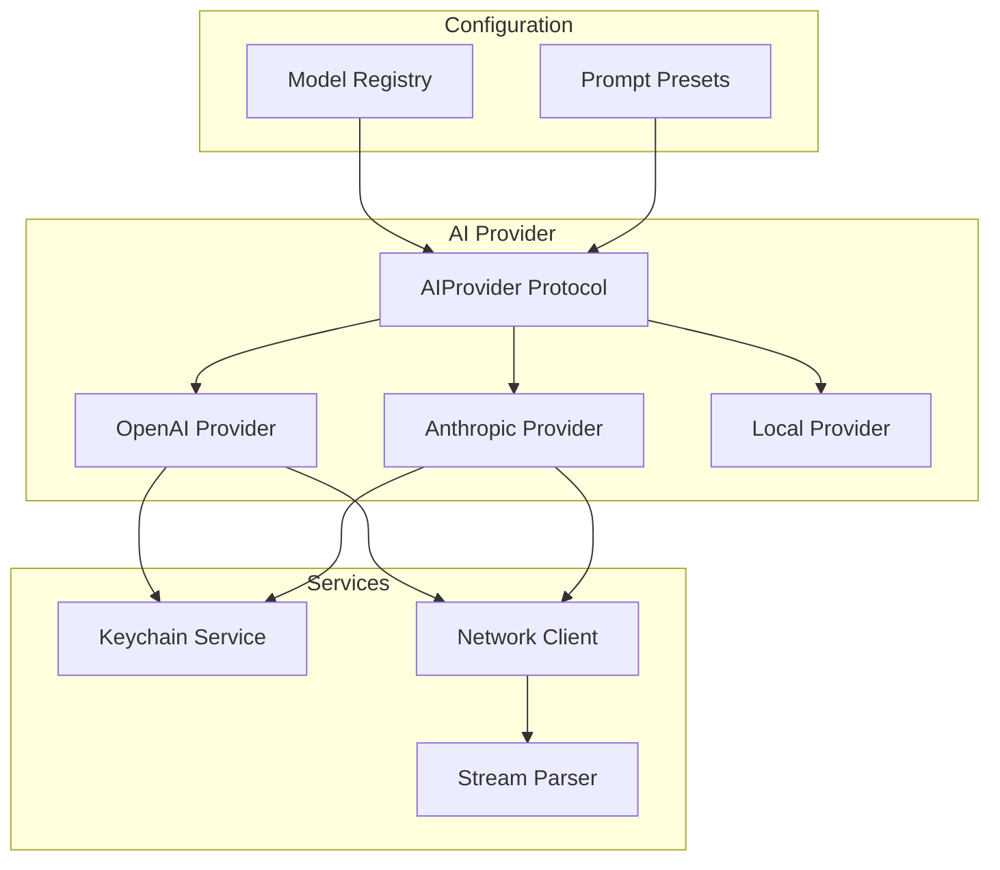

# Spell Caster - AI Provider

## Overview

The AIProvider module abstracts AI backend communication, supporting multiple providers (OpenAI, Anthropic, local models) with streaming responses, model selection, and API key management. This document specifies the architecture for AI integration.

## Architecture



## AI Provider Protocol

### Core Protocol

```swift
import Foundation
import Combine

/// Protocol for AI backend providers
protocol AIProviderProtocol {
    // MARK: - Models
    
    /// Available models for this provider
    var availableModels: [AIModel] { get }
    
    /// Currently selected model
    var selectedModel: AIModel { get set }
    
    // MARK: - Streaming
    
    /// Send a prompt and receive streaming response
    func sendPrompt(
        _ prompt: String,
        context: AIContext
    ) -> AnyPublisher<AIResponseChunk, Error>
    
    /// Cancel ongoing request
    func cancelRequest()
    
    // MARK: - Configuration
    
    /// Configure provider with API key
    func configure(apiKey: String) throws
    
    /// Check if provider is configured
    var isConfigured: Bool { get }
}

// MARK: - Response Chunk

enum AIResponseChunk {
    case content(String)
    case done(String)
    case error(Error)
}

// MARK: - Provider Errors

enum AIProviderError: Error, LocalizedError {
    case notConfigured
    case apiKeyMissing
    case networkError(Error)
    case rateLimited
    case invalidResponse
    case streamingError
    case modelNotAvailable
    case contextTooLarge
    
    var errorDescription: String? {
        switch self {
        case .notConfigured:
            return "AI provider is not configured"
        case .apiKeyMissing:
            return "API key is missing"
        case .networkError(let error):
            return "Network error: \(error.localizedDescription)"
        case .rateLimited:
            return "Rate limit exceeded"
        case .invalidResponse:
            return "Invalid response from AI provider"
        case .streamingError:
            return "Streaming error occurred"
        case .modelNotAvailable:
            return "Selected model is not available"
        case .contextTooLarge:
            return "Context exceeds model's maximum length"
        }
    }
}
```

## OpenAI Provider

### Implementation

```swift
import Foundation
import Combine

/// OpenAI API provider
final class OpenAIProvider: AIProviderProtocol {
    // MARK: - Properties
    
    private let keychainService: KeychainService
    private let networkClient: NetworkClient
    private var apiKey: String?
    
    private var currentTask: URLSessionDataTask?
    private let baseURL = "https://api.openai.com/v1"
    
    // MARK: - Models
    
    var availableModels: [AIModel] = [
        AIModel(
            id: "gpt-4-turbo",
            name: "GPT-4 Turbo",
            provider: .openAI,
            maxContextLength: 128000,
            supportsStreaming: true
        ),
        AIModel(
            id: "gpt-4",
            name: "GPT-4",
            provider: .openAI,
            maxContextLength: 8192,
            supportsStreaming: true
        ),
        AIModel(
            id: "gpt-3.5-turbo",
            name: "GPT-3.5 Turbo",
            provider: .openAI,
            maxContextLength: 16385,
            supportsStreaming: true
        )
    ]
    
    var selectedModel: AIModel
    
    var isConfigured: Bool {
        apiKey != nil
    }
    
    // MARK: - Initialization
    
    init(keychain: KeychainService) {
        self.keychainService = keychain
        self.networkClient = NetworkClient()
        self.selectedModel = availableModels[0]
        
        // Load API key from keychain
        if let key = try? keychain.get(key: "openai_api_key") {
            self.apiKey = key
        }
    }
    
    // MARK: - Configuration
    
    func configure(apiKey: String) throws {
        self.apiKey = apiKey
        try keychainService.set(key: "openai_api_key", value: apiKey)
    }
    
    // MARK: - Streaming
    
    func sendPrompt(
        _ prompt: String,
        context: AIContext
    ) -> AnyPublisher<AIResponseChunk, Error> {
        guard let apiKey = apiKey else {
            return Fail(error: AIProviderError.apiKeyMissing)
                .eraseToAnyPublisher()
        }
        
        // Build messages
        let messages = buildMessages(prompt: prompt, context: context)
        
        // Create request
        let request = createChatCompletionRequest(messages: messages)
        
        // Stream response
        return streamChatCompletion(request: request, apiKey: apiKey)
    }
    
    func cancelRequest() {
        currentTask?.cancel()
        currentTask = nil
    }
    
    // MARK: - Request Building
    
    private func buildMessages(prompt: String, context: AIContext) -> [[String: Any]] {
        var messages: [[String: Any]] = []
        
        // System message with context
        let systemMessage = buildSystemMessage(context: context)
        messages.append([
            "role": "system",
            "content": systemMessage
        ])
        
        // User message
        messages.append([
            "role": "user",
            "content": prompt
        ])
        
        return messages
    }
    
    private func buildSystemMessage(context: AIContext) -> String {
        var parts: [String] = [
            "You are an AI assistant integrated into a terminal emulator.",
            "Help the user with command-line tasks, debugging, and system administration.",
            "When suggesting commands, wrap them in ```bash code blocks."
        ]
        
        // Add context information
        if let cwd = context.workingDirectory {
            parts.append("Current directory: \(cwd.path)")
        }
        
        if let shell = context.shell {
            parts.append("Shell: \(shell.rawValue)")
        }
        
        if let lastCommand = context.lastCommand {
            parts.append("Last command: \(lastCommand)")
            if let exitCode = context.lastExitCode {
                parts.append("Exit code: \(exitCode)")
            }
        }
        
        if let output = context.recentOutput {
            parts.append("Recent output:\n\(output)")
        }
        
        if let gitStatus = context.gitStatus, let branch = gitStatus.branch {
            parts.append("Git branch: \(branch)")
            if !gitStatus.isClean {
                parts.append("Git status: \(gitStatus.staged) staged, \(gitStatus.unstaged) unstaged, \(gitStatus.untracked) untracked")
            }
        }
        
        return parts.joined(separator: "\n\n")
    }
    
    private func createChatCompletionRequest(messages: [[String: Any]]) -> URLRequest {
        let url = URL(string: "\(baseURL)/chat/completions")!
        var request = URLRequest(url: url)
        request.httpMethod = "POST"
        request.setValue("application/json", forHTTPHeaderField: "Content-Type")
        
        let body: [String: Any] = [
            "model": selectedModel.id,
            "messages": messages,
            "stream": true,
            "temperature": 0.7,
            "max_tokens": 4096
        ]
        
        request.httpBody = try? JSONSerialization.data(withJSONObject: body)
        
        return request
    }
    
    // MARK: - Streaming
    
    private func streamChatCompletion(
        request: URLRequest,
        apiKey: String
    ) -> AnyPublisher<AIResponseChunk, Error> {
        let subject = PassthroughSubject<AIResponseChunk, Error>()
        
        var urlRequest = request
        urlRequest.setValue("Bearer \(apiKey)", forHTTPHeaderField: "Authorization")
        
        let task = URLSession.shared.dataTask(with: urlRequest) { data, response, error in
            if let error = error {
                subject.send(completion: .failure(AIProviderError.networkError(error)))
                return
            }
            
            guard let httpResponse = response as? HTTPURLResponse else {
                subject.send(completion: .failure(AIProviderError.invalidResponse))
                return
            }
            
            guard (200...299).contains(httpResponse.statusCode) else {
                if httpResponse.statusCode == 429 {
                    subject.send(completion: .failure(AIProviderError.rateLimited))
                } else {
                    subject.send(completion: .failure(AIProviderError.invalidResponse))
                }
                return
            }
            
            guard let data = data else {
                subject.send(completion: .failure(AIProviderError.invalidResponse))
                return
            }
            
            // Parse SSE stream
            self.parseSSEStream(data: data, subject: subject)
        }
        
        currentTask = task
        task.resume()
        
        return subject.eraseToAnyPublisher()
    }
    
    private func parseSSEStream(
        data: Data,
        subject: PassthroughSubject<AIResponseChunk, Error>
    ) {
        guard let text = String(data: data, encoding: .utf8) else {
            subject.send(completion: .failure(AIProviderError.invalidResponse))
            return
        }
        
        var fullResponse = ""
        let lines = text.components(separatedBy: "\n")
        
        for line in lines {
            guard line.hasPrefix("data: ") else { continue }
            
            let jsonString = String(line.dropFirst(6))
            
            // Check for [DONE]
            if jsonString.trimmingCharacters(in: .whitespaces) == "[DONE]" {
                subject.send(.done(fullResponse))
                subject.send(completion: .finished)
                return
            }
            
            // Parse JSON
            guard let jsonData = jsonString.data(using: .utf8),
                  let json = try? JSONSerialization.jsonObject(with: jsonData) as? [String: Any],
                  let choices = json["choices"] as? [[String: Any]],
                  let firstChoice = choices.first,
                  let delta = firstChoice["delta"] as? [String: Any],
                  let content = delta["content"] as? String else {
                continue
            }
            
            fullResponse += content
            subject.send(.content(content))
        }
    }
}
```

## Anthropic Provider

### Implementation

```swift
import Foundation
import Combine

/// Anthropic (Claude) API provider
final class AnthropicProvider: AIProviderProtocol {
    // MARK: - Properties
    
    private let keychainService: KeychainService
    private let networkClient: NetworkClient
    private var apiKey: String?
    
    private var currentTask: URLSessionDataTask?
    private let baseURL = "https://api.anthropic.com/v1"
    
    // MARK: - Models
    
    var availableModels: [AIModel] = [
        AIModel(
            id: "claude-3-opus-20240229",
            name: "Claude 3 Opus",
            provider: .anthropic,
            maxContextLength: 200000,
            supportsStreaming: true
        ),
        AIModel(
            id: "claude-3-sonnet-20240229",
            name: "Claude 3 Sonnet",
            provider: .anthropic,
            maxContextLength: 200000,
            supportsStreaming: true
        ),
        AIModel(
            id: "claude-3-haiku-20240307",
            name: "Claude 3 Haiku",
            provider: .anthropic,
            maxContextLength: 200000,
            supportsStreaming: true
        )
    ]
    
    var selectedModel: AIModel
    
    var isConfigured: Bool {
        apiKey != nil
    }
    
    // MARK: - Initialization
    
    init(keychain: KeychainService) {
        self.keychainService = keychain
        self.networkClient = NetworkClient()
        self.selectedModel = availableModels[0]
        
        // Load API key from keychain
        if let key = try? keychain.get(key: "anthropic_api_key") {
            self.apiKey = key
        }
    }
    
    // MARK: - Configuration
    
    func configure(apiKey: String) throws {
        self.apiKey = apiKey
        try keychainService.set(key: "anthropic_api_key", value: apiKey)
    }
    
    // MARK: - Streaming
    
    func sendPrompt(
        _ prompt: String,
        context: AIContext
    ) -> AnyPublisher<AIResponseChunk, Error> {
        guard let apiKey = apiKey else {
            return Fail(error: AIProviderError.apiKeyMissing)
                .eraseToAnyPublisher()
        }
        
        // Build messages
        let systemPrompt = buildSystemPrompt(context: context)
        
        // Create request
        let request = createMessagesRequest(
            systemPrompt: systemPrompt,
            userMessage: prompt
        )
        
        // Stream response
        return streamMessages(request: request, apiKey: apiKey)
    }
    
    func cancelRequest() {
        currentTask?.cancel()
        currentTask = nil
    }
    
    // MARK: - Request Building
    
    private func buildSystemPrompt(context: AIContext) -> String {
        var parts: [String] = [
            "You are an AI assistant integrated into a terminal emulator.",
            "Help the user with command-line tasks, debugging, and system administration.",
            "When suggesting commands, wrap them in ```bash code blocks."
        ]
        
        // Add context (similar to OpenAI)
        if let cwd = context.workingDirectory {
            parts.append("Current directory: \(cwd.path)")
        }
        
        if let shell = context.shell {
            parts.append("Shell: \(shell.rawValue)")
        }
        
        if let lastCommand = context.lastCommand {
            parts.append("Last command: \(lastCommand)")
            if let exitCode = context.lastExitCode {
                parts.append("Exit code: \(exitCode)")
            }
        }
        
        if let output = context.recentOutput {
            parts.append("Recent output:\n\(output)")
        }
        
        return parts.joined(separator: "\n\n")
    }
    
    private func createMessagesRequest(
        systemPrompt: String,
        userMessage: String
    ) -> URLRequest {
        let url = URL(string: "\(baseURL)/messages")!
        var request = URLRequest(url: url)
        request.httpMethod = "POST"
        request.setValue("application/json", forHTTPHeaderField: "Content-Type")
        request.setValue("2023-06-01", forHTTPHeaderField: "anthropic-version")
        
        let body: [String: Any] = [
            "model": selectedModel.id,
            "max_tokens": 4096,
            "system": systemPrompt,
            "messages": [
                [
                    "role": "user",
                    "content": userMessage
                ]
            ],
            "stream": true
        ]
        
        request.httpBody = try? JSONSerialization.data(withJSONObject: body)
        
        return request
    }
    
    // MARK: - Streaming
    
    private func streamMessages(
        request: URLRequest,
        apiKey: String
    ) -> AnyPublisher<AIResponseChunk, Error> {
        let subject = PassthroughSubject<AIResponseChunk, Error>()
        
        var urlRequest = request
        urlRequest.setValue(apiKey, forHTTPHeaderField: "x-api-key")
        
        let task = URLSession.shared.dataTask(with: urlRequest) { data, response, error in
            if let error = error {
                subject.send(completion: .failure(AIProviderError.networkError(error)))
                return
            }
            
            guard let data = data else {
                subject.send(completion: .failure(AIProviderError.invalidResponse))
                return
            }
            
            // Parse SSE stream
            self.parseAnthropicStream(data: data, subject: subject)
        }
        
        currentTask = task
        task.resume()
        
        return subject.eraseToAnyPublisher()
    }
    
    private func parseAnthropicStream(
        data: Data,
        subject: PassthroughSubject<AIResponseChunk, Error>
    ) {
        guard let text = String(data: data, encoding: .utf8) else {
            subject.send(completion: .failure(AIProviderError.invalidResponse))
            return
        }
        
        var fullResponse = ""
        let lines = text.components(separatedBy: "\n")
        
        for line in lines {
            guard line.hasPrefix("data: ") else { continue }
            
            let jsonString = String(line.dropFirst(6))
            
            guard let jsonData = jsonString.data(using: .utf8),
                  let json = try? JSONSerialization.jsonObject(with: jsonData) as? [String: Any],
                  let type = json["type"] as? String else {
                continue
            }
            
            switch type {
            case "content_block_delta":
                if let delta = json["delta"] as? [String: Any],
                   let text = delta["text"] as? String {
                    fullResponse += text
                    subject.send(.content(text))
                }
                
            case "message_stop":
                subject.send(.done(fullResponse))
                subject.send(completion: .finished)
                
            default:
                break
            }
        }
    }
}
```

## Local Provider

### Implementation

```swift
import Foundation
import Combine

/// Local model provider (e.g., Ollama, LM Studio)
final class LocalProvider: AIProviderProtocol {
    // MARK: - Properties
    
    private let networkClient: NetworkClient
    private var currentTask: URLSessionDataTask?
    private var baseURL: String = "http://localhost:11434" // Ollama default
    
    // MARK: - Models
    
    var availableModels: [AIModel] = [
        AIModel(
            id: "llama2",
            name: "Llama 2",
            provider: .local,
            maxContextLength: 4096,
            supportsStreaming: true
        ),
        AIModel(
            id: "codellama",
            name: "Code Llama",
            provider: .local,
            maxContextLength: 16384,
            supportsStreaming: true
        ),
        AIModel(
            id: "mistral",
            name: "Mistral",
            provider: .local,
            maxContextLength: 8192,
            supportsStreaming: true
        )
    ]
    
    var selectedModel: AIModel
    
    var isConfigured: Bool {
        // Check if local server is running
        return checkServerAvailability()
    }
    
    // MARK: - Initialization
    
    init() {
        self.networkClient = NetworkClient()
        self.selectedModel = availableModels[0]
        
        // Load available models from server
        loadAvailableModels()
    }
    
    // MARK: - Configuration
    
    func configure(apiKey: String) throws {
        // Local provider doesn't need API key
        // But we can use this to set custom base URL
        self.baseURL = apiKey
    }
    
    // MARK: - Server Check
    
    private func checkServerAvailability() -> Bool {
        // Simple synchronous check
        let url = URL(string: "\(baseURL)/api/tags")!
        let semaphore = DispatchSemaphore(value: 0)
        var isAvailable = false
        
        let task = URLSession.shared.dataTask(with: url) { _, response, _ in
            if let httpResponse = response as? HTTPURLResponse,
               (200...299).contains(httpResponse.statusCode) {
                isAvailable = true
            }
            semaphore.signal()
        }
        
        task.resume()
        _ = semaphore.wait(timeout: .now() + 2)
        
        return isAvailable
    }
    
    private func loadAvailableModels() {
        let url = URL(string: "\(baseURL)/api/tags")!
        
        URLSession.shared.dataTask(with: url) { [weak self] data, _, _ in
            guard let data = data,
                  let json = try? JSONSerialization.jsonObject(with: data) as? [String: Any],
                  let models = json["models"] as? [[String: Any]] else {
                return
            }
            
            var loadedModels: [AIModel] = []
            for model in models {
                if let name = model["name"] as? String {
                    loadedModels.append(AIModel(
                        id: name,
                        name: name.capitalized,
                        provider: .local,
                        maxContextLength: 4096,
                        supportsStreaming: true
                    ))
                }
            }
            
            DispatchQueue.main.async {
                if !loadedModels.isEmpty {
                    self?.availableModels = loadedModels
                    self?.selectedModel = loadedModels[0]
                }
            }
        }.resume()
    }
    
    // MARK: - Streaming
    
    func sendPrompt(
        _ prompt: String,
        context: AIContext
    ) -> AnyPublisher<AIResponseChunk, Error> {
        let systemPrompt = buildSystemPrompt(context: context)
        let fullPrompt = "\(systemPrompt)\n\nUser: \(prompt)\n\nAssistant:"
        
        let request = createGenerateRequest(prompt: fullPrompt)
        
        return streamGenerate(request: request)
    }
    
    func cancelRequest() {
        currentTask?.cancel()
        currentTask = nil
    }
    
    // MARK: - Request Building
    
    private func buildSystemPrompt(context: AIContext) -> String {
        var parts: [String] = [
            "You are an AI assistant integrated into a terminal emulator.",
            "Help the user with command-line tasks."
        ]
        
        if let cwd = context.workingDirectory {
            parts.append("Current directory: \(cwd.path)")
        }
        
        return parts.joined(separator: "\n")
    }
    
    private func createGenerateRequest(prompt: String) -> URLRequest {
        let url = URL(string: "\(baseURL)/api/generate")!
        var request = URLRequest(url: url)
        request.httpMethod = "POST"
        request.setValue("application/json", forHTTPHeaderField: "Content-Type")
        
        let body: [String: Any] = [
            "model": selectedModel.id,
            "prompt": prompt,
            "stream": true
        ]
        
        request.httpBody = try? JSONSerialization.data(withJSONObject: body)
        
        return request
    }
    
    // MARK: - Streaming
    
    private func streamGenerate(
        request: URLRequest
    ) -> AnyPublisher<AIResponseChunk, Error> {
        let subject = PassthroughSubject<AIResponseChunk, Error>()
        
        let task = URLSession.shared.dataTask(with: request) { data, response, error in
            if let error = error {
                subject.send(completion: .failure(AIProviderError.networkError(error)))
                return
            }
            
            guard let data = data else {
                subject.send(completion: .failure(AIProviderError.invalidResponse))
                return
            }
            
            self.parseLocalStream(data: data, subject: subject)
        }
        
        currentTask = task
        task.resume()
        
        return subject.eraseToAnyPublisher()
    }
    
    private func parseLocalStream(
        data: Data,
        subject: PassthroughSubject<AIResponseChunk, Error>
    ) {
        guard let text = String(data: data, encoding: .utf8) else {
            subject.send(completion: .failure(AIProviderError.invalidResponse))
            return
        }
        
        var fullResponse = ""
        let lines = text.components(separatedBy: "\n")
        
        for line in lines {
            guard !line.isEmpty,
                  let jsonData = line.data(using: .utf8),
                  let json = try? JSONSerialization.jsonObject(with: jsonData) as? [String: Any] else {
                continue
            }
            
            if let response = json["response"] as? String {
                fullResponse += response
                subject.send(.content(response))
            }
            
            if let done = json["done"] as? Bool, done {
                subject.send(.done(fullResponse))
                subject.send(completion: .finished)
            }
        }
    }
}
```

## Keychain Service

### Secure Storage

```swift
import Security
import Foundation

/// Keychain service for secure API key storage
final class KeychainService {
    private let service = "com.spellcaster.apikeys"
    
    // MARK: - Set
    
    func set(key: String, value: String) throws {
        guard let data = value.data(using: .utf8) else {
            throw KeychainError.invalidData
        }
        
        // Delete existing item
        try? delete(key: key)
        
        // Add new item
        let query: [String: Any] = [
            kSecClass as String: kSecClassGenericPassword,
            kSecAttrService as String: service,
            kSecAttrAccount as String: key,
            kSecValueData as String: data,
            kSecAttrAccessible as String: kSecAttrAccessibleWhenUnlocked
        ]
        
        let status = SecItemAdd(query as CFDictionary, nil)
        
        guard status == errSecSuccess else {
            throw KeychainError.unhandledError(status: status)
        }
    }
    
    // MARK: - Get
    
    func get(key: String) throws -> String {
        let query: [String: Any] = [
            kSecClass as String: kSecClassGenericPassword,
            kSecAttrService as String: service,
            kSecAttrAccount as String: key,
            kSecReturnData as String: true,
            kSecMatchLimit as String: kSecMatchLimitOne
        ]
        
        var result: AnyObject?
        let status = SecItemCopyMatching(query as CFDictionary, &result)
        
        guard status == errSecSuccess else {
            throw KeychainError.itemNotFound
        }
        
        guard let data = result as? Data,
              let string = String(data: data, encoding: .utf8) else {
            throw KeychainError.invalidData
        }
        
        return string
    }
    
    // MARK: - Delete
    
    func delete(key: String) throws {
        let query: [String: Any] = [
            kSecClass as String: kSecClassGenericPassword,
            kSecAttrService as String: service,
            kSecAttrAccount as String: key
        ]
        
        let status = SecItemDelete(query as CFDictionary)
        
        guard status == errSecSuccess || status == errSecItemNotFound else {
            throw KeychainError.unhandledError(status: status)
        }
    }
}

// MARK: - Errors

enum KeychainError: Error, LocalizedError {
    case itemNotFound
    case invalidData
    case unhandledError(status: OSStatus)
    
    var errorDescription: String? {
        switch self {
        case .itemNotFound:
            return "Item not found in keychain"
        case .invalidData:
            return "Invalid data format"
        case .unhandledError(let status):
            return "Keychain error: \(status)"
        }
    }
}
```

## Prompt Presets

### Preset System

```swift
import Foundation

/// Prompt preset for common tasks
struct PromptPreset: Identifiable, Codable {
    let id: UUID
    let name: String
    let description: String
    let template: String
    let category: PresetCategory
    
    init(
        id: UUID = UUID(),
        name: String,
        description: String,
        template: String,
        category: PresetCategory
    ) {
        self.id = id
        self.name = name
        self.description = description
        self.template = template
        self.category = category
    }
}

enum PresetCategory: String, Codable {
    case debugging
    case scripting
    case systemAdmin
    case git
    case docker
    case general
}

/// Prompt preset manager
final class PromptPresetManager {
    static let shared = PromptPresetManager()
    
    private(set) var presets: [PromptPreset] = []
    
    private init() {
        loadDefaultPresets()
    }
    
    private func loadDefaultPresets() {
        presets = [
            PromptPreset(
                name: "Explain Error",
                description: "Explain the error in the terminal output",
                template: "Explain this error and suggest how to fix it:\n\n{recent_output}",
                category: .debugging
            ),
            PromptPreset(
                name: "Fix Command",
                description: "Fix a command that failed",
                template: "This command failed:\n{last_command}\n\nError:\n{recent_output}\n\nHow can I fix it?",
                category: .debugging
            ),
            PromptPreset(
                name: "Write Script",
                description: "Generate a shell script",
                template: "Write a shell script that: {user_input}",
                category: .scripting
            ),
            PromptPreset(
                name: "Git Help",
                description: "Help with git operations",
                template: "I need help with git. Current status:\n{git_status}\n\nQuestion: {user_input}",
                category: .git
            ),
            PromptPreset(
                name: "Docker Command",
                description: "Generate docker commands",
                template: "Generate a docker command to: {user_input}",
                category: .docker
            )
        ]
    }
    
    func applyPreset(_ preset: PromptPreset, context: AIContext, userInput: String = "") -> String {
        var result = preset.template
        
        // Replace placeholders
        result = result.replacingOccurrences(of: "{user_input}", with: userInput)
        result = result.replacingOccurrences(of: "{recent_output}", with: context.recentOutput ?? "")
        result = result.replacingOccurrences(of: "{last_command}", with: context.lastCommand ?? "")
        
        if let gitStatus = context.gitStatus {
            let statusText = formatGitStatus(gitStatus)
            result = result.replacingOccurrences(of: "{git_status}", with: statusText)
        }
        
        return result
    }
    
    private func formatGitStatus(_ status: GitStatus) -> String {
        var parts: [String] = []
        if let branch = status.branch {
            parts.append("Branch: \(branch)")
        }
        parts.append("Staged: \(status.staged)")
        parts.append("Unstaged: \(status.unstaged)")
        parts.append("Untracked: \(status.untracked)")
        return parts.joined(separator: "\n")
    }
}
```

## Network Client

### HTTP Client

```swift
import Foundation

/// Network client for API requests
final class NetworkClient {
    private let session: URLSession
    
    init() {
        let configuration = URLSessionConfiguration.default
        configuration.timeoutIntervalForRequest = 30
        configuration.timeoutIntervalForResource = 300
        self.session = URLSession(configuration: configuration)
    }
    
    func request<T: Decodable>(
        _ request: URLRequest,
        responseType: T.Type
    ) async throws -> T {
        let (data, response) = try await session.data(for: request)
        
        guard let httpResponse = response as? HTTPURLResponse else {
            throw NetworkError.invalidResponse
        }
        
        guard (200...299).contains(httpResponse.statusCode) else {
            throw NetworkError.httpError(statusCode: httpResponse.statusCode)
        }
        
        let decoder = JSONDecoder()
        return try decoder.decode(T.self, from: data)
    }
}

enum NetworkError: Error, LocalizedError {
    case invalidResponse
    case httpError(statusCode: Int)
    
    var errorDescription: String? {
        switch self {
        case .invalidResponse:
            return "Invalid response from server"
        case .httpError(let code):
            return "HTTP error: \(code)"
        }
    }
}
```

## Provider Factory

### Factory Pattern

```swift
import Foundation

/// Factory for creating AI providers
final class AIProviderFactory {
    static let shared = AIProviderFactory()
    
    private let keychainService = KeychainService()
    
    private init() {}
    
    func createProvider(type: ProviderType) -> AIProviderProtocol {
        switch type {
        case .openAI:
            return OpenAIProvider(keychain: keychainService)
        case .anthropic:
            return AnthropicProvider(keychain: keychainService)
        case .local:
            return LocalProvider()
        }
    }
}
```

## Summary

The AIProvider module provides:

| Component | Purpose |
|-----------|---------|
| [`AIProviderProtocol`](#ai-provider-protocol) | Common interface for all providers |
| [`OpenAIProvider`](#openai-provider) | OpenAI/GPT integration |
| [`AnthropicProvider`](#anthropic-provider) | Anthropic/Claude integration |
| [`LocalProvider`](#local-provider) | Local model support (Ollama, etc.) |
| [`KeychainService`](#keychain-service) | Secure API key storage |
| [`PromptPresetManager`](#prompt-presets) | Preset prompt templates |
| [`NetworkClient`](#network-client) | HTTP client for API requests |

## Next Steps

Continue to [08-context-capture.md](08-context-capture.md) for the context capture specification.
