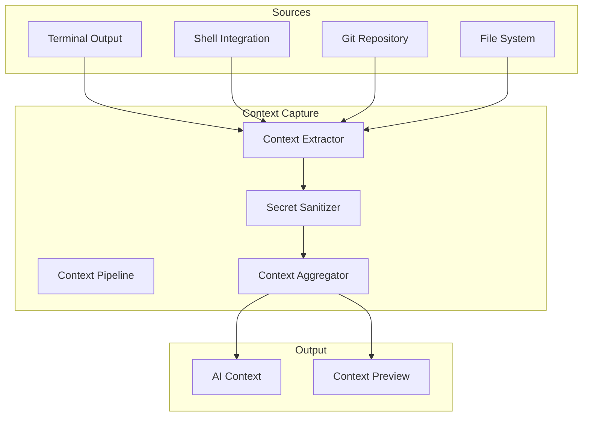

# Spell Caster - Context Capture

## Overview

The ContextCapture module extracts relevant terminal context for AI queries, including working directory, recent output, command history, git status, and more. This document specifies the architecture for intelligent context gathering with privacy protection.

## Architecture



## Context Capture Protocol

### Core Protocol

```swift
import Foundation
import Combine

/// Protocol for context capture
protocol ContextCaptureProtocol {
    /// Current context snapshot
    var currentContext: AIContext { get }
    
    /// Context publisher for reactive updates
    var contextPublisher: AnyPublisher<AIContext, Never> { get }
    
    /// Update context settings
    func updateSettings(_ settings: ContextSettings)
    
    /// Capture context with optional selection
    func captureContext(selection: String?) -> AIContext
    
    /// Clear cached context
    func clearCache()
}
```

## Context Capture Implementation

### Main Implementation

```swift
import Foundation
import Combine

/// Context capture implementation
final class ContextCapture: ContextCaptureProtocol {
    // MARK: - Properties
    
    private weak var terminalEngine: TerminalEngineProtocol?
    private var settings: ContextSettings
    
    private let contextSubject = CurrentValueSubject<AIContext, Never>(AIContext())
    private var cancellables = Set<AnyCancellable>()
    
    // MARK: - Extractors
    
    private let workingDirectoryExtractor: WorkingDirectoryExtractor
    private let outputExtractor: OutputExtractor
    private let commandExtractor: CommandExtractor
    private let gitExtractor: GitExtractor
    private let environmentExtractor: EnvironmentExtractor
    
    // MARK: - Sanitizer
    
    private let secretSanitizer: SecretSanitizer
    
    // MARK: - Computed Properties
    
    var currentContext: AIContext {
        contextSubject.value
    }
    
    var contextPublisher: AnyPublisher<AIContext, Never> {
        contextSubject.eraseToAnyPublisher()
    }
    
    // MARK: - Initialization
    
    init(terminalEngine: TerminalEngineProtocol, settings: ContextSettings = ContextSettings()) {
        self.terminalEngine = terminalEngine
        self.settings = settings
        
        // Initialize extractors
        self.workingDirectoryExtractor = WorkingDirectoryExtractor()
        self.outputExtractor = OutputExtractor(terminalEngine: terminalEngine)
        self.commandExtractor = CommandExtractor(terminalEngine: terminalEngine)
        self.gitExtractor = GitExtractor()
        self.environmentExtractor = EnvironmentExtractor()
        
        // Initialize sanitizer
        self.secretSanitizer = SecretSanitizer()
        
        setupContextUpdates()
    }
    
    // MARK: - Setup
    
    private func setupContextUpdates() {
        // Update context when terminal state changes
        terminalEngine?.statePublisher
            .debounce(for: .milliseconds(500), scheduler: DispatchQueue.main)
            .sink { [weak self] _ in
                self?.updateContext()
            }
            .store(in: &cancellables)
    }
    
    // MARK: - Context Capture
    
    func captureContext(selection: String?) -> AIContext {
        var context = AIContext()
        
        // Working directory
        if settings.includeWorkingDirectory {
            context.workingDirectory = workingDirectoryExtractor.extract()
        }
        
        // Shell type
        context.shell = detectShellType()
        
        // Recent output
        if settings.includeRecentOutput {
            let output = outputExtractor.extract(lines: settings.recentOutputLines)
            context.recentOutput = settings.redactSecrets
                ? secretSanitizer.sanitize(output)
                : output
        }
        
        // Last command
        if settings.includeLastCommand {
            if let command = commandExtractor.extractLastCommand() {
                context.lastCommand = command.command
                context.lastExitCode = command.exitCode
            }
        }
        
        // Selection
        if let selection = selection {
            context.selection = settings.redactSecrets
                ? secretSanitizer.sanitize(selection)
                : selection
        }
        
        // Git status
        if settings.includeGitStatus,
           let cwd = context.workingDirectory {
            context.gitStatus = gitExtractor.extract(at: cwd)
        }
        
        // Environment variables
        if settings.includeEnvironment {
            context.environment = environmentExtractor.extract(redact: settings.redactSecrets)
        }
        
        return context
    }
    
    func updateSettings(_ settings: ContextSettings) {
        self.settings = settings
        updateContext()
    }
    
    func clearCache() {
        contextSubject.send(AIContext())
    }
    
    // MARK: - Private Methods
    
    private func updateContext() {
        let context = captureContext(selection: nil)
        contextSubject.send(context)
    }
    
    private func detectShellType() -> ShellType {
        guard let engine = terminalEngine else { return .unknown }
        
        // Try to detect from shell integration
        if let shellState = engine.state.shellIntegration,
           let type = shellState.shellType {
            return type
        }
        
        // Fallback: detect from environment
        if let shell = ProcessInfo.processInfo.environment["SHELL"] {
            if shell.contains("zsh") { return .zsh }
            if shell.contains("bash") { return .bash }
            if shell.contains("fish") { return .fish }
        }
        
        return .unknown
    }
}
```

## Context Extractors

### Working Directory Extractor

```swift
import Foundation

/// Extracts current working directory
final class WorkingDirectoryExtractor {
    func extract() -> URL? {
        // Try to get from shell integration first
        // This would be set by OSC 7 sequences
        
        // Fallback to process working directory
        let cwd = FileManager.default.currentDirectoryPath
        return URL(fileURLWithPath: cwd)
    }
}
```

### Output Extractor

```swift
import Foundation

/// Extracts recent terminal output
final class OutputExtractor {
    private weak var terminalEngine: TerminalEngineProtocol?
    
    init(terminalEngine: TerminalEngineProtocol) {
        self.terminalEngine = terminalEngine
    }
    
    func extract(lines: Int) -> String {
        guard let engine = terminalEngine else { return "" }
        
        let scrollback = engine.state.scrollback
        let totalLines = scrollback.count
        
        guard totalLines > 0 else { return "" }
        
        // Get last N lines
        let startIndex = max(0, totalLines - lines)
        let endIndex = totalLines
        
        let recentLines = scrollback.getLines(range: startIndex..<endIndex)
        
        // Convert to text
        return recentLines.map { line in
            String(line.cells.map { $0.character })
        }.joined(separator: "\n")
    }
}
```

### Command Extractor

```swift
import Foundation

/// Extracts command history and last command
final class CommandExtractor {
    private weak var terminalEngine: TerminalEngineProtocol?
    
    init(terminalEngine: TerminalEngineProtocol) {
        self.terminalEngine = terminalEngine
    }
    
    func extractLastCommand() -> CommandInfo? {
        guard let engine = terminalEngine,
              let shellState = engine.state.shellIntegration else {
            return nil
        }
        
        return CommandInfo(
            command: shellState.lastCommand ?? "",
            exitCode: shellState.lastExitCode
        )
    }
    
    func extractCommandHistory(count: Int) -> [CommandInfo] {
        // This would require maintaining a command history
        // For now, return empty array
        return []
    }
}

struct CommandInfo {
    let command: String
    let exitCode: Int?
}
```

### Git Extractor

```swift
import Foundation

/// Extracts git repository status
final class GitExtractor {
    func extract(at directory: URL) -> GitStatus? {
        // Check if directory is in a git repository
        guard isGitRepository(at: directory) else {
            return nil
        }
        
        var status = GitStatus.clean
        
        // Get current branch
        status.branch = getCurrentBranch(at: directory)
        
        // Get status counts
        let statusInfo = getStatusInfo(at: directory)
        status.staged = statusInfo.staged
        status.unstaged = statusInfo.unstaged
        status.untracked = statusInfo.untracked
        status.conflicts = statusInfo.conflicts
        status.isClean = statusInfo.isClean
        
        // Get ahead/behind counts
        let tracking = getTrackingInfo(at: directory)
        status.ahead = tracking.ahead
        status.behind = tracking.behind
        
        return status
    }
    
    // MARK: - Git Commands
    
    private func isGitRepository(at directory: URL) -> Bool {
        let gitDir = directory.appendingPathComponent(".git")
        return FileManager.default.fileExists(atPath: gitDir.path)
    }
    
    private func getCurrentBranch(at directory: URL) -> String? {
        let output = runGitCommand(["rev-parse", "--abbrev-ref", "HEAD"], at: directory)
        return output?.trimmingCharacters(in: .whitespacesAndNewlines)
    }
    
    private func getStatusInfo(at directory: URL) -> (staged: Int, unstaged: Int, untracked: Int, conflicts: Int, isClean: Bool) {
        guard let output = runGitCommand(["status", "--porcelain"], at: directory) else {
            return (0, 0, 0, 0, true)
        }
        
        var staged = 0
        var unstaged = 0
        var untracked = 0
        var conflicts = 0
        
        let lines = output.components(separatedBy: .newlines)
        for line in lines {
            guard line.count >= 2 else { continue }
            
            let index = line.prefix(1)
            let workTree = line.dropFirst().prefix(1)
            
            // Staged changes
            if index != " " && index != "?" {
                staged += 1
            }
            
            // Unstaged changes
            if workTree != " " && workTree != "?" {
                unstaged += 1
            }
            
            // Untracked files
            if index == "?" {
                untracked += 1
            }
            
            // Conflicts
            if index == "U" || workTree == "U" {
                conflicts += 1
            }
        }
        
        let isClean = staged == 0 && unstaged == 0 && untracked == 0
        
        return (staged, unstaged, untracked, conflicts, isClean)
    }
    
    private func getTrackingInfo(at directory: URL) -> (ahead: Int, behind: Int) {
        guard let output = runGitCommand(["rev-list", "--left-right", "--count", "HEAD...@{u}"], at: directory) else {
            return (0, 0)
        }
        
        let parts = output.trimmingCharacters(in: .whitespacesAndNewlines).components(separatedBy: "\t")
        guard parts.count == 2 else { return (0, 0) }
        
        let ahead = Int(parts[0]) ?? 0
        let behind = Int(parts[1]) ?? 0
        
        return (ahead, behind)
    }
    
    private func runGitCommand(_ arguments: [String], at directory: URL) -> String? {
        let process = Process()
        process.executableURL = URL(fileURLWithPath: "/usr/bin/git")
        process.arguments = arguments
        process.currentDirectoryURL = directory
        
        let pipe = Pipe()
        process.standardOutput = pipe
        process.standardError = Pipe()
        
        do {
            try process.run()
            process.waitUntilExit()
            
            guard process.terminationStatus == 0 else { return nil }
            
            let data = pipe.fileHandleForReading.readDataToEndOfFile()
            return String(data: data, encoding: .utf8)
        } catch {
            return nil
        }
    }
}
```

### Environment Extractor

```swift
import Foundation

/// Extracts environment variables
final class EnvironmentExtractor {
    private let sensitiveKeys = [
        "API_KEY", "SECRET", "PASSWORD", "TOKEN", "PRIVATE_KEY",
        "AWS_SECRET", "GITHUB_TOKEN", "OPENAI_API_KEY"
    ]
    
    func extract(redact: Bool) -> [String: String] {
        var environment = ProcessInfo.processInfo.environment
        
        if redact {
            // Remove sensitive variables
            for key in environment.keys {
                if shouldRedact(key: key) {
                    environment[key] = "[REDACTED]"
                }
            }
        }
        
        return environment
    }
    
    private func shouldRedact(key: String) -> Bool {
        let uppercased = key.uppercased()
        return sensitiveKeys.contains { uppercased.contains($0) }
    }
}
```

## Secret Sanitizer

### Sanitization Implementation

```swift
import Foundation

/// Sanitizes secrets from text
final class SecretSanitizer {
    // MARK: - Patterns
    
    private let patterns: [SecretPattern] = [
        // API Keys
        SecretPattern(
            name: "Generic API Key",
            regex: try! NSRegularExpression(pattern: "(?i)(api[_-]?key|apikey)[\\s:=]+['\"]?([a-zA-Z0-9_\\-]{20,})['\"]?", options: [])
        ),
        
        // AWS Keys
        SecretPattern(
            name: "AWS Access Key",
            regex: try! NSRegularExpression(pattern: "AKIA[0-9A-Z]{16}", options: [])
        ),
        
        // GitHub Tokens
        SecretPattern(
            name: "GitHub Token",
            regex: try! NSRegularExpression(pattern: "ghp_[a-zA-Z0-9]{36}", options: [])
        ),
        
        // OpenAI Keys
        SecretPattern(
            name: "OpenAI API Key",
            regex: try! NSRegularExpression(pattern: "sk-[a-zA-Z0-9]{48}", options: [])
        ),
        
        // Generic Secrets
        SecretPattern(
            name: "Generic Secret",
            regex: try! NSRegularExpression(pattern: "(?i)(secret|password|passwd|pwd)[\\s:=]+['\"]?([^\\s'\"]{8,})['\"]?", options: [])
        ),
        
        // Private Keys
        SecretPattern(
            name: "Private Key",
            regex: try! NSRegularExpression(pattern: "-----BEGIN [A-Z]+ PRIVATE KEY-----[\\s\\S]+?-----END [A-Z]+ PRIVATE KEY-----", options: [])
        ),
        
        // JWT Tokens
        SecretPattern(
            name: "JWT Token",
            regex: try! NSRegularExpression(pattern: "eyJ[a-zA-Z0-9_-]+\\.eyJ[a-zA-Z0-9_-]+\\.[a-zA-Z0-9_-]+", options: [])
        ),
        
        // Database URLs
        SecretPattern(
            name: "Database URL",
            regex: try! NSRegularExpression(pattern: "(?i)(postgres|mysql|mongodb)://[^\\s@]+:[^\\s@]+@[^\\s]+", options: [])
        )
    ]
    
    // MARK: - Sanitization
    
    func sanitize(_ text: String) -> String {
        var sanitized = text
        
        for pattern in patterns {
            sanitized = pattern.regex.stringByReplacingMatches(
                in: sanitized,
                options: [],
                range: NSRange(location: 0, length: sanitized.utf16.count),
                withTemplate: "[REDACTED:\(pattern.name)]"
            )
        }
        
        return sanitized
    }
    
    func detectSecrets(_ text: String) -> [DetectedSecret] {
        var secrets: [DetectedSecret] = []
        
        for pattern in patterns {
            let matches = pattern.regex.matches(
                in: text,
                options: [],
                range: NSRange(location: 0, length: text.utf16.count)
            )
            
            for match in matches {
                if let range = Range(match.range, in: text) {
                    secrets.append(DetectedSecret(
                        type: pattern.name,
                        range: range,
                        preview: String(text[range].prefix(20)) + "..."
                    ))
                }
            }
        }
        
        return secrets
    }
}

// MARK: - Supporting Types

struct SecretPattern {
    let name: String
    let regex: NSRegularExpression
}

struct DetectedSecret {
    let type: String
    let range: Range<String.Index>
    let preview: String
}
```

## Shell Integration

### Shell Integration Handler

```swift
import Foundation

/// Handles shell integration markers
final class ShellIntegrationHandler {
    private weak var shellState: ShellIntegrationState?
    
    init(shellState: ShellIntegrationState) {
        self.shellState = shellState
    }
    
    // MARK: - OSC Sequences
    
    func handleOSC7(_ payload: String) {
        // OSC 7: Working directory
        // Format: file://hostname/path
        if let url = URL(string: payload) {
            shellState?.currentWorkingDirectory = url
        }
    }
    
    func handleOSC133(_ payload: String) {
        // OSC 133: Semantic prompts
        let parts = payload.split(separator: ";", maxSplits: 1)
        guard let type = parts.first else { return }
        
        switch type {
        case "A":
            // Prompt start
            shellState?.currentPromptRegion = PromptRegion()
            shellState?.commandStartTime = Date()
            
        case "B":
            // Command start
            if parts.count > 1 {
                shellState?.currentPromptRegion?.command = String(parts[1])
            }
            
        case "C":
            // Command executed
            shellState?.currentPromptRegion?.isExecuting = true
            
        case "D":
            // Command finished
            if parts.count > 1, let exitCode = Int(parts[1]) {
                shellState?.currentPromptRegion?.exitCode = exitCode
                shellState?.lastExitCode = exitCode
            }
            
            if let command = shellState?.currentPromptRegion?.command {
                shellState?.lastCommand = command
            }
            
        default:
            break
        }
    }
}
```

### Shell Integration Scripts

```bash
# Zsh integration
# Add to ~/.zshrc

precmd() {
    # Send working directory
    printf "\e]7;file://%s%s\e\\" "$HOSTNAME" "$PWD"
    
    # Prompt start
    printf "\e]133;A\e\\"
}

preexec() {
    # Command start
    printf "\e]133;B\e\\"
}

# Bash integration
# Add to ~/.bashrc

__spell_caster_prompt_command() {
    local exit_code=$?
    
    # Send working directory
    printf "\e]7;file://%s%s\e\\" "$HOSTNAME" "$PWD"
    
    # Command finished (with exit code)
    printf "\e]133;D;%s\e\\" "$exit_code"
    
    # Prompt start
    printf "\e]133;A\e\\"
}

__spell_caster_preexec() {
    # Command start
    printf "\e]133;B\e\\"
}

PROMPT_COMMAND="__spell_caster_prompt_command"
trap '__spell_caster_preexec' DEBUG
```

## Context Aggregator

### Aggregation Logic

```swift
import Foundation

/// Aggregates context from multiple sources
final class ContextAggregator {
    func aggregate(
        workingDirectory: URL?,
        shell: ShellType?,
        output: String?,
        command: CommandInfo?,
        gitStatus: GitStatus?,
        environment: [String: String]?,
        selection: String?
    ) -> AIContext {
        var context = AIContext()
        
        context.workingDirectory = workingDirectory
        context.shell = shell
        context.recentOutput = output
        context.lastCommand = command?.command
        context.lastExitCode = command?.exitCode
        context.gitStatus = gitStatus
        context.environment = environment
        context.selection = selection
        
        return context
    }
    
    func estimateTokenCount(_ context: AIContext) -> Int {
        var count = 0
        
        // Rough estimation: 1 token ≈ 4 characters
        if let cwd = context.workingDirectory {
            count += cwd.path.count / 4
        }
        
        if let output = context.recentOutput {
            count += output.count / 4
        }
        
        if let command = context.lastCommand {
            count += command.count / 4
        }
        
        if let selection = context.selection {
            count += selection.count / 4
        }
        
        if let env = context.environment {
            count += env.reduce(0) { $0 + $1.key.count + $1.value.count } / 4
        }
        
        return count
    }
    
    func truncateIfNeeded(_ context: AIContext, maxTokens: Int) -> AIContext {
        var truncated = context
        let currentTokens = estimateTokenCount(context)
        
        guard currentTokens > maxTokens else { return context }
        
        // Truncate recent output first
        if let output = truncated.recentOutput {
            let targetLength = (output.count * maxTokens) / currentTokens
            truncated.recentOutput = String(output.prefix(targetLength))
        }
        
        // Remove environment if still too large
        if estimateTokenCount(truncated) > maxTokens {
            truncated.environment = nil
        }
        
        return truncated
    }
}
```

## Context Preview

### Preview Generator

```swift
import Foundation

/// Generates human-readable context preview
final class ContextPreviewGenerator {
    func generate(_ context: AIContext) -> String {
        var lines: [String] = []
        
        lines.append("=== Context Preview ===")
        lines.append("")
        
        if let cwd = context.workingDirectory {
            lines.append("📁 Working Directory:")
            lines.append("   \(cwd.path)")
            lines.append("")
        }
        
        if let shell = context.shell {
            lines.append("🐚 Shell: \(shell.rawValue)")
            lines.append("")
        }
        
        if let command = context.lastCommand {
            lines.append("⚡ Last Command:")
            lines.append("   \(command)")
            if let exitCode = context.lastExitCode {
                let status = exitCode == 0 ? "✅" : "❌"
                lines.append("   Exit Code: \(exitCode) \(status)")
            }
            lines.append("")
        }
        
        if let output = context.recentOutput {
            lines.append("📄 Recent Output (\(output.count) chars):")
            let preview = output.prefix(200)
            lines.append("   \(preview)...")
            lines.append("")
        }
        
        if let gitStatus = context.gitStatus {
            lines.append("🌿 Git Status:")
            if let branch = gitStatus.branch {
                lines.append("   Branch: \(branch)")
            }
            if !gitStatus.isClean {
                lines.append("   Changes: \(gitStatus.staged) staged, \(gitStatus.unstaged) unstaged, \(gitStatus.untracked) untracked")
            } else {
                lines.append("   Status: Clean")
            }
            lines.append("")
        }
        
        if let selection = context.selection {
            lines.append("📋 Selection (\(selection.count) chars):")
            let preview = selection.prefix(100)
            lines.append("   \(preview)...")
            lines.append("")
        }
        
        lines.append("======================")
        
        return lines.joined(separator: "\n")
    }
}
```

## Performance Optimization

### Caching Strategy

```swift
import Foundation

/// Caches context to avoid repeated extraction
final class ContextCache {
    private var cache: [String: CachedContext] = [:]
    private let maxAge: TimeInterval = 5.0 // 5 seconds
    
    struct CachedContext {
        let context: AIContext
        let timestamp: Date
    }
    
    func get(key: String) -> AIContext? {
        guard let cached = cache[key] else { return nil }
        
        // Check if expired
        if Date().timeIntervalSince(cached.timestamp) > maxAge {
            cache.removeValue(forKey: key)
            return nil
        }
        
        return cached.context
    }
    
    func set(key: String, context: AIContext) {
        cache[key] = CachedContext(context: context, timestamp: Date())
    }
    
    func clear() {
        cache.removeAll()
    }
}
```

## Summary

The ContextCapture module provides:

| Component | Purpose |
|-----------|---------|
| [`ContextCapture`](#context-capture-implementation) | Main context capture orchestrator |
| [`WorkingDirectoryExtractor`](#working-directory-extractor) | Extracts current directory |
| [`OutputExtractor`](#output-extractor) | Extracts terminal output |
| [`CommandExtractor`](#command-extractor) | Extracts command history |
| [`GitExtractor`](#git-extractor) | Extracts git repository status |
| [`SecretSanitizer`](#secret-sanitizer) | Redacts sensitive information |
| [`ShellIntegrationHandler`](#shell-integration) | Handles shell integration markers |
| [`ContextAggregator`](#context-aggregator) | Aggregates context from sources |

## Next Steps

Continue to [09-security-privacy.md](09-security-privacy.md) for security and privacy considerations.
