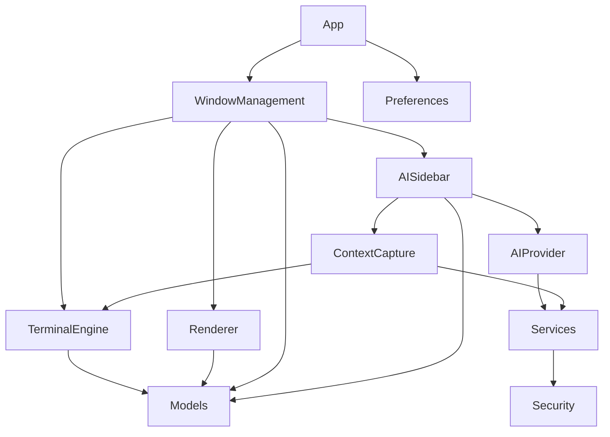

# Spell Caster - File Structure

## Overview

This document defines the file and directory structure for the Spell Caster Xcode project, including group organization, naming conventions, and target configuration.

## Project Structure

```
SpellCaster/
├── SpellCaster.xcodeproj
├── SpellCaster/                    # Main application target
│   ├── App/
│   │   ├── SpellCasterApp.swift
│   │   ├── AppDelegate.swift
│   │   └── AppState.swift
│   │
│   ├── Core/
│   │   ├── TerminalEngine/
│   │   │   ├── TerminalEngine.swift
│   │   │   ├── PTYManager.swift
│   │   │   ├── EscapeSequenceParser.swift
│   │   │   ├── TerminalState.swift
│   │   │   ├── InputHandler.swift
│   │   │   ├── MouseHandler.swift
│   │   │   ├── SignalHandler.swift
│   │   │   └── UTF8Decoder.swift
│   │   │
│   │   ├── Renderer/
│   │   │   ├── MetalTerminalRenderer.swift
│   │   │   ├── GlyphAtlas.swift
│   │   │   ├── Shaders.metal
│   │   │   ├── SmoothScrollController.swift
│   │   │   ├── DirtyRegionTracker.swift
│   │   │   └── RenderBatcher.swift
│   │   │
│   │   └── ContextCapture/
│   │       ├── ContextCapture.swift
│   │       ├── WorkingDirectoryExtractor.swift
│   │       ├── OutputExtractor.swift
│   │       ├── CommandExtractor.swift
│   │       ├── GitExtractor.swift
│   │       ├── EnvironmentExtractor.swift
│   │       ├── SecretSanitizer.swift
│   │       ├── ShellIntegrationHandler.swift
│   │       └── ContextAggregator.swift
│   │
│   ├── Features/
│   │   ├── WindowManagement/
│   │   │   ├── WindowManager.swift
│   │   │   ├── WindowController.swift
│   │   │   ├── WindowContentView.swift
│   │   │   ├── TabBarView.swift
│   │   │   ├── TabContentView.swift
│   │   │   ├── PaneView.swift
│   │   │   ├── SessionPersister.swift
│   │   │   └── FocusManager.swift
│   │   │
│   │   ├── AISidebar/
│   │   │   ├── AISidebarView.swift
│   │   │   ├── AISidebarViewModel.swift
│   │   │   ├── MessageView.swift
│   │   │   ├── ActionCard.swift
│   │   │   ├── ContextAttachmentsView.swift
│   │   │   ├── ContextInspectorView.swift
│   │   │   └── StreamingMessageView.swift
│   │   │
│   │   ├── AIProvider/
│   │   │   ├── AIProviderProtocol.swift
│   │   │   ├── OpenAIProvider.swift
│   │   │   ├── AnthropicProvider.swift
│   │   │   ├── LocalProvider.swift
│   │   │   ├── AIProviderFactory.swift
│   │   │   ├── PromptPresetManager.swift
│   │   │   └── NetworkClient.swift
│   │   │
│   │   └── Preferences/
│   │       ├── PreferencesView.swift
│   │       ├── PreferencesViewModel.swift
│   │       ├── GeneralPreferencesView.swift
│   │       ├── AppearancePreferencesView.swift
│   │       ├── ProfilesPreferencesView.swift
│   │       ├── AIPreferencesView.swift
│   │       └── KeyboardPreferencesView.swift
│   │
│   ├── Models/
│   │   ├── WindowModel.swift
│   │   ├── TabModel.swift
│   │   ├── PaneModel.swift
│   │   ├── PTYSession.swift
│   │   ├── AISession.swift
│   │   ├── ChatMessage.swift
│   │   ├── CommandAction.swift
│   │   ├── Profile.swift
│   │   ├── ColorScheme.swift
│   │   ├── TerminalGrid.swift
│   │   ├── TerminalCell.swift
│   │   ├── ScrollbackBuffer.swift
│   │   ├── ShellIntegrationState.swift
│   │   ├── AIContext.swift
│   │   └── GitStatus.swift
│   │
│   ├── Services/
│   │   ├── KeychainService.swift
│   │   ├── SecureAPIKeyStorage.swift
│   │   ├── SecurityAuditLogger.swift
│   │   ├── ConsentManager.swift
│   │   ├── PrivateMode.swift
│   │   └── DependencyContainer.swift
│   │
│   ├── Security/
│   │   ├── CommandRiskAssessor.swift
│   │   ├── SecretDetector.swift
│   │   ├── AdvancedSecretDetector.swift
│   │   ├── SecureString.swift
│   │   └── CertificatePinner.swift
│   │
│   ├── Views/
│   │   ├── Components/
│   │   │   ├── TerminalView.swift
│   │   │   ├── TerminalNSView.swift
│   │   │   ├── ContextToggle.swift
│   │   │   ├── CommandConfirmationDialog.swift
│   │   │   └── EmptyTerminalView.swift
│   │   │
│   │   └── Shared/
│   │       ├── ColorPicker.swift
│   │       ├── FontPicker.swift
│   │       └── KeyBindingEditor.swift
│   │
│   ├── Extensions/
│   │   ├── Color+Hex.swift
│   │   ├── Character+Wide.swift
│   │   ├── Data+Extensions.swift
│   │   └── Notification+Names.swift
│   │
│   ├── Utilities/
│   │   ├── Logger.swift
│   │   ├── PerformanceMonitor.swift
│   │   └── DebugHelpers.swift
│   │
│   ├── Resources/
│   │   ├── Assets.xcassets/
│   │   │   ├── AppIcon.appiconset/
│   │   │   ├── Colors/
│   │   │   └── Images/
│   │   │
│   │   ├── Localizable.strings
│   │   ├── Info.plist
│   │   ├── Entitlements.plist
│   │   └── ShellIntegration/
│   │       ├── zsh-integration.sh
│   │       ├── bash-integration.sh
│   │       └── fish-integration.fish
│   │
│   └── Supporting Files/
│       └── SpellCaster-Bridging-Header.h
│
├── SpellCasterTests/               # Unit tests
│   ├── TerminalEngineTests/
│   │   ├── PTYManagerTests.swift
│   │   ├── EscapeSequenceParserTests.swift
│   │   └── TerminalStateTests.swift
│   │
│   ├── RendererTests/
│   │   ├── GlyphAtlasTests.swift
│   │   └── RenderBatcherTests.swift
│   │
│   ├── ContextCaptureTests/
│   │   ├── SecretSanitizerTests.swift
│   │   ├── GitExtractorTests.swift
│   │   └── ContextAggregatorTests.swift
│   │
│   ├── AIProviderTests/
│   │   ├── OpenAIProviderTests.swift
│   │   ├── AnthropicProviderTests.swift
│   │   └── PromptPresetManagerTests.swift
│   │
│   ├── SecurityTests/
│   │   ├── CommandRiskAssessorTests.swift
│   │   ├── SecretDetectorTests.swift
│   │   └── KeychainServiceTests.swift
│   │
│   └── Mocks/
│       ├── MockTerminalEngine.swift
│       ├── MockAIProvider.swift
│       └── MockContextCapture.swift
│
├── SpellCasterUITests/             # UI tests
│   ├── WindowManagementUITests.swift
│   ├── AISidebarUITests.swift
│   ├── PreferencesUITests.swift
│   └── TerminalInteractionUITests.swift
│
├── docs/                           # Documentation
│   ├── architecture/
│   │   ├── 01-overall-architecture.md
│   │   ├── 02-data-models.md
│   │   ├── 03-terminal-engine.md
│   │   ├── 04-rendering-layer.md
│   │   ├── 05-window-management.md
│   │   ├── 06-ai-sidebar.md
│   │   ├── 07-ai-provider.md
│   │   ├── 08-context-capture.md
│   │   ├── 09-security-privacy.md
│   │   └── 10-file-structure.md
│   │
│   ├── user-guide/
│   │   ├── getting-started.md
│   │   ├── keyboard-shortcuts.md
│   │   ├── profiles.md
│   │   └── ai-features.md
│   │
│   └── development/
│       ├── setup.md
│       ├── building.md
│       ├── testing.md
│       └── contributing.md
│
├── scripts/                        # Build and utility scripts
│   ├── setup.sh
│   ├── build.sh
│   ├── test.sh
│   └── generate-icons.sh
│
├── .gitignore
├── .swiftlint.yml
├── README.md
├── LICENSE
└── CHANGELOG.md
```

## Naming Conventions

### Files

| Type | Convention | Example |
|------|------------|---------|
| Swift files | PascalCase | `TerminalEngine.swift` |
| View files | PascalCase + "View" suffix | `AISidebarView.swift` |
| ViewModel files | PascalCase + "ViewModel" suffix | `AISidebarViewModel.swift` |
| Protocol files | PascalCase + "Protocol" suffix | `AIProviderProtocol.swift` |
| Extension files | Type + "+" + Extension | `Color+Hex.swift` |
| Test files | Type + "Tests" suffix | `PTYManagerTests.swift` |
| Metal shaders | lowercase + ".metal" | `shaders.metal` |
| Shell scripts | lowercase + ".sh" | `setup.sh` |

### Groups

| Type | Convention | Example |
|------|------------|---------|
| Feature groups | PascalCase | `WindowManagement` |
| Core groups | PascalCase | `TerminalEngine` |
| Test groups | PascalCase + "Tests" | `TerminalEngineTests` |

### Code

| Type | Convention | Example |
|------|------------|---------|
| Classes | PascalCase | `TerminalEngine` |
| Structs | PascalCase | `TerminalCell` |
| Enums | PascalCase | `RiskLevel` |
| Protocols | PascalCase + "Protocol" | `AIProviderProtocol` |
| Variables | camelCase | `currentContext` |
| Constants | camelCase | `maxTokens` |
| Functions | camelCase | `captureContext()` |
| Type aliases | PascalCase | `CompletionHandler` |

## Target Configuration

### Main App Target

```swift
// Target: SpellCaster
// Bundle Identifier: com.spellcaster.app
// Deployment Target: macOS 13.0+
// Swift Version: 5.9+

// Frameworks:
// - SwiftUI
// - AppKit
// - Metal
// - MetalKit
// - CoreText
// - Security
// - Combine
// - OSLog

// Build Settings:
// - SWIFT_OPTIMIZATION_LEVEL = -O (Release)
// - SWIFT_COMPILATION_MODE = wholemodule (Release)
// - ENABLE_TESTABILITY = YES (Debug)
// - CODE_SIGN_STYLE = Automatic
// - DEVELOPMENT_TEAM = [Your Team ID]
```

### Test Targets

```swift
// Target: SpellCasterTests
// Host Application: SpellCaster
// Test Host: $(BUILT_PRODUCTS_DIR)/SpellCaster.app/Contents/MacOS/SpellCaster

// Target: SpellCasterUITests
// Target Application: SpellCaster
```

## Build Phases

### Main Target Build Phases

1. **Dependencies**
   - Link frameworks
   - Embed frameworks (if any)

2. **Compile Sources**
   - All `.swift` files
   - All `.metal` files

3. **Copy Bundle Resources**
   - Assets.xcassets
   - Localizable.strings
   - Shell integration scripts
   - Info.plist

4. **Run Script** (SwiftLint)
   ```bash
   if which swiftlint >/dev/null; then
     swiftlint
   else
     echo "warning: SwiftLint not installed"
   fi
   ```

5. **Code Signing**
   - Sign with development certificate (Debug)
   - Sign with distribution certificate (Release)

## Workspace Organization

### Xcode Groups vs Folders

The Xcode project uses groups that mirror the file system structure:

- ✅ Groups match folder structure
- ✅ No "virtual" groups
- ✅ Easy to navigate in Finder and Xcode
- ✅ Consistent with Git repository structure

### Group Ordering

Groups are ordered by importance:

1. **App** - Application entry point
2. **Core** - Core functionality (Terminal, Renderer, Context)
3. **Features** - Feature modules (Window, AI, Preferences)
4. **Models** - Data models
5. **Services** - Shared services
6. **Security** - Security components
7. **Views** - UI components
8. **Extensions** - Swift extensions
9. **Utilities** - Helper utilities
10. **Resources** - Assets and resources
11. **Supporting Files** - Bridging headers, etc.

## Asset Organization

### Assets.xcassets Structure

```
Assets.xcassets/
├── AppIcon.appiconset/
│   ├── Contents.json
│   ├── icon_16x16.png
│   ├── icon_16x16@2x.png
│   ├── icon_32x32.png
│   ├── icon_32x32@2x.png
│   ├── icon_128x128.png
│   ├── icon_128x128@2x.png
│   ├── icon_256x256.png
│   ├── icon_256x256@2x.png
│   ├── icon_512x512.png
│   └── icon_512x512@2x.png
│
├── Colors/
│   ├── AccentColor.colorset/
│   ├── BackgroundColor.colorset/
│   └── ForegroundColor.colorset/
│
└── Images/
    ├── terminal-icon.imageset/
    ├── ai-icon.imageset/
    └── settings-icon.imageset/
```

## Localization

### Localizable.strings Structure

```swift
// English (Base)
"app.name" = "Spell Caster";
"app.tagline" = "Terminal with AI Co-pilot";

// Window Management
"window.new" = "New Window";
"window.close" = "Close Window";
"tab.new" = "New Tab";
"tab.close" = "Close Tab";

// AI Sidebar
"ai.title" = "AI Assistant";
"ai.input.placeholder" = "Ask me anything...";
"ai.clear" = "Clear History";

// Preferences
"preferences.general" = "General";
"preferences.appearance" = "Appearance";
"preferences.profiles" = "Profiles";
"preferences.ai" = "AI";
"preferences.keyboard" = "Keyboard";

// Security
"security.risk.low" = "Low Risk";
"security.risk.medium" = "Medium Risk";
"security.risk.high" = "High Risk";
"security.risk.critical" = "Critical Risk";
"security.confirm.title" = "Confirm Command Execution";
```

## Configuration Files

### .swiftlint.yml

```yaml
# SwiftLint Configuration
disabled_rules:
  - trailing_whitespace
  - line_length

opt_in_rules:
  - empty_count
  - explicit_init
  - closure_spacing
  - operator_usage_whitespace

excluded:
  - Pods
  - SpellCasterTests
  - SpellCasterUITests

line_length:
  warning: 120
  error: 200

type_body_length:
  warning: 300
  error: 500

file_length:
  warning: 500
  error: 1000

identifier_name:
  min_length:
    warning: 2
  max_length:
    warning: 50
```

### .gitignore

```gitignore
# Xcode
*.xcodeproj/*
!*.xcodeproj/project.pbxproj
!*.xcodeproj/xcshareddata/
!*.xcworkspace/contents.xcworkspacedata
*.xcuserstate
*.xcuserdatad

# Build
build/
DerivedData/
*.ipa
*.dSYM.zip
*.dSYM

# Swift Package Manager
.swiftpm/
.build/
Packages/
Package.resolved

# CocoaPods
Pods/
*.podspec

# Carthage
Carthage/Build/

# macOS
.DS_Store
.AppleDouble
.LSOverride

# Secrets
*.key
*.pem
secrets.json

# IDE
.vscode/
.idea/
*.swp
*.swo
*~

# Documentation
docs/.build/
```

## Module Map

### Feature Dependencies



## Build Configurations

### Debug Configuration

```
SWIFT_OPTIMIZATION_LEVEL = -Onone
SWIFT_ACTIVE_COMPILATION_CONDITIONS = DEBUG
ENABLE_TESTABILITY = YES
GCC_PREPROCESSOR_DEFINITIONS = DEBUG=1
ONLY_ACTIVE_ARCH = YES
```

### Release Configuration

```
SWIFT_OPTIMIZATION_LEVEL = -O
SWIFT_COMPILATION_MODE = wholemodule
ENABLE_TESTABILITY = NO
VALIDATE_PRODUCT = YES
COPY_PHASE_STRIP = YES
```

## Scripts

### setup.sh

```bash
#!/bin/bash
# Setup development environment

echo "Setting up Spell Caster development environment..."

# Check Xcode installation
if ! command -v xcodebuild &> /dev/null; then
    echo "Error: Xcode is not installed"
    exit 1
fi

# Install SwiftLint
if ! command -v swiftlint &> /dev/null; then
    echo "Installing SwiftLint..."
    brew install swiftlint
fi

# Create necessary directories
mkdir -p docs/architecture
mkdir -p docs/user-guide
mkdir -p docs/development

echo "Setup complete!"
```

### build.sh

```bash
#!/bin/bash
# Build the application

xcodebuild \
    -project SpellCaster.xcodeproj \
    -scheme SpellCaster \
    -configuration Release \
    -derivedDataPath build \
    clean build
```

### test.sh

```bash
#!/bin/bash
# Run tests

xcodebuild test \
    -project SpellCaster.xcodeproj \
    -scheme SpellCaster \
    -destination 'platform=macOS'
```

## Summary

The file structure provides:

| Aspect | Benefit |
|--------|---------|
| Clear separation | Easy to navigate and maintain |
| Logical grouping | Related files together |
| Consistent naming | Predictable file locations |
| Scalable structure | Easy to add new features |
| Test organization | Tests mirror source structure |
| Resource management | Centralized assets and resources |

## Next Steps

With all architecture documents complete, the next phase is implementation:

1. Set up Xcode project with this structure
2. Implement core modules (TerminalEngine, Renderer)
3. Build UI layer (WindowManagement, AISidebar)
4. Integrate AI providers
5. Add security features
6. Write tests
7. Polish and optimize

---

**End of Architecture Documentation**

All 10 architecture documents have been created:
1. ✅ Overall Architecture
2. ✅ Data Models
3. ✅ Terminal Engine
4. ✅ Rendering Layer
5. ✅ Window Management
6. ✅ AI Sidebar
7. ✅ AI Provider
8. ✅ Context Capture
9. ✅ Security & Privacy
10. ✅ File Structure
